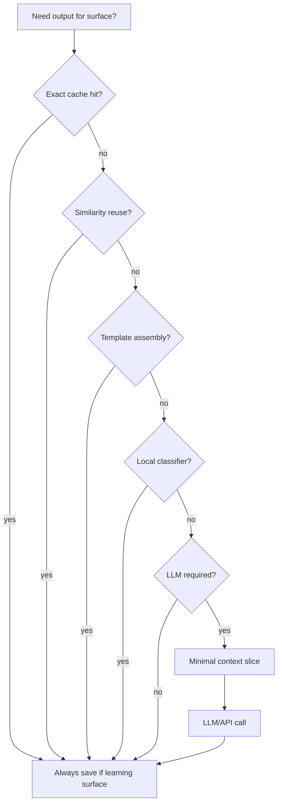
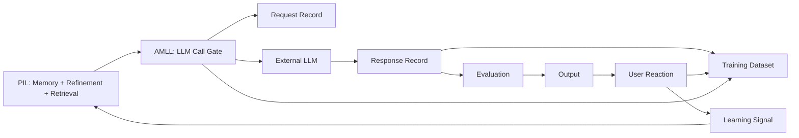

# API Memory & Learning Layer (AMLL)

**Статус:** принято (канон экономики и обучения на API).  
**Версия:** 1.0 (2026-05-31).  
**Владелец:** Product + Engineering.

**Уровень:** рядом с [PERSONAL_INTELLIGENCE_LAYER.md](pim/PERSONAL_INTELLIGENCE_LAYER.md), [DATA_OWNERSHIP_AND_CONSUMPTION_MAP.md](./DATA_OWNERSHIP_AND_CONSUMPTION_MAP.md), [REFERENCE_LAYER_AND_BUILD_ORDER.md](./REFERENCE_LAYER_AND_BUILD_ORDER.md).

**Связь:** [USER_KNOWLEDGE_MODEL.md](pim/USER_KNOWLEDGE_MODEL.md) (Gate читает Knowledge, не events), [PERSONAL_INTELLIGENCE_LAYER.md](pim/PERSONAL_INTELLIGENCE_LAYER.md) (сквозной PIL), [PERSONAL_INTELLIGENCE_LAYER.md](pim/PERSONAL_INTELLIGENCE_LAYER.md) (orchestrator, quality gate), [TODAY_PERSONALIZATION_CORE.md](./TODAY_PERSONALIZATION_CORE.md) (events + `generation_id`), [PERSONAL_INTELLIGENCE_LAYER.md](pim/PERSONAL_INTELLIGENCE_LAYER.md).

---

## 0. Главный канон

**LLM API — не источник истины.**

LLM API — **дорогой генератор кандидатов**.

**Источник истины:**

- Reference Layer  
- CoreProfile Snapshot  
- Behavior Memory  
- Daily Memory  
- User Feedback  

**Главная цель AMLL:** каждый API-вызов должен становиться **активом**, а не расходом.

API должен использоваться **всё меньше**, потому что система учится:

- переиспользовать хорошие ответы;
- лучше выбирать context slice;
- точнее формировать prompt;
- не генерировать то, что можно собрать из своих данных;
- готовить training dataset для собственной модели.

### Неправильно

```
prompt → response → UI → забыли
```

### Правильно

```
context slice → API (или gate: no_call) → save response → UI
  → user reaction → link reaction ↔ response
  → learning signal → update memory / ranking / prompt strategy
  → next time: cache / reuse / smaller slice
```

---

## 1. Purpose

AMLL — подслой [Personal Intelligence Layer](pim/PERSONAL_INTELLIGENCE_LAYER.md), отвечающий за **жизненный цикл каждого LLM/API-вызова**:

| Фаза | Что делает AMLL |
|------|-----------------|
| **Before call** | LLM Call Gate: нужен ли API, кэш, reuse, minimal slice |
| **During call** | Request Record + cost tracking |
| **After call** | Response Record + evaluation + distillation |
| **After UI** | User Reaction Record → Learning Signal |
| **Long-term** | Dataset candidate policy + ROI metrics |

**Экономический смысл (ROI):** каждый вызов должен дать **хотя бы одно** из:

- полезный ответ пользователю;
- улучшение Behavior Profile / Prompt Strategy;
- reusable content (cache / template / pattern);
- training example;
- снижение будущих API-затрат.

Если вызов не даёт ничего из списка — **лишний**.

---

## 2. LLM Call Gate

**Обязательный слой перед любым LLM/API.** Решение: `call` | `no_call` + причина.



### 2.1 Вопросы Gate

| Вопрос | Решение |
|--------|---------|
| Нужен ли API? | `call` / `no_call` |
| Можно ли взять кэш? | `cache_hit` / `cache_miss` |
| Можно ли переиспользовать прошлый ответ? | `reuse` / `no_reuse` |
| Какой context slice? | `minimal` / `standard` / `rich` |
| Какая модель? | `cheap` / `standard` / `premium` |
| Лимит tokens? | `max_tokens` |
| Сохранять результат? | **always yes** для learning surfaces |

### 2.2 Порядок «можно ли без API?»

1. **Exact cache** — тот же user + day + surface + context hash  
2. **Similarity reuse** — похожий successful response (см. §7)  
3. **Template assembly** — Reference + UI Copy + deterministic blocks  
4. **Small model / local classifier** — routing, labels, short blocks  
5. **Нужен ли LLM вообще?**  
6. Если да — **минимальный** context slice + cheapest adequate model  

**Build order:** LLM Call Gate v1 — **после** [USER_KNOWLEDGE_MODEL.md](pim/USER_KNOWLEDGE_MODEL.md) UKM-3 (Knowledge Store). Gate решает на **Knowledge slice**, не на сыром event log.

---

## 3. API Request Record

Каждый **фактический или виртуальный** (cache/reuse) вызов порождает Request Record.

| Поле | Тип | Обязательно | Описание |
|------|-----|-------------|----------|
| `request_id` | uuid / int | ✓ | PK; для cache/reuse — ссылка на source |
| `surface` | string | ✓ | `guide`, `day_layer`, `tarot_reading`, … |
| `user_id` | int | ✓ | |
| `day_key` | date string | ✓ | локальный день пользователя |
| `context_slice_id` | string | ✓ | hash canonical slice (не full prompt dump) |
| `context_slice` | JSON | ○ | сжатый slice для audit (redacted) |
| `prompt_template_id` | string | ✓ | e.g. `today_base_model_v1` |
| `prompt_version` | string | ✓ | e.g. `today-narrative-v13` |
| `model` | string | ○ | null если `no_call` |
| `temperature` | float | ○ | |
| `max_tokens` | int | ○ | |
| `input_tokens` | int | ○ | после call |
| `estimated_cost_usd` | decimal | ○ | |
| `purpose` | enum | ✓ | `generate` \| `regen` \| `evaluate` \| `classify` |
| `gate_decision` | enum | ✓ | `call` \| `cache_hit` \| `reuse` \| `template` \| `no_call` |
| `parent_request_id` | int | ○ | regen chain |

**Хранение v0:** `generation_logs` + `input_payload` (расширить).  
**Хранение v1:** таблица `api_request_records` или unified `generation_artifacts`.

**Уже есть:** `user_id`, `surface`, `model`, `input_payload`, `prompt_version_id`, `system_prompt`, `user_prompt`, `duration_ms`.

**Gap:** `context_slice_id`, token counts, cost, `gate_decision`, `purpose`.

---

## 4. API Response Record

| Поле | Тип | Обязательно | Описание |
|------|-----|-------------|----------|
| `response_id` | int | ✓ | FK → request |
| `raw_response` | text | ✓ | сырой ответ API |
| `parsed_response` | JSON | ✓ | после schema parse |
| `response_version` | string | ✓ | contract version |
| `quality_score` | float 0–1 | ○ | evaluation aggregate |
| `evaluation_result` | enum | ✓ | `pass` \| `fail` \| `regen` \| `fallback` |
| `safety_flags` | string[] | ○ | moderation / PII |
| `used_in_ui` | bool | ✓ | показан пользователю |
| `final_output_id` | string | ○ | id UI artifact / generation_log id |
| `distilled_forms` | JSON | ○ | short, cards, pattern (§7.4) |

**Хранение v0:** `generation_logs.raw_response`, `normalized_response`, `status`, `used_fallback`.

**Правило:** даже **fallback** и **rejected** responses сохраняются для learning (с label `rejected` / `poisoned`).

---

## 5. User Reaction Record

Реакция **привязана** к `response_id` / `generation_id` через `meaning_events` и `generation_feedback`.

| Поле | Источник |
|------|----------|
| `opened` | `sphere_opened`, visibility events |
| `ignored` | no open / short dwell (backlog) |
| `saved` | save action (backlog) |
| `completed` | `focus_completed`, `practice_completed` |
| `dismissed` | dismiss (backlog) |
| `rated` | `sphere_feedback`, `feedback_questions` |
| `edited` | user correction (backlog) |
| `asked_followup` | Guidance follow-up |
| `returned_later` | session / evening return |
| `changed_mood_after` | mood delta post-practice |
| `completed_recommendation` | `support_selected`, action completion |

**Payload канон:** `generation_id`, `day_key`, `surface`, `entity_id` — [TODAY_PERSONALIZATION_CORE.md](./TODAY_PERSONALIZATION_CORE.md).

**Хранение v0:** `generation_feedback` (`signal`, `score`, `meta_payload`); `meaning_events` linked by `generation_id` in payload.

---

## 6. Learning Signal

Из Reaction Record → **нормализованный сигнал** для памяти и ranking.

| Поведение | Learning Signal | Обновляет |
|-----------|-----------------|-----------|
| Сохранил | `useful` | Semantic Memory, dataset `approved` candidate |
| Выполнил рекомендацию | `effective` | Behavioral Memory + |
| Закрыл быстро | `low_relevance` | Preference (shorter) |
| Попросил уточнить | `incomplete` | Prompt Strategy (more detail) |
| Настроение ↑ после | `positive_impact` | Behavioral Memory |
| Проигнорировал 3× | `suppress_pattern` | Negative Memory |
| Выполнил практику | `practice_works` | Recommendation ranking + |
| Пропустил | `timing_format_mismatch` | Negative Memory, rhythm |

**Правило:** один reaction → один или несколько signals с `confidence` и `window_days` (anti-personalization guard, PIL §8.2).

**Ownership:** Meaning Engine **создаёт** signal; PIL **применяет** к memory stores.

---

## 7. Cache & Reuse Policy

### 7.1 Exact Cache

**Ключ:** `user_id` + `day_key` + `surface` + `context_slice_id` + `prompt_version` + `locale`.

**Hit:** вернуть `parsed_response` без API; Request Record с `gate_decision: cache_hit`.

**Код:** `_load_narrative_cache` + `input_payload.day_context_sha256` (guide).

### 7.2 Similarity Reuse

**Условие:** нет exact hit, но есть **approved** response с similarity ≥ threshold по:

- mood band, tarot card, personal day number, head topic, energy mode;
- прошлый `learning_signal: effective`.

**Действие:** adapt template (light edit / slot fill) **без** full LLM; log `gate_decision: reuse` + `source_response_id`.

**Backlog:** embedding index или rule-based similarity v0.

### 7.3 Template Assembly (no LLM)

Блоки **без** API:

- CTA, короткие пояснения из UI Copy;
- статус трекера, прогресс, calendar day color;
- simple recommendations по machine tags (Practice P2).

`gate_decision: template`.

### 7.4 Response Distillation

После **successful** API call сохранить формы:

| Форма | Назначение |
|-------|------------|
| `raw` | audit, regen |
| `parsed` | UI contract |
| `short` | quick depth / notifications |
| `ui_cards` | structured blocks |
| `embedding` | similarity reuse (later) |
| `reusable_pattern` | slot-based template |
| `training_example` | dataset row |

**Правило:** distillation — **post-evaluation**, не до quality gate.

---

## 8. Dataset Candidate Policy

Полная пара для future model (Training Memory):

| Поле | Зачем |
|------|-------|
| `context_slice` | что знала система |
| `prompt` | что спросили (refined) |
| `raw_response` | что ответила модель |
| `parsed_output` | что показали |
| `evaluation` | pass/fail/regen |
| `user_reaction` | linked events |
| `final_label` | см. статусы ниже |

### 8.1 Статусы примеров

| Статус | Значение |
|--------|----------|
| `candidate` | можно рассмотреть |
| `approved` | подходит для dataset |
| `rejected` | не использовать |
| `needs_review` | human review |
| `poisoned` | вредный / ошибочный |

**Не каждый API-ответ годится для обучения.**

Auto-`approved` только при: `evaluation_result: pass` + `used_in_ui: true` + positive signal (`useful`, `effective`, `positive_impact`).

Auto-`poisoned`: safety fail, user «не про меня» × N, harmful flag.

**Хранение:** `training_examples` table (backlog); v0 — export job из `generation_logs` + linked events.

---

## 9. Response Evaluation

Связь с PIL §14 и PIL quality gate.

| Check | Blocks UI | Blocks `approved` dataset |
|-------|-----------|----------------------------|
| Schema valid | ✓ | ✓ |
| DayContext aligned | ✓ | ✓ |
| Not generic / template-y | ✓ | ✓ |
| Length within refined limits | ✓ | ○ |
| No repeat yesterday | ✓ | ○ |
| Negative memory respected | ✓ | ✓ |
| Practical action present | ○ | ✓ for action surfaces |

**Fail path:** regen (narrow slice) → fallback → save all attempts with `evaluation_result`.

---

## 10. Token Cost Control

| Рычаг | Когда |
|-------|-------|
| Gate `no_call` | template / cache / reuse |
| `minimal` slice | low confidence, repeat surface |
| `cheap` model | classify, short blocks, eval |
| `max_tokens` cap | per surface in Prompt Refinement |
| Regen limit | max 1–2 per request |
| Batch distillation | one long call → many short forms ( amortize ) |

**Метрики (product):**

- `api_calls_avoided` (cache + reuse + template)  
- `tokens_saved_estimate`  
- `cost_per_useful_response` (useful = effective signal)  
- `cache_hit_rate` by surface  

**Правило:** отчётность по ROI — не optional; привязка к `generation_logs` / future `api_request_records`.

---

## 11. Feedback Loop (AMLL → PIL)

После reaction обновляются (через PIL):

1. **Behavior Profile** — what works / when active  
2. **Prompt Strategy** — shorter/longer, softer/directer  
3. **Recommendation Ranking** — practices up/down  
4. **Negative Memory** — suppress patterns  
5. **Context Selector** — which slice fields correlate with `effective`  

**Замыкание:** следующий Gate читает обновлённые stores → меньше tokens / лучше hit rate.

---

## 12. Ownership & Privacy

| Данные | Владелец | LLM | UI | Training export |
|--------|----------|-----|-----|-----------------|
| Request/Response records | Platform SN | internal | no raw prompts | redacted |
| User reactions | User domain | no | aggregated opt-in | user-scoped |
| Learning signals | PIL SN | slices only | no | anonymized pipeline |
| Dataset `approved` | Platform | — | — | consent + retention policy |

**Запрещено в training export:** cross-user rows without aggregation; full diary; PII; `poisoned` without quarantine.

**User control:** delete account → cascade generation logs per retention policy; export «my data» includes reactions not raw system prompts (unless legal require).

**См. также:** DATA_OWNERSHIP LLM matrix, PIL §10.13 privacy.

---

## 13. Integration with Personal Intelligence Layer



| PIL компонент | AMLL компонент |
|---------------|----------------|
| Prompt Refinement | Request Record inputs |
| LLM Orchestrator | **Gate** + model tier |
| Evaluation Engine | Response Record `evaluation_result` |
| Feedback Loop | User Reaction → Learning Signal |
| Training Dataset Layer | Dataset Candidate Policy |
| Memory stores | updated from Learning Signals |

**Build order:** UKM Knowledge Store (UKM-3) **до** AMLL Gate v1; Gate + full Request/Response **до** новых LLM surfaces.

---

## 14. Code baseline & gaps

| Capability | Status | Location |
|------------|--------|----------|
| Request/Response log | 🟡 partial | `generation_logs`, `GenerationFeedback` |
| Exact cache (guide) | 🟡 | `today_narrative._load_narrative_cache` |
| Context hash | 🟡 | `day_context_sha256` in `input_payload` |
| Event ↔ generation link | 🟡 | `generation_id` in meaning events |
| LLM Call Gate artifact | ⬜ | backlog |
| Token/cost fields | ⬜ | backlog |
| Similarity reuse | ⬜ | backlog |
| Training examples table | ⬜ | backlog |
| Dataset status workflow | ⬜ | backlog |

---

## 15. Feature checklist (DoD)

Любая новая LLM surface **не merge** без:

- [ ] Gate decision logged (`call` / `no_call` + reason)  
- [ ] Request Record fields (min: surface, context_slice_id, prompt_version)  
- [ ] Response Record (raw + parsed + evaluation + used_in_ui)  
- [ ] ≥1 reaction event type with `generation_id`  
- [ ] Learning signal mapping documented  
- [ ] Cache key documented (if applicable)  
- [ ] Dataset status rule (candidate vs never)  

---

## 16. Changelog

- **1.1 (2026-05-31)** — Gate v1 **after** UKM-3; decisions on Knowledge slice, not raw events.
- **1.0 (2026-05-31)** — первый канон AMLL: Gate, Request/Response/Reaction records, Learning Signals, cache/reuse, dataset policy, token ROI, PIL integration.
