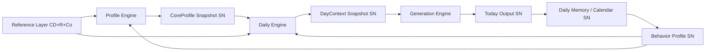

# Карта владения данными и потребления (Data Ownership & Consumption)

**Статус:** принято (канон архитектуры данных).  
**Версия:** 1.0 (2026-05-31).  
**Владелец:** Product + Engineering.

**Связь:** [REFERENCE_LAYER_AND_BUILD_ORDER.md](./REFERENCE_LAYER_AND_BUILD_ORDER.md), [DATA_ORIGINATION_AND_LIFECYCLE.md](./DATA_ORIGINATION_AND_LIFECYCLE.md), [DAYMODEL_INPUT_CONTRACT.md](./DAYMODEL_INPUT_CONTRACT.md), [DAY_CONTEXT_V0.md](./DAY_CONTEXT_V0.md), [TODAY_PERSONALIZATION_CORE.md](./TODAY_PERSONALIZATION_CORE.md), [PERSONAL_INTELLIGENCE_LAYER.md](./PERSONAL_INTELLIGENCE_LAYER.md), [USER_KNOWLEDGE_MODEL.md](./USER_KNOWLEDGE_MODEL.md), [API_MEMORY_AND_LEARNING_LAYER.md](./API_MEMORY_AND_LEARNING_LAYER.md).

**Главный принцип:** каждый слой читает **только свой вход**, а не весь мир. Справочники — источник истины для **движков**, а не payload каждого HTTP-запроса. **Personal Intelligence Layer** — обязательный посредник перед LLM/API ([PERSONAL_INTELLIGENCE_LAYER.md](./PERSONAL_INTELLIGENCE_LAYER.md)). **API Memory & Learning Layer** — каждый LLM-вызов становится активом ([API_MEMORY_AND_LEARNING_LAYER.md](./API_MEMORY_AND_LEARNING_LAYER.md)).

---

## 1. Четыре типа данных

| Тип | Код | Что это | Где живёт | Когда создаётся | Кто читает (типично) |
|-----|-----|---------|-----------|-----------------|----------------------|
| **Canonical Data** | **CD** | Атомы справочников (источник истины) | `DATA/reference/`, `DATA/astrology_reference/` | Editorial / system seed | Engines при **расчёте**, не UI напрямую |
| **Derived Data** | **DD** | Результат формулы: CD + user input + время | В памяти движка → snapshot | При расчёте профиля / дня | Следующий слой pipeline |
| **Snapshot Data** | **SN** | Зафиксированный снимок DD (+ ссылки на версии) | БД / кэш / generation_logs | После успешного расчёта слоя | API, LLM, UI **без** повторного ref-load |
| **Runtime Data** | **RT** | Состояние «сейчас» / «этот день» | DayContext, tracking, session | Check-in, cron, user action | Daily Engine, Generation, Calendar |

**Соответствие taxonomy C/D/Co/R:**

| Taxonomy | Data type |
|----------|-----------|
| Canonical (C) | **CD** |
| Derived (D) | **DD** → часто **SN** |
| Content (Co) | **CD** (тексты), отдаётся в LLM/UI **по коду**, не bulk |
| Runtime rules (R) | **CD** (policy) + **RT** (instantiated) |

---

## 2. Главная цепочка (ownership flow)



| # | Слой | Создаёт | Владеет | Читает |
|---|------|---------|---------|--------|
| 1 | **Reference Layer** | Editorial / eng (CD, Co, R) | Platform / content | Profile Engine, Daily Engine, Recommendation |
| 2 | **Profile Engine** | CoreProfile (DD) | User domain | Daily Engine, Horoscope, Compatibility, Guidance |
| 3 | **CoreProfile Snapshot** | Profile Engine (persist) | User record | Today path, API `/account/core-profile` |
| 4 | **Daily Engine** | DayContext (DD+RT) | Day domain (`target_date`) | Generation, Calendar aggregation |
| 5 | **DayContext Snapshot** | `build_day_context_v0` (+ persist optional) | Day + `day_context_sha256` | Generation pipeline, explainability |
| 6 | **Generation Engine** | Today Output (text JSON) | `generation_logs` | UI |
| 7 | **Today Output** | POST narrative / morning ritual | Client + logs | User |
| 8 | **Daily Memory / Calendar** | User actions, end-of-day | Tracking tables | Behavior Profile, Calendar UI |
| 9 | **Behavior Profile** | Aggregates over events | `internal_profile` / learning | DayContext layers, Selector |

**Код сегодня (ориентиры):** `CoreProfileService` + `CoreProfileSnapshot` · `build_day_context_v0` · `build_today_narrative` · `GET /tracking/fusion` · `meaning_events`.

---

## 3. Главное правило: справочник не таскается каждый раз

### Неправильно

```
User opens Today
  → load Zodiac Reference
  → recompute sun sign
  → load all planet/house content
  → rebuild profile in request
  → LLM gets full reference dump
```

### Правильно

```
Onboarding / birth update
  → Profile Engine reads Reference (CD+R) once
  → computes DD
  → writes CoreProfile Snapshot (SN) + profile_hash + reference_version refs

User opens Today
  → load CoreProfile Snapshot (SN)
  → Daily Engine adds RT for target_date
  → build DayContext Snapshot (SN)
  → Generation reads SN slices only
```

**Пересчёт CoreProfile** — только при: смена birth data, явный rebuild, migration policy. **Не** на каждый GET `/today`.

---

## 4. Матрица: справочник → владелец → момент использования

| Справочник / домен | Primary owner (engine) | Data type | Когда читается CD/Co | Кто потребляет SN/DD | Частота |
|--------------------|------------------------|-----------|----------------------|----------------------|---------|
| Zodiac Sign | Profile Engine | CD+Co | Birth chart calc | CoreProfile.sun_sign code | On profile build |
| Planet / House / Aspect | Profile Engine | CD+Co | Natal calc | CoreProfile.astro codes | On profile build |
| Element / Modality | Profile Engine | CD | Sign lookup | CoreProfile.baseline | On profile build |
| Numerology Core Numbers | Profile Engine | CD+R | Name/date calc | CoreProfile.numerology | On profile build |
| Tarot Cards (machine) | Daily Engine | CD+R | Card-of-day pick (cron/ritual) | DayContext ritual + card SN | 1×/day |
| Tarot Cards (content) | Generation | Co | **Not** in profile path | LLM tarot step (by card_id) | 1×/day if opened |
| Personal Day Number | Daily Engine | DD | Formula daily | DayContext ritual | 1×/day |
| Transit / Daily Astro | Daily Engine | DD | Ephemeris + natal | DayContext daily_foundation | 1×/day |
| Emotional State | Check-in / Runtime | R+Co | Check-in slug map | DayContext ritual, DayModel Risk | Per check-in |
| Practice | Recommendation Engine | CD+Co | Pick practice | Today support / Flow | On demand |
| Goal | User + Recommendation | CD (type) + user SN | Create goal | DayContext fusion.rhythm | Active goals |
| Habit / Ascetic | Tracker Engine | CD (type) + user SN | Create tracker | DayContext fusion | Daily |
| Calendar Rhythm | Calendar Engine | R | Month aggregation | Calendar UI | On calendar view |
| UI Copy | UI / Generation | Co | Render | All surfaces | Per screen |
| DayModel / Strategy | DayModel Engine | R (output) | Aggregate machine SN | Generation, UI brief | 1×/day |

---

## 5. CoreProfile Snapshot — что хранить и что запрещено

**Владелец:** Profile Engine · **Тип:** SN · **API:** `GET /account/core-profile` · **Таблица:** `CoreProfileSnapshot` (payload JSON).

### Должно быть в snapshot

| Категория | Примеры |
|-----------|---------|
| Идентификаторы | `profile_hash`, `profile_version`, `user_id` |
| Коды (не лонгриды) | `sun_sign`, planet/house **codes**, numerology integers |
| Сжатый interpretation | `interpretation.*` modules, `baseline` |
| Living / learning slice | `living.summary`, signal aggregates (links) |
| Provenance | `reference_version` / `source_versions` per domain (target) |
| Multi-profile | `profiles.items[]`, selected id |

### Нельзя класть в CoreProfile

| Запрещено | Почему |
|-----------|--------|
| Полный текст знака / карты / числа из справочника | Это **Co**, устаревает без version bump |
| Daily layer (карта дня, транзит сегодня) | Это **RT** / DayContext |
| Сырой Reference JSON bulk | Раздувает snapshot, ломает LLM budget |
| Today narrative output | Отдельный SN в generation_logs |
| Full Personal Map editorial | PROFILE_SCREEN_MASTER — селектор, не dump |

---

## 6. DayContext Snapshot — состав и границы

**Владелец:** Daily Engine · **Тип:** SN (+ RT inputs) · **Контракт:** [DAY_CONTEXT_V0.md](./DAY_CONTEXT_V0.md) · **Сборщик:** `build_day_context_v0`.

### Берёт (read-only)

| Вход | Тип | Источник |
|------|-----|----------|
| CoreProfile (сжатый) | SN | `user_core` / `_core_context_for_narrative` |
| Profile Selector slice | SN | `layers.profile_selector` |
| Active goals / habits / ascetics | RT+SN | `fusion.rhythm_context` |
| Card of day / number of day | RT+SN | ritual, morning_ritual persist |
| Transits / daily foundation | DD+SN | `daily_foundation` |
| Check-in | RT | ritual mood, tracking |
| Recent events / history | SN | `layers.history`, meaning_events |
| Behavior patterns | SN | `behavior_patterns`, `internal_profile` |
| Machine tarot slice | SN | `DATA/reference/tarot/machine` → preview (P0.4+) |

### Не делает DayContext

- Не пересчитывает натал с нуля (не ходит в Planet/House ref bulk).
- Не генерирует тексты (это Generation Engine).
- Не заменяет Calendar long-term storage.

**Кэш narrative:** `day_context_sha256` + `intent_context_fp` — DayContext SN считается стабильным ключом для LLM cache.

---

## 7. API — что читает каждый endpoint (target)

| API surface | Читает | Не читает |
|-------------|--------|-----------|
| **Profile API** | CoreProfile Snapshot | Full reference, daily ritual |
| **Today / narrative API** | DayContext SN + prior generation cache | Bulk astrology ref, full core raw |
| **Morning ritual API** | CoreProfile SN + daily DD (card, number) | Re-build profile |
| **Horoscope API** | CoreProfile SN + Transit SN for date | Tarot machine (unless cross-feature) |
| **Tarot API** | Card SN + history (user) | Full 78 content dump |
| **Calendar API** | Daily Memory + tracker events + rhythm R | Regenerate DayContext |
| **Recommendation API** | DayContext SN + Practice/Goal/Habit **codes** | Entire practice catalog text |
| **Reference API** (target) | CD/R/Co by `entity_code` | User snapshots |

---

## 8. Политики по типам данных (12 вопросов)

### 8.1 Canonical Data (CD)

| Вопрос | Политика |
|--------|----------|
| Владелец | Platform (editorial + engineering) |
| Создаёт | Expert, system seed; AI → `draft` only |
| Читает | Engines at **calculation** time; Reference API for admin/tools |
| Пересчитывает | Никто — **версионируется**, не пересчитывается |
| Хранение | `DATA/reference/`, legacy `DATA/astrology_reference/` |
| Частота read | Low at runtime (on snapshot miss / rebuild) |
| Кэш | In-process LRU (loaders), immutable per version |
| UI | **Коды и labels**, не machine rules; не bulk |
| LLM | **Запрещён** bulk; только Co slice by `entity_code` |
| Snapshot | N/A (CD is already persistent) |
| Устаревание | `valid_to`, `deprecated`; old SN keep `reference_version` |

### 8.2 Derived Data (DD)

| Вопрос | Политика |
|--------|----------|
| Владелец | Engine that computed (Profile / Daily / Calendar) |
| Создаёт | Deterministic engine from CD + inputs |
| Читает | Next pipeline stage; may persist as SN |
| Пересчитывает | Owner engine when inputs change |
| Хранение | Ephemeral or embedded in SN |
| Частота | Per event (birth change, new day, check-in) |
| Кэш | Promote to SN when expensive or stable |
| UI | Only via SN (formatted) |
| LLM | Only structured DD in DayContext, not raw ephemeris |
| Snapshot | Promote when user-visible or LLM-facing |
| Устаревание | Invalid when input SN or date changes |

### 8.3 Snapshot Data (SN)

| Вопрос | Политика |
|--------|----------|
| Владелец | Domain: User (CoreProfile), Day (DayContext), Generation (logs) |
| Создаёт | Profile Engine, Daily Engine, Generation Engine |
| Читает | API handlers, LLM prompts, UI |
| Пересчитывает | **Только owner**; readers never mutate |
| Хранение | DB: `CoreProfileSnapshot`, `generation_logs`, `DayConnection`, etc. |
| Частота read | **High** — every Today session |
| Кэш | HTTP/LLM cache keyed by hash (`profile_hash`, `day_context_sha256`) |
| UI | Yes — primary user-facing truth |
| LLM | Yes — **slices** via Selector, not full SN always |
| Snapshot | Already snapshot |
| Устаревание | CoreProfile: birth change; DayContext: date rollover; Generation: new ritual/check-in |

### 8.4 Runtime Data (RT)

| Вопрос | Политика |
|--------|----------|
| Владелец | User session + day record |
| Создаёт | User (check-in), cron (card pick), trackers |
| Читает | Daily Engine → folded into DayContext |
| Пересчитывает | On each user action |
| Хранение | `DayConnection`, ritual payload, fusion activity |
| Частота | Many times per day |
| Кэш | Short-lived; merged into DayContext SN on narrative call |
| UI | Yes (forms, toggles) |
| LLM | Yes as facts (mood, completed habits) |
| Snapshot | End-of-day → Daily Memory SN |
| Устаревание | End of `target_date` or explicit overwrite |

---

## 9. Частота использования (сколько раз «таскается»)

| Данные | Типично за день (active user) | Примечание |
|--------|-------------------------------|------------|
| Zodiac / natal CD | **0** (after onboarding) | Только если rebuild profile |
| Tarot machine CD | **1** | Card pick → SN in ritual |
| Personal day DD | **1** | Stored in ritual |
| CoreProfile SN | **3–10 reads** | Today, tabs, background |
| DayContext SN build | **1–4** | guide + optional surfaces |
| Reference Co for LLM | **3–6 narrow calls** (target DE-13) | Not one bulk |
| UI Copy Co | **per screen** | i18n cache |
| meaning_events write | **5–20** | Calendar / behavior |

---

## 10. Права на пересчёт (кто может invalidate)

| Событие | Что пересчитывается | Кто |
|---------|---------------------|-----|
| Birth data changed | CoreProfile SN | Profile Engine |
| User edits goals/habits | fusion.rhythm_context | Tracking → next DayContext |
| New calendar day | DayContext, card, number | Daily Engine (cron/open) |
| Check-in submitted | ritual + Risk/Strategy | Daily Engine |
| Reference version bump | Optional profile rebuild | Admin job + policy |
| User feedback «не про меня» | Selector weights, not full ref | Learning layer |

**Запрещено:** Generation Engine пересчитывает CoreProfile или натал.

---

## 11. LLM vs UI exposure matrix

| Data | UI | LLM |
|------|----|-----|
| CD machine (vector scores) | **No** | **No** (only aggregated DayModel) |
| CD codes (sun_sign, card_id) | Yes (labels) | Yes (codes) |
| Co (advice, keywords) | Yes | Yes (bounded slice) |
| CoreProfile SN | Yes (portrait) | Yes (`user_core`, Selector slice) |
| DayContext SN | Partial (explain) | Yes (layer slices) |
| internal_profile aggregates | Soft wording only | Yes (`internal_profile`) |
| Full reference catalog | **No** | **Forbidden** |

---

## 12. Согласование с текущей реализацией

| Канон | Статус в коде |
|-------|----------------|
| CoreProfile Snapshot | ✅ `CoreProfileService`, `/account/core-profile` |
| DayContext SN | ✅ `build_day_context_v0`, narrative input |
| Reference not every request | ⚠️ Partial — some paths still pull large context; target Selector |
| Tarot machine separate from legacy Co | ✅ P0.3–P0.4 |
| `reference_version` in SN | 🔲 Target — log in generation; profile provenance backlog |
| DayContext as public API | 🔲 Intermediate contract only (doc/schema) |
| Reference API | 🔲 Not implemented |

---

## 13. Definition of Done (этот документ)

- [x] Четыре типа данных определены
- [x] Цепочка Reference → … → Behavior Profile
- [x] Матрица справочник → owner → frequency
- [x] CoreProfile / DayContext boundaries
- [x] API read model
- [x] Policies: cache, UI, LLM, snapshot, staleness
- [ ] Implement `reference_version` on CoreProfile SN (engineering ticket)
- [ ] Reference API read-only (engineering ticket)

---

## 14. Связанные документы (порядок чтения)

1. [REFERENCE_LAYER_AND_BUILD_ORDER.md](./REFERENCE_LAYER_AND_BUILD_ORDER.md) — что за сущности существуют (180)  
2. [DATA_ORIGINATION_AND_LIFECYCLE.md](./DATA_ORIGINATION_AND_LIFECYCLE.md) — **откуда** появляются, confirm, retire, наполнение  
3. **DATA_OWNERSHIP_AND_CONSUMPTION_MAP.md** (этот файл) — кто владеет и кто читает  
4. [REFERENCE_LAYER_AND_BUILD_ORDER.md](./REFERENCE_LAYER_AND_BUILD_ORDER.md) — catalog §6, build order  
5. [DAYMODEL_INPUT_CONTRACT.md](./DAYMODEL_INPUT_CONTRACT.md) — как RT machine питает DayModel  
6. [DAY_CONTEXT_V0.md](./DAY_CONTEXT_V0.md) — форма DayContext SN  

---

*При смене owner или API read path — bump версию и запись в PRODUCT_EXECUTION_TRACKER.*
