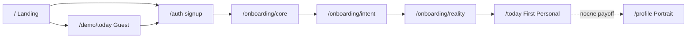

# First Day & Onboarding — продуктовый контракт

**Статус:** **ACCEPTED** — канон **guest → signup → onboarding → First Today** (маршруты, данные, PIM, DoD).  
**Версия:** 2.0 (2026-06-23).  
**Владелец:** Product + Engineering.

**Web launch (2026-07-01):** маршрут guest `/demo/today`, auth-first и landing demo — **superseded**. Источник истины: [status/WEB_LAUNCH_PRODUCT_BLUEPRINT.md](./status/WEB_LAUNCH_PRODUCT_BLUEPRINT.md) (UX) + [status/WEB_LAUNCH_EXECUTION_PLAN.md](./status/WEB_LAUNCH_EXECUTION_PLAN.md) (работы, код).

**Scope:** полный user journey до первого персонального Today + First Day Package.  
**Не входит:** реализация экранов (см. §13 Execution backlog), новые API без обоснования, C1.7 / causal graph.

**Связь:** [CORE_PRODUCT_CANON.md](./CORE_PRODUCT_CANON.md) · [TODAY_SCREEN_V1_CANON.md](./TODAY_SCREEN_V1_CANON.md) · [TODAY_PRODUCT_MODEL.md](./TODAY_PRODUCT_MODEL.md) · [TODAY_PERSONALIZATION_CORE.md](./TODAY_PERSONALIZATION_CORE.md) · [KNOWLEDGE_ACQUISITION_AND_SIGNAL_POLICY.md](./KNOWLEDGE_ACQUISITION_AND_SIGNAL_POLICY.md) (канал A) · [INTENT_MODEL_V1.md](./INTENT_MODEL_V1.md) · [PROFILE_SCREEN_MASTER.md](./PROFILE_SCREEN_MASTER.md).

**Главное решение (v2):** **Profile — не onboarding.** Profile = кабинет / карта личности **после** первого payoff (First Today). Первый экран после signup — **быстрый путь к личному Today**, не `/profile?setup=core`.

---

## 0. Главный вопрос

> **Что пользователь понимает и получает до email — и что видит через ~30 секунд после регистрации?**

| Фаза | Вопрос | Ответ |
|------|--------|-------|
| **Guest** | Зачем мне регистрироваться? | Демо-день + cold teaser: «персональный день за ~30 секунд» |
| **Post-signup** | Что сегодня главное / что сделать / что после? | **First Today Package:** Theme → Action → Progress |

North star loop: **Theme → Action → Progress** ([CORE_USER_LOOP.md](./CORE_USER_LOOP.md)).

**Symbolic — вне критического пути First Day** (layer 2+).

---

## 1. Guest value (до регистрации)

**Цель:** человек понимает пользу **до** email/password.

| Экран / маршрут | Что даём | Auth |
|-----------------|----------|------|
| **`/`** Landing | Обещание: персональный день за ~30 секунд; CTA signup + demo | нет |
| **`/demo/today`** Guest Today | Урезанный Today **без** birth profile; deterministic DayModel / cold-start | **нет** |
| **`/compatibility/signs`**, **`/horoscope/today/[sign]`** | Общий контент по знаку | нет |
| **Cold-start teaser** | 2–3 наблюдения без профиля (`selectColdState` / onboarding teaser) | нет |
| **`/journal`** | 1 локальная демо-запись → CTA signup | нет |

**Правило лендинга:** CTA «Открыть демо-день» → **`/demo/today`**, не `/today` (prod `/today` требует login).

**Guest Today (`/demo/today`) — минимальный контракт:**

- Theme + Action + Progress empty state (generic copy, не персональные transits/natal).
- Без LLM; без сохранения на сервере.
- Явный CTA: «Собрать **свой** день» → `/auth?mode=signup&redirect=/onboarding/core`.
- Не показывать натальную карту, life path, «почему именно для тебя» без Identity.

---

## 2. Целевой маршрут (route contract)



| # | Route | Роль | Не путать с |
|---|-------|------|-------------|
| 1 | `/` | Landing | — |
| 2 | `/demo/today` | Guest value | `/today` (auth) |
| 3 | `/auth?mode=signup` | Account only | core fields |
| 4 | `/onboarding/core` | Identity (birth facts) | ~~`/profile?setup=core`~~ |
| 5 | `/onboarding/intent` | 1 intent chip | Profile Intent layer |
| 6 | `/onboarding/reality` | 1 reality chip | mood journal |
| 7 | `/today?first=1` | First Personal Today | full Profile |
| 8 | `/profile` | Портрет **после** First Today | onboarding |

**Post-auth redirect (target):**

- `core_profile.is_ready === false` → `/onboarding/core` (не Profile hub).
- После Reality → `/today` (не `/profile?setup=done`).
- Profile как «твой портрет» — **после** первого открытия First Today или явный depth CTA.

**iOS паритет:** Auth → birth onboarding → intent/reality (native) → Today → Profile summary; те же REST-контракты, не WKWebView Profile как onboarding.

---

## 3. Signup — что собираем (и что не собираем)

**На signup только account + legal + attribution.**  
**Intake SoT (TARGET):** [PRODUCT_DATA_INTAKE.md](./PRODUCT_DATA_INTAKE.md) — ровно 2 способа (публичный 1A/1B → email · авторизованный «добавить профиль»).  
Исторический путь `/onboarding/core` — кандидат на слияние в 1B/2, не отдельный третий сценарий.

| Поле | Обязательно | Зачем | Хранение |
|------|-------------|-------|----------|
| `email` | да | аккаунт | `User` |
| `password` / OAuth | да | вход | `User` / IdP |
| `consent` (terms) | да | legal | event / settings |
| `locale` | да | язык UI и контента | `UserSettings.locale` |
| `signup_source` | ○ | аналитика (`landing`, `demo_today`, `journal`, …) | settings / event |
| `initial_referrer` | ○ | attribution | event payload |

**Не собираем на signup:** имя, дата/время/место рождения, gender, intent, reality.

**API (reuse):** `POST /auth/signup` · OAuth callbacks. Расширение payload для `locale` / `signup_source` / `initial_referrer` — **target**; до wire — client localStorage + first authenticated event.

---

## 4. Core onboarding (`/onboarding/core`)

**Канал A (KASP):** explicit facts, trust **T1**, `knowledge_type: fact` → CoreProfile SN.

**API (reuse):** `POST /account/core-setup` после auth.

| Поле | Обязательно | Зачем |
|------|-------------|-------|
| `first_name` | **да** | обращение, нумерология (expression / soul / personality) |
| `birth_date` | **да** | знак, life path, natal |
| `birth_time` | нет | дома, ASC; `time_unknown=true` OK |
| `location_name` + coords | **да** | geocode → natal engine |
| `gender` | желательно | грамматика RU (`female` \| `male` \| `unspecified`) |
| `locale` | **да** | UI + server copy (если не задан на signup) |
| `last_name` | **нет** | расширенная нумерология; **не блокировать** onboarding |

**Geocode:** `GET /astro/geocode/suggest` — offline city dataset + Nominatim fallback; см. `backend/.../services/geocode.py`.

**После submit:** warm natal cache → `CoreProfileService.build()` → redirect `/onboarding/intent`.

**UX:** один экран, без «кабинета»; loading = «собираем карту», не Profile v0 hero.

---

## 5. Intent chip (`/onboarding/intent`)

**Вопрос:** «Что тебе сейчас важнее всего?» — **ровно 1 chip**.

| Chip (UI) | `intent_theme` slug | Для DayModel / Action |
|-----------|---------------------|------------------------|
| Focus | `focus` | работа / концентрация |
| Energy | `energy` | энергия / темп |
| Relationships | `relationships` | отношения |
| Money | `money` | деньги |
| Clarity | `clarity` | ясность решений |
| Calm | `calm` | спокойствие |

**Persist (target):** client state → первый `GET /today` / `ritual_context` + meaning event `onboarding_intent_selected` (payload: `theme`, `day_key`).

**Не:** анкета, multi-select, Goals screen.

---

## 6. Reality chip (`/onboarding/reality`)

**Вопрос:** «Какой сейчас день по ощущениям?» — **ровно 1 chip**.

| Chip (UI) | `reality_state` slug | Сигнал |
|-----------|----------------------|--------|
| Overloaded | `overloaded` | перегруз |
| Stable | `stable` | нормально |
| Unclear | `unclear` | нет ясности |
| Tired | `tired` | усталость |
| Motivated | `motivated` | есть энергия |
| Sensitive | `sensitive` | эмоциональность |

**Persist (target):** `onboarding_reality_selected` + pass в DayModel `operating_mode` / ritual_context.

**После submit:** `/today?first=1` (First Personal Today).

---

## 7. Таймлайн ~30 секунд (post-signup)

| Момент | Действие | Слой | Артефакт |
|--------|----------|------|----------|
| **T+0** | Signup | — | `User` + token |
| **T+10** | Core (имя, дата, место) | Identity | `AstroProfile` + numerology + CoreProfile |
| **T+15** | Intent chip | Intent | `intent_theme` |
| **T+20** | Reality chip | Reality | `reality_state` |
| **T+30** | First Today | payoff | **First Today Package** |

**Правило:** Profile portrait **не** финальная точка онбординга. Today — первый payoff.

---

## 8. First Today — пакет и блоки

**Не лонгрид.** Deterministic DayModel preferred; **0 LLM calls** acceptable на день 1.

| Блок | Источник (день 1) |
|------|-------------------|
| **Theme** | birth date + `intent_theme` + DayModel |
| **Insight** | astro/numerology baseline (без Knowledge) |
| **Action** | template + intent/reality bias |
| **Progress** | empty state: «День 1 · первый шаг впереди» |
| **Why** | minimal hidden (tap): natal slice + intent + reality |
| **Symbolic** | optional collapsed; не блокирует Theme/Action |

Подробнее — §3–§5 legacy First Day (блоки, empty Progress, скрытое Reflection) ниже без изменения смысла.

### 8.1 Обязательные блоки

| Блок | Режим дня 1 | Источник |
|------|-------------|----------|
| **Theme** | Персональный угол через Identity + Intent | DayModel + natal/numerology slice |
| **Insight** | 3 сферы с весом от Intent theme | DayModel vectors + Intent |
| **Action** | 1 главный шаг + опоры (template) | DayModel + Intent domain |
| **Symbolic** | Карта + число (можно collapsed) | Reference machine |
| **Progress** | **Empty state обязателен** | см. §8.2 |
| **Why** | Минимальный скрытый слой | §8.3 |

### 8.2 Progress — empty state (обязателен)

| Поле (продукт) | День 1 |
|----------------|--------|
| `day_number` | 1 |
| `status_label` | «День начался» / «Первый шаг впереди» |
| `completions_today` | 0 |
| `streak` | — или «начало пути» |
| `next_micro_win` | привязан к Action |

### 8.3 Why — minimal (hidden)

```yaml
selected_because:
  - "natal sun sign + today's transit axis"
  - "intent theme: {intent_theme}"
  - "state: {reality_state}"
filtered_because: []
blocked_because: []
```

### 8.4 First Today Package (форма)

```
First Today Package
├── Theme       ← Identity + Intent + DayModel (no Knowledge)
├── Insight     ← DayModel + Intent weighting
├── Action      ← template + Intent domain
├── Progress    ← empty state (mandatory)
├── Symbolic    ← tarot + numerology (reference)
├── Reflection  ← null until evening
└── Why         ← minimal trace (hidden until tap)
```

### 8.5 Порядок секций (First Today UI)

| # | Секция | День 1 |
|---|--------|--------|
| 1 | Hero (Theme) | Сразу — до длинного ритуала |
| 2 | Progress strip | «День 1 · первый шаг впереди» |
| 3 | Check-in | 1 экран, 2 тапа max (если не дублирует Reality) |
| 4 | Symbolic | collapsed → expand |
| 5 | Insight | 3 сферы |
| 6 | Action | главный шаг |
| 7 | Why | по запросу |
| 8 | Depth | **1** CTA по Intent → Profile **или** Guidance |

**Не на день 1:** evolution badges, calendar rhythm, «уже отмечено N» при N=0.

---

## 9. Profile на первый день

Profile **не** цель онбординга.

| Profile блок | День 1 |
|--------------|--------|
| Identity | SN есть; UI — teaser или depth CTA |
| Intent / Reality | последние chips (если показываем) |
| Goals, Knowledge, Evolution | empty / скрыто |

Пользователь может зайти в Profile **после** First Today — не до.

---

## 10. PIM в onboarding (скрытый контур)

PIM **не** выглядит как «сбор данных». Два выхода: Product Output + Learning Output.

| Событие | Класс | PIM / learning |
|---------|-------|----------------|
| `core_setup_completed` | explicit T1 | CoreProfile facts; **не** Knowledge Atom как UI-fact |
| `onboarding_intent_selected` | explicit T1 | current priority → Intent slice / ritual_context |
| `onboarding_reality_selected` | explicit T1 | operating mode snapshot |
| `first_today_opened` | behavioral | first engagement |
| `action_completed` | behavioral T2+ | confirmation path |
| check-in / journal | meaning_events | signals → позже patterns |

**День 1:** **не** создаём Knowledge Atoms как «истину о человеке». Только сигналы + CoreProfile static facts. Meaning events — **с** First Today interact, не до Identity.

**Pipeline (напоминание):** Signals → PIM → DRE/LRE → Gate → LLM slice. Запрещено: Experience → LLM напрямую.

---

## 11. Consumer-путь (reuse API)

| # | Шаг | Контур |
|---|-----|--------|
| 0 | Signup | `POST /auth/signup` |
| 1 | Identity | `POST /account/core-setup` |
| 2 | Intent + Reality | client → `ritual_context` + meaning events |
| 3 | First Package | `GET /today` + deterministic bundle; LLM **optional off** |
| 4 | Progress | server embed **target**; client empty state **interim** |
| 5 | Learning | `POST /meaning/events` с First Today |

**Freeze:** не плодить endpoints ради onboarding; выравнивать responses под First Today Package shape.

---

## 12. Daily Loop (день 2+)

| День | Что добавляется |
|------|-----------------|
| **1** | Identity + Intent + Reality; Progress empty; Why minimal |
| **2–3** | Progress completions; Why + ritual answers |
| **4–7** | Behavior signals; streak hint |
| **7+** | Pattern candidates (не в UI как fact) |
| **14+** | Knowledge top-K (confirmed); richer Why |

---

## 13. Execution backlog (порядок работ)

**P0 — до UX-полировки экранов:**

| # | Задача | DoD |
|---|--------|-----|
| **P0.1** | Реальный **`/demo/today`** | Guest Theme/Action/Progress; landing CTA → demo; без auth |
| **P0.2** | Core setup **вынести** из `/profile?setup=core` → **`/onboarding/core`** | `/onboarding/core` — форма; `/profile` — только кабинет |
| **P0.3** | **`/onboarding/intent`** + **`/onboarding/reality`** | 1 chip each; persist + events |
| **P0.4** | Post-signup redirect → onboarding, **не** Profile | `resolvePostAuthTarget` → `/onboarding/core` if !ready |
| **P0.5** | First Today **`?first=1`** mode | Theme-first, 0 LLM, Progress empty |
| **P0.6** | Profile после First Today | teaser + depth CTA; не blocking onboarding |

**Canon vs code (2026-06-23):**

| Контракт | Код сейчас |
|----------|------------|
| `/demo/today` | **✅** `frontend/src/app/demo/today`; landing CTA → demo |
| `/onboarding/core` | **✅** `CoreOnboardingFlow` + `useCoreSetupFlow`; Profile redirects if incomplete |
| Intent/Reality screens | **✅** `/onboarding/intent` + `/onboarding/reality`; chips + meaning events + localStorage |
| First Today `?first=1` | **✅** `FirstTodaySurface` + `buildFirstTodayPackage`; без ritual gate, Progress empty |
| Profile day 1 | **✅** teaser + depth CTA; journey guard → First Today before portrait |
| Post-signup | **✅** `resolvePostAuthTarget` → `/onboarding/core` when `!is_ready` |
| Legacy `/profile?setup=core` | **✅** redirect / links → `/onboarding/core` |
| Signup payload | email + password only |

---

## 14. Критерии готовности (DoD)

| # | Критерий |
|---|----------|
| F0 | Guest может пройти `/demo/today` без account |
| F1 | ≤ 3 экрана **после signup** до First Today (core + intent + reality) |
| F2 | Обязательные блоки §8.1 на дне 1 |
| F3 | Progress never empty UI |
| F4 | Why ≥2 причины по tap |
| F5 | 0 LLM — acceptable день 1 |
| F6 | web + iOS паритет маршрута |
| F7 | Meaning events с First Today / action |
| F8 | Profile **не** первый экран после signup |

---

## 15. Что откладываем

| Не сейчас | Почему |
|-----------|--------|
| C1.7 / association registries | First Day не нуждается |
| Knowledge / Evolution UI | нет данных день 1 |
| Full Profile portrait до Today | payoff = Today |
| Обязательная фамилия | friction |
| Новые API без reuse | contract first |

---

## 16. Execution lock (история)

**2026-06-01:** v1 — one-sentence test; Test A backend ✅ / UX ❌.  
**2026-06-23:** v2 — **onboarding route contract**, guest demo, Profile ≠ onboarding, Intent/Reality chips, PIM table, P0 backlog.

---

## 17. Связанные документы

- Today blocks: [TODAY_PRODUCT_MODEL.md](./TODAY_PRODUCT_MODEL.md)
- Today UX: [TODAY_SCREEN_V1_CANON.md](./TODAY_SCREEN_V1_CANON.md)
- Profile (кабинет): [PROFILE_SCREEN_MASTER.md](./PROFILE_SCREEN_MASTER.md)
- Events: [TODAY_PERSONALIZATION_CORE.md](./TODAY_PERSONALIZATION_CORE.md)
- Gap Today UI: [status/TODAY_CANON_VS_CODE_DIFF.md](./status/TODAY_CANON_VS_CODE_DIFF.md)

---

*Bump версию при изменении route contract, guest surfaces, chip catalogs, First Today blocks или P0 backlog.*
