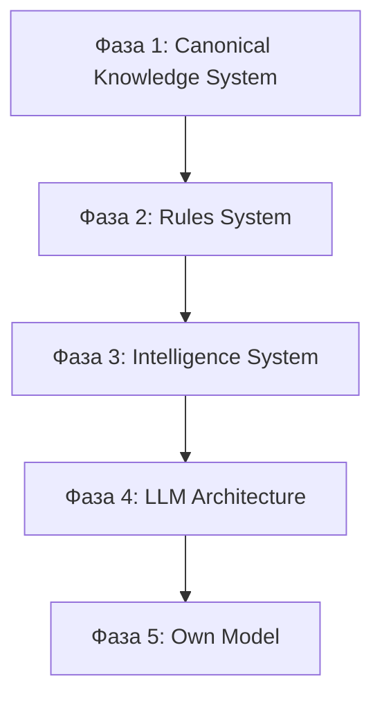

# Онтология мира и фазы построения TodayFlow

**Статус:** принято (канон **вида сверху** — где мы сейчас и в каком порядке строим систему).  
**Версия:** 1.0 (2026-05-31).  
**Владелец:** Product + Engineering.

**Роль:** зафиксировать, что TodayFlow **сейчас** на этапе «определяем фундамент **мира**», а не пользователя, экранов, API или LLM. Потребители данных — **последними**.

**Связь:** [CORE_PRODUCT_CANON.md](./CORE_PRODUCT_CANON.md), [REFERENCE_LAYER_AND_BUILD_ORDER.md](./REFERENCE_LAYER_AND_BUILD_ORDER.md), [DATA_ORIGINATION_AND_LIFECYCLE.md](./DATA_ORIGINATION_AND_LIFECYCLE.md), [DATA_OWNERSHIP_AND_CONSUMPTION_MAP.md](./DATA_OWNERSHIP_AND_CONSUMPTION_MAP.md), [PERSONAL_INTELLIGENCE_LAYER.md](./PERSONAL_INTELLIGENCE_LAYER.md), [PERSONAL_INTELLIGENCE_LAYER.md](./PERSONAL_INTELLIGENCE_LAYER.md), [PRODUCT_EXECUTION_TRACKER.md](./PRODUCT_EXECUTION_TRACKER.md).

---

## 0. Где мы сейчас

```
Сейчас:  «Определяем фундамент мира TodayFlow»
Не сейчас: пользователь как продукт · Today Screen · рекомендации · LLM · API · UI
```

**Главный вопрос этапа:**

> **Какие сущности существуют в мире TodayFlow, какие между ними связи и какие правила управляют этим миром?**

Пока этот вопрос не закрыт — всё остальное строится на **неполном фундаменте**.

**Риск:** начать проектировать **потребителей** данных (экраны, endpoints, промпты) раньше, чем существуют **источники истины** и **правила**.

**~80% будущей ценности** — не в модели и не в промптах, а в:

- справочниках (что существует),
- правилах (как считать и интерпретировать),
- карте интерпретаций,
- системе эволюции пользователя,
- системе обучения на поведении.

Именно это позволит **заменить внешнюю модель** без разрушения продукта.

---

## 1. Пять фаз (канонический порядок)



| Фаза | Название | На выходе | Мы **ещё не** здесь, если… |
|------|----------|-----------|----------------------------|
| **1** | Canonical Knowledge System | Система **знает, что существует** в мире TF | нет machine/content contract на домен |
| **2** | Rules System | Система **знает, как работать** со знаниями | правила в коде/промптах ad hoc |
| **3** | Intelligence System | Система **умеет учиться** | event → knowledge без confirm |
| **4** | LLM Architecture | Эффективное использование **внешнего** ИИ | новые промпты без Gate/dataset |
| **5** | Own Model | Классификаторы, ранжировщики, свои модели | нет dataset gate |

**Жёстко:** фазы **не перескакиваются**. Документы фаз 3–5 **можно** писать заранее (канон), **нельзя** внедрять в prod/API/UI до закрытия предшественника.

---

## 2. Фаза 1 — Canonical Knowledge System

**Цель:** все **источники истины** — что существует в онтологии TodayFlow.

### 2.1 Домены (мир)

| Домен | Сущности (примеры) | Канон / артефакт | Статус |
|-------|-------------------|------------------|--------|
| **Astrology Reference** | ZodiacSign, Planet, House, Aspect (atomic); composites → Composition Engine | AMC + ACM-Compose; `DATA/reference/astrology/machine/` | partial (39 atomic P0.8 ✅) |
| **Tarot Reference** | TarotCard, Spread, SpreadPosition | P0.3–P0.4; `DATA/reference/tarot/` | partial (22 major machine) |
| **Numerology Reference** | CoreNumber, MasterNumber, PersonalDay/Month/Year, LetterMapping | P0.5; `DATA/reference/numerology/` | partial (39 machine) |
| **Symbolic Assets Reference** | Stone, Symbol, SKU, stage/month gates | [REFERENCE_LAYER_AND_BUILD_ORDER.md](./REFERENCE_LAYER_AND_BUILD_ORDER.md) | missing catalog |
| **Practice Reference** | PracticeTemplate, Category | `rituals.json`, REFERENCE §6 | partial |
| **Goal Reference** | GoalCategory, GoalType | REFERENCE §6 | missing |
| **Habit Reference** | HabitType, streak rules | REFERENCE §6 | missing |
| **Emotion Reference** | MoodSlug, CheckInDimension, OperatingMode | check_ins, ritual slugs | partial |
| **Interpretation Reference** | meaning_id, L1–L4, multi-weight | [INTERPRETATION_LAYER_AND_REFERENCE.md](./INTERPRETATION_LAYER_AND_REFERENCE.md) | canon; catalog missing |
| **DayModel Reference** | Vector, Tempo, Risk, Dependency Map | [DAYMODEL_INPUT_CONTRACT.md](./DAYMODEL_INPUT_CONTRACT.md) | contract ✅; aggregation **P1.0** (after 3 SoT) |
| **Evolution Reference** | Path stages, PEG shape, ES factors | [USER_MODEL_TARGET_STATE.md](./USER_MODEL_TARGET_STATE.md), [EVOLUTION_CALCULATION_CONTRACT.md](./EVOLUTION_CALCULATION_CONTRACT.md) | canon ✅; no API |
| **Commerce Reference** | ranking rules, symbolic ↔ theme/stage | SYMBOLIC_ASSET doc | partial |

### 2.2 Обязательные артеfactы фазы 1

На каждую сущность — [DATA_ORIGINATION_AND_LIFECYCLE.md](./DATA_ORIGINATION_AND_LIFECYCLE.md) §2 (9 полей) + строка REFERENCE §6:

- **identity** (entity_code, domain)
- **Machine Contract** (где применимо)
- **Content Contract** (min viable)
- **status** (`draft` → `active`)
- **creation / filling policy** (§8 DOL)

### 2.3 Текущий прогресс фазы 1

| Готово | В работе | Не начато |
|--------|----------|-----------|
| Taxonomy 180, ownership map, origination canon | Tarot/Numerology machine; P0.7 AMC; P0.8–P0.9 astro | Goal/Habit/Symbolic/ILR catalogs; full 78 tarot; astro machine **drafts** |
| DayModel Input Contract, JSON Schema CI | Astrology unify under model | Reference read API v1 |
| Evolution + ECC **как канон** (не API) | Content layer numerology/tarot | Commerce reference rows |

**Критерий выхода из фазы 1 (Machine pillars):** три домена + **P0.9 PASS** ✅ → фаза 2 **P1.0** DayModel aggregation.

---

## 3. Фаза 2 — Rules System

**Цель:** после справочников — **правила**, как система оперирует знаниями. Не UI. Не LLM.

| Область правил | Документ / артефакт | Зависит от фазы 1 |
|----------------|---------------------|-------------------|
| Правила расчёта (formulas) | numerology service, astro calc, personal cycles | Numerology, Astro CD |
| Правила формирования DayModel | DAYMODEL §3 aggregation, **P1.0** | Tarot + Numerology + Astro machine (all three) |
| Правила интерпретации | ILR: Event → Interpretation Instance | Interpretation Reference |
| Подтверждение гипотез | KASP §5 confirmation gates | Emotion + behavioral refs |
| Эволюция пользователя | ECC + Gamification gates | Evolution Reference |
| Рекомендации (symbolic/practice) | SYMBOLIC doc, Practice machine tags | Symbolic, Practice, Goal refs |
| Подбор практик / активов | P2 REFERENCE + rules tables (TBD) | Practice, Symbolic refs |

**На выходе:** движки (Profile, Daily, DayModel, Selector) читают **CD + Rules**, пишут **DD/SN** — без invention в промпте.

**Текущий прогресс:** DayModel Dependency Map ✅; ECC ✅; ILR/KASP **канон** ✅; AMC **P0.7** ✅; aggregation **P1.0** ⬜ (не partial P0.6).

**Критерий выхода:** `day_model_v1` multi-source green CI; ECC fixtures; ILR instance contract in code; commerce ranking rules table `active`.

---

## 4. Фаза 3 — Intelligence System

**Цель:** система **учится** — от событий к знанию с confirm.

| Слой | Назначение | Канон |
|------|------------|-------|
| **Event Layer** | сырые действия | TODAY_PERSONALIZATION_CORE, meaning_events |
| **Signal Layer** | нормализованные сигналы | KASP |
| **Knowledge Layer** | Knowledge Atoms | UKM |
| **Memory Layer** | materialized SN | DATA_OWNERSHIP, CUM P0.8 |
| **Context Layer** | DayContext, CUM slices | DAY_CONTEXT_V0, USER_MODEL_TARGET_STATE |
| **Learning Layer** | feedback → update atoms | PIL § feedback |

**На выходе:** Event → Signal → Interpretation → Confirmation → Knowledge → Memory → Context Selection.

**Сейчас:** каноны ✅; код partial (events, fusion, internal_profile); **CUM P0.8** — gate перед evolution API.

**Критерий выхода:** UKM atom persistence; confirmation UI/path; CUM v1 read model; PIL reads SN not bulk ref.

---

## 5. Фаза 4 — LLM Architecture

**Цель:** не «своя модель», а **архитектура** эффективного использования внешнего ИИ.

| Компонент | Канон |
|-----------|-------|
| Prompt Refinement | PIL §7 |
| Context Selection | UKM top-K 15–30 atoms |
| Retrieval | PIL + reference codes |
| Evaluation | PIL quality gate |
| Distillation | template/cache paths |
| Dataset Building | AMLL Learning Signals |
| Fine-tuning Pipeline | PIL §12 backlog |

**На выходе:** LLM Call Gate **после** UKM; каждый call = Request/Response/Reaction record.

**Сейчас:** generation_logs partial; Gate backlog; **freeze** новых промптов до фазы 1–2 P0.

**Критерий выхода:** Gate v1 in prod path; dataset status on all narrative calls; eval blocks bad output.

---

## 6. Фаза 5 — Own Model

**Цель:** когда накоплены events, knowledge, interpretations, confirmations, reactions, successful outputs.

| Артеfact | Предшествует |
|----------|--------------|
| Классификаторы / ранжировщики | labeled dataset from фаза 4 |
| Локальные / специализированные модели | domain dataset gate |
| Собственная большая модель | ROI + privacy + eval parity |

**Сейчас:** ⬜ intentionally last.

---

## 7. Что **не** делать на текущем этапе

| Запрещено как «следующий шаг» | Почему |
|-------------------------------|--------|
| Новые экраны / Today UI redesign | нет полного мира + DayModel v1 |
| Новые публичные API «для фичи» | API = projection SN, не источник истины |
| `evolution_stage` в REST | фаза 2 не закрыта + нет CUM |
| Новые LLM-промпты «на весь день» | фаза 4; сейчас фаза 1–2 |
| UEM / Commerce **как driver** roadmap | consumers; нужны personal month/year **machine** + rules |
| Bulk LLM на reference | нет Intelligence Layer gate |

**Разрешено:** багфиксы, i18n без смены смысла, CI, **draft** CD records, канон-документы, тесты контрактов, loader/aggregator **без** prod UI wiring.

---

## 8. Согласование с тактическим P0 (Reference Layer)

Тактическая очередь — подмножество **фазы 1 + начало фазы 2**:

```
P0.5 Numerology machine ✅
  → P0.7 Astrology Machine Contract ✅
  → P0.8 Astro machine drafts
  → P0.9 Cross-domain validation (three pillars)
  → P1.0 DayModel multi-source (Rules — фаза 2)
  → P1.1 CUM → ECC → UEM-2
```

[PERSONAL_INTELLIGENCE_LAYER.md](./PERSONAL_INTELLIGENCE_LAYER.md) §2 Global Build Order — **горизонтальный** срез; **этот документ** — **вертикальные фазы** (1→5).

| PIL # | PIL слой | Фаза |
|-------|----------|------|
| 1, 1a, 2 | Reference, DOL, Ownership | **1** |
| DayModel, ECC, ILR, KASP rules | | **2** |
| 3a–3b, 4–6 | KASP, UKM, Profile, Memory, DayContext | **3** |
| 7–8, 7b | Prompt refinement, Eval, AMLL | **4** |
| 11–12 | Dataset, Own model | **5** |

---

## 9. Чеклист «честный взгляд сверху»

Перед любой задачей спросить:

1. **Какая фаза?** (1–5)  
2. **Какая сущность мира?** (строка §2.1 или DOL §7)  
3. **Creation method?** (DOL §3)  
4. **Это consumer?** Если да — есть ли уже CD + Rules?  
5. **Learning output?** Только если фаза ≥3 и KASP channel exists.

Если ответы 1–4 неясны — задача **отложить**.

---

## 10. Changelog

- **1.0 (2026-05-31)** — пять фаз, текущий этап «онтология мира», 80% thesis, запрет consumer-first, mapping P0 + PIL.

---

*При смене фазового статуса домена — точечная запись в PRODUCT_EXECUTION_TRACKER, не отдельный audit.*
