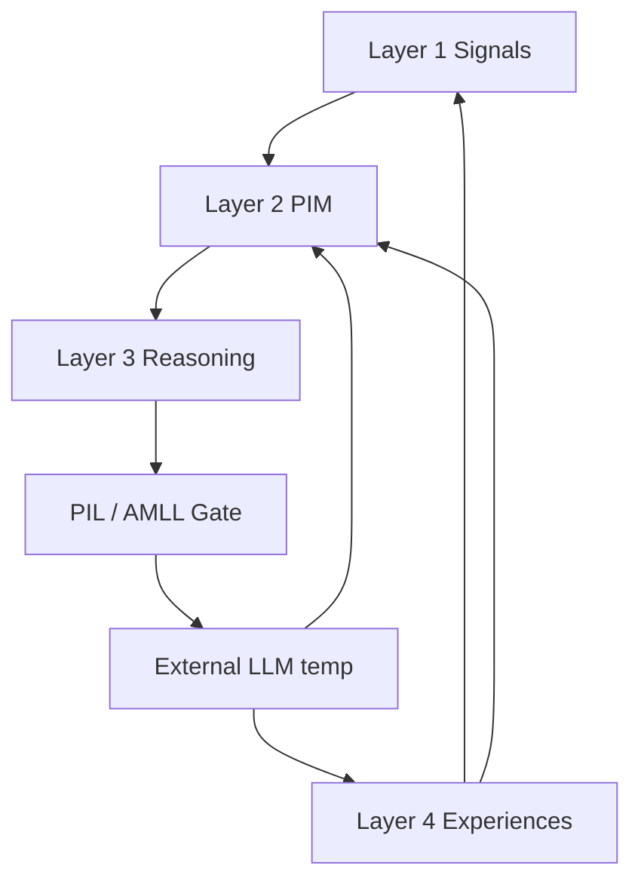
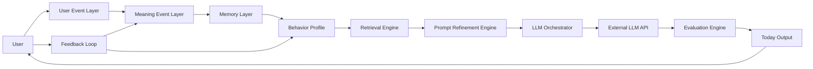

# Personal Intelligence Layer (PIL)

**Статус:** принято (сквозной архитектурный канон).  
**Версия:** 2.3 (2026-07-02).  
**Владелец:** Product + Engineering.

**Уровень:** рядом с [USER_MODEL_TARGET_STATE.md](./USER_MODEL_TARGET_STATE.md) (**зачем**), [REFERENCE_LAYER_AND_BUILD_ORDER.md](./REFERENCE_LAYER_AND_BUILD_ORDER.md), [DAYMODEL_INPUT_CONTRACT.md](./DAYMODEL_INPUT_CONTRACT.md), [DATA_OWNERSHIP_AND_CONSUMPTION_MAP.md](./DATA_OWNERSHIP_AND_CONSUMPTION_MAP.md).

**Связь:** [USER_MODEL_TARGET_STATE.md](./USER_MODEL_TARGET_STATE.md) (4 выхода, CUM), [USER_KNOWLEDGE_MODEL.md](./USER_KNOWLEDGE_MODEL.md), [INTERPRETATION_LAYER_AND_REFERENCE.md](./INTERPRETATION_LAYER_AND_REFERENCE.md), [PERSONAL_INTELLIGENCE_LAYER.md](./PERSONAL_INTELLIGENCE_LAYER.md), [API_MEMORY_AND_LEARNING_LAYER.md](./API_MEMORY_AND_LEARNING_LAYER.md), [DATA_OWNERSHIP_AND_CONSUMPTION_MAP.md](./DATA_OWNERSHIP_AND_CONSUMPTION_MAP.md), [PERSONAL_INTELLIGENCE_LAYER.md](./PERSONAL_INTELLIGENCE_LAYER.md), [TODAY_PERSONALIZATION_CORE.md](./TODAY_PERSONALIZATION_CORE.md), [DAY_CONTEXT_V0.md](./DAY_CONTEXT_V0.md), [DAY_CONTEXT_V0.md](./DAY_CONTEXT_V0.md).

---

## 0. Жёсткий канон

### Every feature must be learning-aware.

Каждый экран, справочник, трекер, ответ, чек-ин и API-вызов проектируется так, чтобы **с первого дня**:

1. **создавать обучающие события** (Learning Output);
2. **обновлять память** (Memory Layer);
3. **улучшать следующий запрос** к LLM/API (Prompt Refinement);
4. **накапливать training dataset** для будущей собственной модели;
5. **не ломать приватность** и контроль данных пользователя.

PIL — **не модуль «когда-нибудь»**, а **обязательный посредник** между продуктовыми слоями, памятью, внешним LLM/API и будущей собственной моделью.

**North star:** [USER_MODEL_TARGET_STATE.md](./USER_MODEL_TARGET_STATE.md) — Intelligence производит **Compact User Model**, не events/memory dump.

### Ключевая мысль

TodayFlow **не** проектируется как приложение, которое «использует LLM».

TodayFlow — **обучающаяся персональная система**, где LLM/API — **временный исполнитель**, а не мозг продукта.

**Центральный артефакт:** [PERSONAL_INTELLIGENCE_MODEL_V1.md](./PERSONAL_INTELLIGENCE_MODEL_V1.md) (PIM). **Единица знания:** Knowledge Atom ([USER_KNOWLEDGE_MODEL.md](./USER_KNOWLEDGE_MODEL.md)). **Домен намерений:** [INTENT_MODEL_V1.md](./INTENT_MODEL_V1.md). PIL — **процесс** вокруг PIM, не дублирует его.

**Reasoning:** два двигателя — **DRE** (день) и **LRE** (обучение); не смешивать в одном prompt.

**Signal ≠ Interpretation (C14):** observation → ILR → atom с `evidence_chain`; не писать выводы в PIM так же охотно, как факты.

**Contradiction (C15):** система **меняет мнение** через Contradiction Event — живая модель, не архив старых labels.

**Temporal Identity (C16):** различать **model_error**, **person_evolution**, **context_shift** — исторический PIM, не статичный профиль.

**Decision Relevance (C17):** что из знания **важно для решений** — ranking для DRE, LRE, Gate.

**PR gate:** три контура — Experience · Architecture · **Learning Δ** — [PIM_PR_GATE_V1.md](./PIM_PR_GATE_V1.md). **North star:** [PIM_PRODUCT_NORTH_STAR.md](./PIM_PRODUCT_NORTH_STAR.md).

Собственный интеллект живёт в архитектуре:

```
Events → Signals → Knowledge → Memory → Context → Prompt → Gate → Output → Feedback → Training
```

См. [USER_KNOWLEDGE_MODEL.md](./USER_KNOWLEDGE_MODEL.md) — **событие ≠ знание**; без UKM память становится свалкой events.

---

## 1. Роль слоя

Personal Intelligence Layer отвечает за **семь функций**:

| # | Функция | Что делает |
|---|---------|------------|
| 1 | **Memory** | что система знает о пользователе (8 типов, §5) |
| 2 | **Behavior Learning** | что реально работает по поведению |
| 3 | **Context Selection** | какой slice данных идёт в запрос |
| 4 | **Prompt Refinement** | как уточнять запрос к API |
| 5 | **Response Evaluation** | можно ли показать ответ |
| 6 | **Feedback Loop** | как реакция улучшает будущие ответы |
| 7 | **Training Dataset** | что сохраняется для future fine-tune / own model |

**Позиция в stack:** PIL стоит **между всеми продуктовыми слоями и LLM**, не сбоку.

### Было (устаревшая схема)

```
Reference Layer → Profile → Daily Engine → LLM → Today
```

### Должно быть (канон)

```
Signals → PIM (Personal Intelligence Model) → Reasoning
  → Personal Intelligence Layer / AMLL Gate
  → LLM/API (временно) → Evaluation → Experience → Feedback → PIM
```

См. [PERSONAL_INTELLIGENCE_MODEL_V1.md](./PERSONAL_INTELLIGENCE_MODEL_V1.md) — **запрещено** Experience → LLM напрямую.

### Устаревшая схема (только как историческая)

```
Reference Layer → Profile → Daily Engine
  → Personal Intelligence Layer
  → LLM/API → …
```



*(Детали: [PERSONAL_INTELLIGENCE_MODEL_V1.md](./PERSONAL_INTELLIGENCE_MODEL_V1.md).)*

---

## 2. Global Build Order

**Вертикальные фазы (1→5):** [ONTOLOGY_AND_FOUNDATION_PHASES.md](./ONTOLOGY_AND_FOUNDATION_PHASES.md) — **читать первым** для приоритизации. Ниже — горизонтальный срез PIL; output surfaces (9+) только после фазы 1–2 P0.

Порядок построения **всего продукта** (не только справочников). Справочники — шаг 1; PIL — шаг 3 **до** новых output surfaces.

| # | Слой | Документ / артефакт | Статус |
|---|------|---------------------|--------|
| 1 | Reference Layer | [REFERENCE_LAYER_AND_BUILD_ORDER.md](./REFERENCE_LAYER_AND_BUILD_ORDER.md) | 🟡 P0 in progress |
| 1a | **Data Origination & Lifecycle** | [DATA_ORIGINATION_AND_LIFECYCLE.md](./DATA_ORIGINATION_AND_LIFECYCLE.md) | ✅ |
| 2 | Data Ownership Map | [DATA_OWNERSHIP_AND_CONSUMPTION_MAP.md](./DATA_OWNERSHIP_AND_CONSUMPTION_MAP.md) | ✅ |
| 3 | **Personal Intelligence Architecture** | **этот документ** | ✅ v2 |
| 2b | **Interpretation Layer** | Reference + Engine — [INTERPRETATION_LAYER_AND_REFERENCE.md](./INTERPRETATION_LAYER_AND_REFERENCE.md) | ✅ canon; ⬜ code |
| 3a | **Knowledge Acquisition Policy** | [KNOWLEDGE_ACQUISITION_AND_SIGNAL_POLICY.md](./KNOWLEDGE_ACQUISITION_AND_SIGNAL_POLICY.md) | ✅ |
| 3b | **User Knowledge Model** | Knowledge Atoms — [USER_KNOWLEDGE_MODEL.md](./USER_KNOWLEDGE_MODEL.md) | ✅ canon; ⬜ code |
| 4 | Profile Layer | CoreProfile, Profile Engine | 🟡 |
| 5 | Memory Layer | materialized SN from knowledge | 🟡 partial |
| 6 | Daily Context Builder | [DAY_CONTEXT_V0.md](./DAY_CONTEXT_V0.md) | 🟡 |
| 7 | Prompt Refinement Engine | `PromptRefinementOutput` (backlog) | ⬜ |
| 7b | **API Memory & Learning** | Gate **после UKM**, Request/Response, cache ROI — [API_MEMORY_AND_LEARNING_LAYER.md](./API_MEMORY_AND_LEARNING_LAYER.md) | 🟡 partial; Gate backlog |
| 8 | Evaluation Engine | quality gate, O8/O10 | 🟡 partial |
| 9 | Output Surfaces | Today, Tarot, Horoscope UI | 🟡 legacy |
| 10 | Feedback Loop | meaning events, fusion | 🟡 partial |
| 11 | Training Dataset | пары для future model | ⬜ |
| 12 | Fine-tuning / Own Model | после dataset gate | ⬜ |

**Freeze:** нельзя строить пункты 9+ как **новые** фичи без явного Learning Output и PIL trace (§4).

**Data-first:** новые экраны/API — только как consumers существующих SN; см. [DATA_ORIGINATION_AND_LIFECYCLE.md](./DATA_ORIGINATION_AND_LIFECYCLE.md) §0.

---

## 3. Правило для всех модулей: два выхода

Каждый модуль **обязан** иметь два выхода:

| Выход | Назначение |
|-------|------------|
| **Product Output** | То, что видит пользователь |
| **Learning Output** | То, чему учится система |

### Today

| Product Output | Learning Output |
|----------------|-----------------|
| совет дня, карта, число, действия | открыл ли карту; выполнил ли действие; что сохранил; где проигнорировал; изменилось ли состояние вечером |

### Tarot

| Product Output | Learning Output |
|----------------|-----------------|
| карта, трактовка, совет | какие карты вовлекают; какие темы сохраняет; какие трактовки игнорирует; повторяющиеся вопросы |

### Calendar

| Product Output | Learning Output |
|----------------|-----------------|
| месяц, прогресс, ритм | реальные циклы поведения; пропуски; сильные/слабые дни; повторяющиеся состояния |

### Compatibility

| Product Output | Learning Output |
|----------------|-----------------|
| tier · условия · сценарии · next step | какие сценарии резонируют; какие выводы подтверждает; какие сферы отношений важны сейчас |

### Profile

| Product Output | Learning Output |
|----------------|-----------------|
| living portrait · паттерны · «что меняется» | какие выводы точны / неточны; что изменилось; новые интересы и приоритеты |

**DoD любой новой фичи:** в PR/задаче указаны оба выхода + `event_type`(ы) + целевая память + запреты LLM.

### 3.1 Interaction Loop *(в каждом разделе · не вечерний допрос)*

**Жёсткое правило:** при **каждом** взаимодействии пользователя с продуктом система:

1. **читает** из Compact User Model / Profile slice (atoms top-K, intent, rhythm, не сырой event log);
2. **даёт** персонализированный Product Output из этого slice;
3. **получает** минимальный Learning Output (explicit или behavioral);
4. **пишет** signal → confirmation path → atom / intent update.

```
Profile (CUM) ──read──► Surface ──give──► User
       ▲                    │
       └── write ◄── learn ◄┘
```

**Запрещённый анти-паттерн:** один экран «сбора данных» (вечерний опросник, onboarding quiz, modal «расскажи о себе») **без** give на том же шаге и **без** micro-signals в остальных точках дня.

| Раздел | Что берём из Profile | Что даём пользователю | Что узнаём (micro-signals) |
|--------|----------------------|------------------------|----------------------------|
| **Today** | mood · focus · promise · rhythm · top atoms | понимание дня · ритуал · практика · обещание | состояние · фокус · карта · число · исход обещания · *опционально* вечерний chip |
| **Tarot** | recurring themes · past spreads · intent | трактовка · совет · контекст вопроса | вопрос · «это про меня?» · save/dismiss · повтор тем |
| **Compatibility** | relationship atoms · scenario history | tier · условия · next step | сценарий · подтверждение вывода · сфера отношений |
| **Profile** | full CUM · evolution · contradictions | living portrait · «что меняется» | confirm / edit / «не про меня» · новый интерес |
| **Maps** *(Profile layer)* | temporal atoms · cross-map patterns · CUM top-K | heatmap · journey · observation stories · drill-down L3 | map view · day tap · share · «не про меня» на insight · wish check-in |

**Evening на Today** — **одна** из ~6–8 touchpoints за день, не главный канал обучения. Основной поток — ритуал, обещание, подтверждения по ходу, implicit dwell/skip. **Maps** накапливают **все** touchpoints — не только вечер.

**Паритет:** web · iOS · Android — те же `event_type` и те же CUM fields на touchpoint. См. [SCREEN_CONTRACTS_V1.md](./SCREEN_CONTRACTS_V1.md) §1.

### 3.2 Micro-signal policy *(ненавязчивость)*

| Правило | Смысл |
|---------|--------|
| **MS1 — Give before ask** | Нельзя спрашивать без персонализированной отдачи на том же экране или непосредственно перед вопросом |
| **MS2 — One explicit ask per moment** | Не более одного explicit вопроса на micro-moment; chips предпочтительнее textarea |
| **MS3 — Staleness, not daily gate** | mood · focus · state — спрашивать когда **нет или устарело** (TTL), не каждое открытие |
| **MS4 — Skip is signal** | `skip` / dismiss пишется в Learning Output; не блокировать продукт |
| **MS5 — Confirm hypotheses** | L3 inferred — через «это про тебя?», не как факт в UI |
| **MS6 — Session budget** | ≤3 explicit micro-asks за сессию на surface; остальное — behavioral |

Implementation anchor (web): `frontend/src/lib/pimSectionInteraction.ts`.  
CUM read: `GET /account/compact-user-model`.  
Explicit L1 write: `explicit_l1_knowledge_v0` on `POST /meaning/events`.  
Pattern/hypothesis write: `meaning_derived_knowledge_v0` (3+ hypothesis · 7+ active knowledge gate).

### 3.3 Maps loop *(Today → PIM → Profile)*

**Канон продукта:** [TODAYFLOW_PRODUCT_MODEL.md](./TODAYFLOW_PRODUCT_MODEL.md) §4.10 · [PROFILE_SCREEN_MASTER.md](./PROFILE_SCREEN_MASTER.md) §7.

Maps — **Product Output** накопленного Learning Output. Каждая Map entity в PR обязана иметь:

| # | Поле |
|---|------|
| 1 | `event_type`(ы) источника (Today · Tarot · Growth services) |
| 2 | CUM / atom fields для aggregation |
| 3 | Map render contract (L1 visual · L3 drill-down story) |
| 4 | User correction path на generated observation |
| 5 | Запрет mechanism copy (§5.8 Product Model) |

```
Today touchpoint → signal → atom → map_aggregate_v* → story_render → Profile Map UI
                                      ↑                                    │
                                      └──────── confirm / correction ──────┘
```

**DoD Map feature:** Learning Δ > 0 · observation copy проходит EXPLAIN_MEANING · web/iOS/Android event parity.

---

## 4. Что нельзя строить без PIL

Пока не зафиксировано для фичи:

- какие **события** она пишет;
- какие данные идут в **память**;
- какие данные идут в **training dataset**;
- какие данные **запрещены** для LLM;
- как пользователь может **исправить** вывод системы;

**запрещено** (новые scope, не bugfix):

| Запрещено | Почему |
|-----------|--------|
| Today Screen (новые блоки / layout) | нет Learning Output contract |
| новые промпты / LLM-вызовы | нет Prompt Refinement + Evaluation trace |
| генерация практик | нет Behavioral Memory loop |
| recommendation engine | нет ranking + negative memory |
| календарная аналитика | нет episodic → behavior pipeline |
| profile refinement | нет user correction loop |
| «умные» уведомления | нет preference + rhythm signals |

См. также freeze в [REFERENCE_LAYER_AND_BUILD_ORDER.md](./REFERENCE_LAYER_AND_BUILD_ORDER.md).

---

## 5. Канонический словарь событий (verbs)

Базовые **глаголы** (маппятся на `event_type` в [TODAY_PERSONALIZATION_CORE.md](./TODAY_PERSONALIZATION_CORE.md) и расширяются осознанно, web + iOS + Android):

| Verb | Смысл | Пример `event_type` / backlog |
|------|-------|-------------------------------|
| `view` | блок попал в viewport | `today_day_history_first_visible` |
| `open` | раскрыл деталь | `sphere_opened`, `today_guide_why_opened` |
| `skip` | пропустил шаг / закрыл без действия | backlog |
| `save` | сохранил текст / карту | backlog |
| `complete` | довёл до конца | `focus_completed`, `practice_completed` |
| `dismiss` | явно отклонил | backlog |
| `edit` | исправил системный вывод | backlog (user correction) |
| `rate` | оценил точность | `sphere_feedback`, `feedback_questions` |
| `reflect` | вечерняя рефлексия | `evening_reflection_submitted` |
| `ask_followup` | уточняющий вопрос | Guidance backlog |
| `change_goal` | сменил цель / приоритет | `goal_created`, backlog |
| `change_mood` | сменил состояние | `mood_selected` |
| `relapse` | срыв привычки / аскезы | tracker backlog |
| `return_after_gap` | вернулся после паузы | session backlog |

**Payload:** `day_key`, `surface`, опционально `generation_id`, `entity_id`, `duration_ms`.

---

## 6. Главная петля (runtime)



**Цепочка в одну строку:**

Пользователь → события → память → профиль → контекст → **уточнённый** запрос к LLM → ответ → реакция → обучение системы.

**Связь с data ownership:** PIL читает **SN/RT slices** (CoreProfile, DayContext, Behavior Profile, Daily Memory), а не bulk Reference Layer. См. [DATA_OWNERSHIP_AND_CONSUMPTION_MAP.md](./DATA_OWNERSHIP_AND_CONSUMPTION_MAP.md).

---

## 7. Порядок зрелости (не начинать с собственной модели)

| Этап | Что строим | Статус в продукте |
|------|------------|-------------------|
| **1** | Внешняя LLM через API | ✅ `ai_client`, `today_narrative` |
| **2** | Слой памяти и поведения | 🟡 `meaning_events`, `behavior_patterns`, `LearningService`, `internal_profile` |
| **3** | Prompt Refinement Engine | 🟡 bundle в `build_today_narrative`, `profile_prompt_slices_v0`, DE-12 |
| **4** | Evaluation Engine | 🟡 semantic validation, RU quality gate, O8/O10 post-processors |
| **5** | Dataset (успех / reject / human fix) | ⬜ backlog §10.5 PIL |
| **6** | Fine-tuning | ⬜ только после тысяч стабильных кейсов |
| **7** | Своя модель / малые специализированные модели | ⬜ после этапов 1–6 |

**Правило:** до этапа 5 «обучение» идёт **без** дообучения весов модели — через memory update, behavior scoring, prompt adaptation, retrieval ranking, recommendation ranking, evaluation rules.

---

## 8. Слои Personal Intelligence (детализация)

**Каноническая пятёрка** (между Event и LLM):

1. User Event Layer  
2. Learning Signal Layer  
3. **Interpretation Layer** — [INTERPRETATION_LAYER_AND_REFERENCE.md](./INTERPRETATION_LAYER_AND_REFERENCE.md)  
4. **User Knowledge Model**  
5. Memory Layer  
6. Context Selection Layer  

Ниже — детализация слоёв 1–2 и 4; Knowledge — отдельный канон.

### 8.1 User Event Layer (сырьё)

Собирает **все значимые** действия пользователя. Канон имён для Today — [TODAY_PERSONALIZATION_CORE.md](./TODAY_PERSONALIZATION_CORE.md#шаг-2-события-которые-учат-систему-tracking).

| Категория | Примеры | Транспорт |
|-----------|---------|-----------|
| Ритуал / Today | `tarot_selected`, `mood_selected`, `number_selected`, `head_topic_selected` | `POST /meaning/events` |
| Взаимодействие с текстом | `sphere_opened`, `sphere_feedback`, `today_guide_why_opened`, `today_day_history_first_visible` | meaning events |
| Действия | `action_option_selected`, `focus_started`, `focus_completed`, `practice_completed`, `support_selected` | meaning events |
| Настройки / формат | `today_narrative_depth_changed` | meaning events |
| Вечер / итог | `evening_reflection_submitted` | meaning events |
| Создание сущностей | `goal_created`, `habit_created` | tracking + meaning |
| Неявные сигналы (backlog) | dwell time, scroll depth, dismiss, save, delete, skip | client → meaning или analytics |

**Ownership:** клиент **создаёт** событие; backend **владеет** записью (`meaning_events`, tracking tables).  
**Правило:** один словарь `event_type` для **web + iOS + Android**; payload с `day_key`, опционально `generation_id`.

**Код:** `VALID_EVENT_TYPES`, `RING_EVENT_WEIGHTS`, `tests/test_meaning_events.py`.

---

### 8.2 Meaning Event Layer (поведение → смысл)

Не все события равны. Слой **интерпретирует** поток в устойчивые смыслы.

| Наблюдаемое поведение | Извлекаемый смысл | Куда пишется |
|----------------------|-------------------|--------------|
| 5× пропуск утренней практики | Утро — плохое окно для практик | Behavioral Memory, `negative_memory` |
| Сохраняет тексты про контроль | Тема контроля значима | Semantic Memory |
| Игнорирует длинные гороскопы | Нужен короткий формат | Preference Memory → `format: short` |
| Часто выбирает «устал» | Низкий темп рекомендаций | Profile Memory → `energy_mode: low` |
| Выполняет телесные практики | Body-based practices работают | Behavioral Memory → `recommend: body` |

**Ownership:** Meaning Engine (агрегаторы) **создаёт** смыслы; Behavior Profile **владеет** агрегатами.

**Код сегодня:** `build_meaning_surface_patterns_v0` → proto-knowledge (counts, not atoms). **Цель:** `user_knowledge_atoms` + `DayContext.layers.user_knowledge` — [USER_KNOWLEDGE_MODEL.md](./USER_KNOWLEDGE_MODEL.md) §11.

**Пороги:** см. anti-personalization guard в [PERSONAL_INTELLIGENCE_LAYER.md](./PERSONAL_INTELLIGENCE_LAYER.md) §10.12 — `observation → weak signal → pattern → stable pattern`.

---

### 8.3 Behavior Profile

**Не анкета.** Профиль, построенный по поведению. Хранит агрегаты с источником, окном и версией.

| Поле / ось | Пример значения | Источник |
|------------|-----------------|----------|
| `preferred_format` | `short` \| `normal` \| `deep` | depth changes, read/skip signals |
| `sensitive_topics` | `control`, `relationships` | semantic memory |
| `working_practices` | `body_2min`, `breath` | completions |
| `non_working_practices` | `morning_routine` | skips, negative feedback |
| `discipline_level` | 0–1 score | focus completion rate |
| `activity_rhythm` | `evening_peak` | time-of-day aggregates |
| `common_slips` | `overload_friday` | episodic patterns |
| `triggers` | `long_text`, `abstract_advice` | reject / dismiss |
| `best_hours` | `[19, 20, 21]` | implicit timing |
| `recurring_themes` | `work`, `money` | head_topic, diary |
| `recommendation_style` | `calm_direct` | feedback + corrections |

**Где живёт:** `internal_profile` / `core_profile.living.learning_context` / `DayContext.layers.internal_profile` (visible vs internal — DE-12).

**Кто читает:** Retrieval Engine, Prompt Refinement Engine — **не** UI напрямую (кроме opt-in «как мы тебя понимаем»).

**Кто пересчитывает:** batch/incremental job по `meaning_events` + feedback; не на каждый HTTP-запрос целиком.

---

### 8.4 Memory Layer (8 типов)

| Тип памяти | Что хранит | Data type | Пример |
|------------|------------|-----------|--------|
| **Static Memory** | Редко меняющиеся факты | SN | CoreProfile: знак, число, natal snapshot |
| **Profile Memory** | Устойчивые паттерны личности | SN | psychotype tags, living layer |
| **Behavioral Memory** | Что реально работает | SN | working/non-working practices |
| **Episodic Memory** | Конкретные дни и события | SN/RT | `day_history_v0`, fusion scores по датам |
| **Preference Memory** | Нравится / не нравится | SN | format, tone, depth |
| **Semantic Memory** | Смысловые темы | SN | control, relationships, burnout |
| **Negative Memory** | Что **не** предлагать | SN | `avoid: morning-heavy`, rejected advice ids |
| **Training Memory** | Пары для future model | SN (immutable log) | context slice + prompt + response + reaction |

**Training Memory** — append-only store для §13; не смешивать с runtime preference updates.

**Правило:** в LLM уходит **сжатый slice**, не сырой лог событий и не полный справочник.

**Код:** CoreProfile SN · `history_layer_v0` · `behavior_patterns` · `LearningService.build_learning_context` · `generation_logs`.

---

## 9. Context Selection (Retrieval Engine)

LLM **не** получает весь профиль. Retrieval выбирает **релевантный срез** по surface.

### 9.1 Today (guide / day_layer)

| Slice | Лимит / приоритет |
|-------|-------------------|
| CoreProfile short | знак, число, ключевые паттерны |
| DayContext SN | `day_model`, rhythm, intent, conflict |
| Последние 7 дней | `day_history_v0`, fusion deltas |
| Активные цели | top-N релевантных |
| Behavior patterns | top-3 stable |
| Negative memory | avoid list |
| Подходящие практики | filtered by Behavioral Memory |

### 9.2 Tarot

| Slice | |
|-------|---|
| Card snapshot | id + machine scores |
| User question | if any |
| Похожая история | last N same arcana / suit |
| Emotional state | mood from DayContext |
| Current theme | head_topic / semantic memory |

### 9.3 Horoscope

| Slice | |
|-------|---|
| Natal snapshot | from CoreProfile SN |
| Transit snapshot | daily, not recalc natal |
| Active life areas | spheres / goals |
| Current period | calendar rhythm |
| Format constraints | from Behavior Profile |

**Код:** Profile Selector, `_attach_profile_slices`, `_attach_day_history_to_llm_pack`, `_fusion_slim_for_prompt`.

**Selector evaluation:** тесты «вход → ожидаемый slice», см. PIL §10.3.

---

## 10. Prompt Refinement Engine

Каждый запрос уточняется по: **цели**, **surface**, **длине**, **тону**, **энергии**, **рискам**, **прошлым реакциям**, **запретам**, **working patterns**.

### 10.1 Решения до вызова LLM

| Вопрос | Пример решения |
|--------|----------------|
| Цель ответа | `guide` \| `day_layer` \| `spheres` \| `tarot_reading` |
| Surface | `today_practice`, `today_guide`, `horoscope_transit` |
| Тон | `calm_direct`, `warm`, `neutral` |
| Длина | `max_chars: 500`, `depth: quick` |
| Какие данные **нужны** | CoreProfile short, DayContext, 3 behavior patterns |
| Какие данные **не нужны** | bulk tarot content, full natal ephemeris |
| Темы исключить | из Negative Memory |
| Рекомендации не повторять | rejected / yesterday duplicate |
| Допустимое давление | `low` при `energy_mode: low` |
| Формат | structured JSON contract version |

### 10.2 Пример refinement

**Сигналы:** часто «устал», не делает утренние практики, сохраняет короткие советы, игнорирует длинные объяснения.

**Неправильный запрос:** «Сделай практику дня».

**Правильный refined request (machine):**

```json
{
  "surface": "today_practice",
  "format": "short",
  "energy_mode": "low",
  "avoid": ["morning-heavy routines", "long_explanation"],
  "recommend": ["2-minute body practice"],
  "tone": "calm_direct",
  "max_length_chars": 500,
  "do_not_include": ["generic_horoscope", "repeat_yesterday_advice"]
}
```

**Код сегодня:** частично в `_fusion_slim_for_prompt`, `profile_prompt_slices_v0`, `user_core.learning`, system paragraphs по `PROMPT_VER`.  
**Цель:** явный контракт `PromptRefinementOutput` + лог в `generation_logs.input_payload`.

---

## 11. LLM Orchestrator

Отдельный слой управления **всеми** генерациями. См. также Generation Orchestrator в [PERSONAL_INTELLIGENCE_LAYER.md](./PERSONAL_INTELLIGENCE_LAYER.md) §11.

| Вопрос | Решение |
|--------|---------|
| Нужен ли LLM? | Да / нет (детерминированный блок, кэш, fallback template) |
| Какая модель? | `cheap` / `standard` / `premium` по surface и confidence |
| Какие данные дать? | Только slice из Retrieval |
| Какой prompt template? | По surface + `prompt_version` registry |
| Нужен ли retrieval? | Да / нет; RAG по Co slice by `entity_code` |
| Какая память? | `static` / `behavior` / `episodic` — по матрице surface |
| Сохранять ответ? | Да → `generation_logs` + `generation_id` |
| Оценивать ответ? | Да → Evaluation Engine до UI |

**Правило freeze (Phase 0):** не размножать новые промпты и монолитные surface без Reference P0 и без orchestrator trace. DE-13 — узкие LLM-вызовы вместо одного `surface=guide`.

**Код:** `build_today_narrative` (единая точка для Today narrative surfaces).

---

## 12. Feedback Loop

После ответа система фиксирует **обучающие** сигналы, не только аналитику.

| Сигнал | event / metric | Влияние |
|--------|----------------|---------|
| Открыт блок | `sphere_opened`, visibility events | engagement score |
| Дочитан | scroll / time (backlog) | format preference |
| Сохранён | save action (backlog) | semantic importance |
| Рекомендация выполнена | `practice_completed`, `focus_completed` | Behavioral Memory + |
| Оценка | `feedback_questions`, `sphere_feedback` | Preference Memory |
| Возврат позже | session / evening | episodic weight |
| Настроение после практики | mood delta | outcome model |
| Игнор / dismiss | skip, no open | Negative Memory |

**Привязка:** `generation_id` + `day_key` + `surface` + `prompt_version`.

**После показа события обновляют:**

- Behavior Profile  
- Preference Memory  
- Negative Memory  
- Recommendation Scores  
- Prompt Strategy (refinement rules)

**Правило UX:** не говорить пользователю «обучаем нейросеть» — формулировки про точность для него ([PERSONAL_INTELLIGENCE_LAYER.md](./PERSONAL_INTELLIGENCE_LAYER.md) §6).

---

## 13. Training Dataset Layer

Сохраняем **пары** для будущей собственной модели (Training Memory, append-only):

| Поле | Описание |
|------|----------|
| `context_slice` | что ушло в retrieval (hash + version) |
| `prompt_refined` | refined request + `prompt_version` |
| `model_response` | сырой ответ API |
| `evaluation_result` | pass / fail / regen / fallback |
| `user_reaction` | events + ratings после показа |
| `final_accepted_output` | что реально увидел пользователь |

**Источник сегодня:** `generation_logs.input_payload` + `generation_logs.output` + linked `meaning_events`.  
**Канон полного lifecycle:** [API_MEMORY_AND_LEARNING_LAYER.md](./API_MEMORY_AND_LEARNING_LAYER.md) (Gate, Request/Response Record, Learning Signal, dataset status).  
**Backlog:** dedicated `training_examples` table + export для fine-tune.

**Gate для fine-tuning:** см. §16; не начинать до стабильных категорий и тысяч **accepted** пар.

---

## 14. Evaluation Engine

Перед показом (или перед сохранением в cache) — проверка качества.

### 14.1 Чеклист (v0 rules → v1 LLM-evaluator)

| Проверка | Действие при fail |
|----------|-------------------|
| Соответствует DayContext | regen с narrower slice |
| Не противоречит CoreProfile / Negative Memory | regen / fallback |
| Не слишком общий | semantic validation |
| Не слишком длинный | O8 finalize / truncate |
| Есть конкретное действие | regen |
| Не повторяет вчера | dedup post-processor |
| Соблюдает constraints (avoid, format) | regen |
| Подходит тону пользователя | prompt adjustment |

**Код:** `ai_client` semantic checks, RU quality gate, `_finalize_day_layer_payload_o8`, `strip_llm_meta_commentary`, grounded fallbacks.

**Правило:** плохой ответ **не показывать** сразу — узкая перегенерация или quality fallback ([PERSONAL_INTELLIGENCE_LAYER.md](./PERSONAL_INTELLIGENCE_LAYER.md) §10.7).

---

## 15. Как система «обучается» (без fine-tuning)

| Механизм | Что меняется | Частота |
|----------|--------------|---------|
| **Memory update** | episodic, preference, negative | после событий / вечера |
| **Behavior scoring** | discipline, rhythm, triggers | incremental / daily job |
| **Prompt adaptation** | tone, length, avoid lists | перед каждой генерацией |
| **Retrieval ranking** | какие slices в top-K | при изменении patterns |
| **Recommendation ranking** | practice / goal / habit order | daily + feedback |
| **Evaluation rules** | lint patterns, thresholds | deploy новых правил |

Это **дешевле, быстрее и контролируемее**, чем fine-tuning, и даёт ощущение «система меня знает» на горизонте недель.

---

## 16. Когда нужен fine-tuning

Только когда накопятся:

- тысячи **успешных** ответов с привязкой к input slice;
- оценки пользователей и **rejected** answers с human fix;
- before/after улучшения по версиям промпта;
- **стабильные категории** surface и форматов.

**Fine-tuning для:** стиль TodayFlow, формат ответов, сжатие текстов, классификация событий, выбор стратегии, короткие UI-блоки.

**Не для:** «знать пользователя» — это Memory + Behavior Profile + Retrieval.

---

## 17. Итоговая схема (полный stack)

| # | Слой | Роль в PIL |
|---|------|------------|
| 1 | Reference Layer | Истина системы; Co slice by code в retrieval |
| 2 | CoreProfile Snapshot | Кто пользователь (static + profile memory) |
| 3 | Behavior Memory / Profile | Как пользователь **действует** |
| 4 | DayContext Snapshot | Что происходит **сегодня** |
| 5 | Retrieval Engine | Выбирает нужные данные |
| 6 | Prompt Refinement Engine | Уточняет запрос к LLM |
| 7 | LLM Orchestrator + External API | Генерирует ответ |
| 8 | Evaluation Engine | Проверяет качество |
| 9 | Today Output | Показывается пользователю |
| 10 | Feedback Loop | Поведение → Meaning → Memory |
| 11 | Training Dataset | Пары для future model |

---

## 18. Запрещено отправлять в LLM

| Категория | Почему |
|-----------|--------|
| Bulk Reference JSON (все знаки, все карты, все практики) | budget, hallucination, ownership violation |
| Сырой поток `meaning_events` | noise; только агрегаты |
| PII вне политики | privacy |
| `internal_profile` целиком в user-visible trace | DE-12: только slices |
| Сырые ephemeris / расчётные таблицы | LLM интерпретирует **snapshot**, не считает |
| Диагностические формулировки (sex, trauma as diagnosis) | §10.13 PIL |
| Полные тексты дневника без redaction | sensitivity layer |
| API keys, system prompts других users | security |

**Только внутри системы (never in LLM prompt):** полные tracking logs, cross-user aggregates, unredeemed payment data, raw device fingerprints, moderation flags.

---

## 19. Матрица: память × surface × LLM

| Surface | Static | Profile | Episodic | Preference | Behavioral | Semantic | Negative |
|---------|--------|---------|----------|------------|------------|----------|----------|
| Today guide | ✓ short | ✓ | ✓ 7d | ✓ | ✓ top-3 | ✓ theme | ✓ |
| Today practice | ✓ | ○ | ○ | ✓ | ✓ | ○ | ✓ |
| Tarot reading | ○ | ○ | ✓ history | ✓ | ○ | ✓ | ○ |
| Horoscope | ✓ natal SN | ✓ | ○ | ✓ format | ○ | ✓ areas | ○ |
| Guidance | ✓ | ✓ | ✓ 30d | ✓ | ✓ | ✓ | ✓ |
| Compatibility | ✓ both SN | ○ | ○ | ○ | ○ | ✓ | ○ |

✓ = включать по умолчанию · ○ = по необходимости · лимиты — в Prompt Refinement.

---

## 20. Соответствие коду (v0 baseline)

| PIL слой | Модуль / артефакт |
|----------|-------------------|
| User Event | `meaning_events`, tracking API |
| Meaning Event | `meaning_surface_patterns.py` |
| Behavior Profile | `LearningService`, `internal_profile`, `behavior_patterns` |
| Memory | CoreProfile SN, `day_history_v0`, `learning_context` |
| Retrieval | `profile_selector`, `_attach_*_to_llm_pack` |
| Prompt Refinement | `today_narrative` user JSON assembly, `PROMPT_VER` |
| Orchestrator | `build_today_narrative` |
| Evaluation | `ai_client`, O8/O10 sanitizers |
| Output | `generation_logs`, Today API responses |
| Feedback | meaning events + `feedback_questions` answers |
| Training Dataset | `generation_logs` (partial); dedicated store backlog |

---

## 21. Backlog (инкрементальная реализация)

**Приоритет:** KASP → ILR-2…ILR-4 → UKM-1…UKM-4 **до** Gate.

0. Interpretation Reference schema + Engine v0; UKM Knowledge Store.  
1. Явный контракт `PromptRefinementOutput` + лог в `generation_logs.input_payload`.  
2. `MeaningEvent` rules engine (declarative thresholds → semantic tags).  
3. Negative Memory store (rejected advice ids, avoid patterns).  
4. Dataset store для eval / future fine-tune (PIL §10.5).  
5. LLM-evaluator как второй cheap call при borderline quality score.  
6. Cross-surface consistency check (Today vs Guidance same day).  
7. Implicit signals (dwell, save) с privacy guard.

**Freeze:** новые промпты и UI narrative — после Reference P0 active rows ([REFERENCE_LAYER_AND_BUILD_ORDER.md](./REFERENCE_LAYER_AND_BUILD_ORDER.md)).

---

## 22. Changelog

- **2.2 (2026-07-02)** — §3.1 Interaction Loop (Profile read/write на каждом touchpoint); §3.2 Micro-signal policy; Compatibility + Profile в таблице двух выходов; анти-паттерн «вечерний допрос».
- **2.1 (2026-05-31)** — UKM в цепочке Events→Signals→Knowledge→Memory; build order 3b; Gate после UKM.
- **2.0 (2026-05-31)** — PIL как **сквозной обязательный слой**: Every feature must be learning-aware; два выхода модуля; Global Build Order 1–12; Training Memory/Dataset; freeze без PIL trace; канонический словарь event verbs.
- **1.0 (2026-05-31)** — первый канон PIL: слои, orchestrator, retrieval slices, evaluation, fine-tuning gate, LLM denylist.
