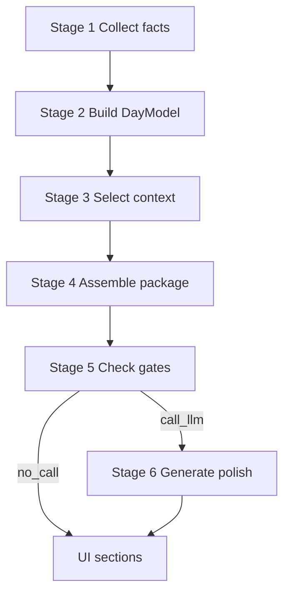

# Today — продуктовая модель

**Статус:** принято (канон **что такое экран Today** и **воронка формирования дня**).  
**Версия:** 1.1 (2026-06-01).  
**Владелец:** Product + Engineering.

**Роль:** зафиксировать **из чего состоит Today для пользователя** как **projection** [Core User Loop](./CORE_USER_LOOP.md) (Theme → Action → Progress) и [Daily Navigation Model](./DAILY_NAVIGATION_MODEL.md) (Context → Guidance → Action на экране дня).

**Не входит:** OpenAPI, JSON Schema, prompt texts. Pipeline — [PERSONAL_INTELLIGENCE_LAYER.md](./PERSONAL_INTELLIGENCE_LAYER.md), [API_MEMORY_AND_LEARNING_LAYER.md](./API_MEMORY_AND_LEARNING_LAYER.md); experience/UI — [TODAY_SCREEN_V1_CANON.md](./TODAY_SCREEN_V1_CANON.md).

**Связь:** [CORE_USER_LOOP.md](./CORE_USER_LOOP.md) · [MARKET_ATTENTION_AND_SCREEN_JOBS.md](./MARKET_ATTENTION_AND_SCREEN_JOBS.md) (5 доменов Today · Today formula) · [PROFILE_SCREEN_MASTER.md](./PROFILE_SCREEN_MASTER.md) · [FIRST_DAY_EXPERIENCE.md](./FIRST_DAY_EXPERIENCE.md) · [USER_MODEL_TARGET_STATE.md](./USER_MODEL_TARGET_STATE.md) · [DAY_CONTEXT_V0.md](./DAY_CONTEXT_V0.md) · [DAYMODEL_INPUT_CONTRACT.md](./DAYMODEL_INPUT_CONTRACT.md) · [TODAY_PERSONALIZATION_CORE.md](./TODAY_PERSONALIZATION_CORE.md) · [SCREEN_CONTRACTS_V1.md](./SCREEN_CONTRACTS_V1.md) · [INTERPRETATION_LAYER_AND_REFERENCE.md](./INTERPRETATION_LAYER_AND_REFERENCE.md) (Why layer — product consumer, не блокер wire).

---

## 0. Главный принцип

Today — **не «гороскоп на день»** и **не пять отдельных генераций**.

Today — **персональный экран дня** и **потребитель** [Profile](./PROFILE_SCREEN_MASTER.md). Проектировать блок Today — только после строки «из какого блока Profile приходит data».

| # | Вопрос | Блок |
|---|--------|------|
| 1 | **Что происходит?** | Theme + Symbolic |
| 2 | **Что делать?** | Insight + Action |
| 3 | **Продвигаюсь ли я?** | **Progress** |

> Какой это день → на чём сфокусироваться → чего избегать → что сделать → **как идёт день** → как зафиксировать → (по запросу) почему именно так.

**Формула данных (продукт):**

```
Today = транзиты + карта + число + Profile + ответы пользователя + история реакций
```

**Формула сборки (система):**

```
Facts → DayModel → Context selection → Package → Gates → (optional) one generation → UI sections
```

Today — **одновременно** Product Output и **главный канал Learning Output** (check-in, chips, meaning events).

---

## 1. Что такое Today (продуктово)

| Блок Today | Вопрос для пользователя | Обязателен на экране | Фаза дня |
|------------|-------------------------|----------------------|----------|
| **Main Theme** | Какой это день для меня? | **Да** | Утро (hero) |
| **Day Brief** | Коротко: фокус, темп, риск, окно | **Да** | Утро |
| **What to Focus On** | Где действовать? | **Да** | После ритуала |
| **What to Avoid** | Где не спешить? | **Да** | После ритуала |
| **Symbolic Context** | Карта дня + число дня | **Да** | Ритуал |
| **Action** | Главный шаг | **Да** (fallback OK) | После ритуала |
| **Progress** | Продвигаюсь ли я? | **Да** (empty state OK) | Весь день |
| **Why** | Почему именно это? | **Да** (скрыт до tap) | По запросу |
| **Reflection** | Как закрыть день? | Нет утром; **да** вечером | Вечер |
| **Calendar Context** | Ритм, streaks, отметки | Опционально (не день 1) | Весь день |
| **Depth routes** | Куда уйти за глубиной | **Да** (CTA) | По запросу |

### 1.1 Main Theme + Day Brief

- **Main Theme** — заголовок и смысл дня (strategy + personal angle).
- **Day Brief** — «Коротко о дне»: фокус, темп, риск, лучшее окно.

### 1.6 Progress

- Ответ на «продвигаюсь ли я?» — **обязательный** блок, не побочный запрос.
- **День 1:** empty state («День начался», `completions_today: 0`, `next_micro_win` → Action).
- **День 2+:** completions, streak hints, Flow counters — по мере накопления.
- **Часть Today Package** — сервер или клиент **всегда** проецирует Progress; отсутствие данных ≠ отсутствие блока.

### 1.7 Why (explainability)

- Скрытый слой пакета — **не** отдельная генерация и **не** простыня в UI.
- Питает «Почему так?» (popover / sheet) у Theme и при необходимости у Action / Symbolic.
- Три типа записей (human-readable, 1 строка = 1 причина):

| Тип | Смысл | Пример |
|-----|-------|--------|
| `selected_because` | почему **выбрано** это | «тема отношений из твоего намерения», «транзит × натальное Солнце» |
| `filtered_because` | почему **не вошло** альтернативное | «персональные паттерны пока не подтверждены» |
| `blocked_because` | что **заблокировало** gate | «глубина ответа: базовый режим» |

- Causal graph — **источник** для Why на зрелом продукте; на день 1 достаточно Identity + Intent + DayModel trace. См. [FIRST_DAY_EXPERIENCE.md](./FIRST_DAY_EXPERIENCE.md) §3.4.

**Execution (2026-06-01):** Why **заморожен** до закрытия First Day P0 — см. [FIRST_DAY_EXPERIENCE.md](./FIRST_DAY_EXPERIENCE.md). Модель сохранена; реализация — после нескольких дней использования продукта.

### 1.2 What to Focus On · What to Avoid

- Списки «легче / избегать / опереться» после символического ритуала.
- **Сферы внимания** (3 темы: work / love / money) — комфорт действий в теме, **не** «вероятность события».

### 1.3 Symbolic Context

- Tarot card of the day + numerology day number.
- Интерактив: честный шаг, rhythm need, save as focus — **сигналы**, не отдельные генерации.

### 1.4 Action

- **Главный шаг на сегодня** — один primary action + опции (domain, 20 min focus).
- Всегда виден; при пустом плане — deterministic fallback.

### 1.5 Reflection · Calendar

- **Reflection** — вечерняя фиксация; не автогенерируется утром без check-in.
- **Calendar Context** — rhythm line, day marks (когда E1 persisted); не First Day.

---

## 2. Today Package — один продуктовый артефакт

UI раскладывает **один пакет** по секциям. **Не** отдельный API-запрос на каждый блок.

```
Today Package
├── Theme          ← Main Theme + Day Brief (strategy, tempo, risk)
├── Insight        ← Focus / Avoid / Spheres / Guidance lines
├── Action         ← Main step + action options + practice support
├── Progress       ← day status, completions, next micro-win (never omit)
├── Symbolic       ← Tarot + numerology + symbolic visibility hints
├── Reflection     ← Evening slot (may be empty until check-in)
└── Why            ← hidden: selected / filtered / blocked (explainability)
```

| Package part | UI секции | Обязательные subfields |
|--------------|-----------|------------------------|
| **Theme** | Hero, «Коротко о дне» | title, summary, risk_line, tempo, best_window |
| **Insight** | Ориентиры, сферы | focus[], avoid[], spheres[3], warning?, opportunity? |
| **Action** | Главный шаг, support, essentials | primary_action, action_options[3], support block |
| **Progress** | Strip под hero / у Action | status_label, completions_today, next_micro_win; streak optional |
| **Symbolic** | Карта + число | tarot_ref, numerology_ref, interaction hooks |
| **Reflection** | Вечерняя фиксация | prompt (evening only); null утром OK |
| **Why** | «Почему так?» popover | selected_because[], filtered_because[], blocked_because[] |

**LLM:** **0–1** combined polish call на утро (hard max 2 — см. [API_MEMORY_AND_LEARNING_LAYER.md](./API_MEMORY_AND_LEARNING_LAYER.md)). Evening — **+0 or +1** отдельно.

**Legacy note:** prod сегодня использует monolithic `POST /today/narrative`; target — foundation path → один package → UI projection. Контракт `today_day_v1` — **форма Insight + Action** для post-ritual UI, см. [TODAY_PERSONALIZATION_CORE.md](./TODAY_PERSONALIZATION_CORE.md).

---

## 3. Воронка построения Today

Шесть стадий — **строгий порядок**. Детали gates — [PERSONAL_INTELLIGENCE_LAYER.md](./PERSONAL_INTELLIGENCE_LAYER.md), [TODAY_CONTRACT_ASSEMBLER_MAPPING.md](./TODAY_CONTRACT_ASSEMBLER_MAPPING.md).



### Stage 1 — Собрать факты (no LLM)

| Источник | Что берём | Блок Profile / системы |
|----------|-----------|------------------------|
| Birth Profile | natal slice, numerology base | Identity |
| Intent Profile | themes, morning intention, head_topic | Intent |
| Current State | mood, energy, stress, mode | Current State |
| Active Goals | stated + tracker goals | Goals |
| Active Practices | habits, ascetic, cycles | Practices |
| Calendar | day marks, rhythm | Calendar Rhythm |
| Knowledge | top-K confirmed atoms (may be empty) | Knowledge |
| Evolution | presentation envelope (caps) | Evolution |
| Reference machine | tarot draw, numerology day, transits | Symbolic |
| Behavior | confirmed patterns, fusion | Behavioral Baseline |

**Артефакт:** `day_context_v1` / layers.

**Зависимость от Profile воронки:** Stage 1 **требует** Identity SN; качество растёт с Intent + Reality; Behavior обогащает с дня 2+.

### Stage 2 — Построить DayModel (deterministic, no LLM)

**Выход:** strategy, tempo, risk, vector, confidence.

**Питает блоки:** Theme, Day Brief, basis для Insight.

### Stage 3 — Выбрать контекст (no LLM)

Из тысяч сущностей — **мало**:

| Тип | Cap (ориентир) |
|-----|----------------|
| Knowledge atoms | 3 (soft) / 5 (hard) |
| Goals | 2 active |
| Practices | 1 primary |
| Cycles / rhythm | 1 |
| Content fragments | по slot mapping |

**Питает:** Insight, Action support, Symbolic visibility.

### Stage 4 — Собрать пакет дня (no LLM)

**Не текст ради текста — structured package:**

| Slot | Package part |
|------|--------------|
| headline | Theme |
| guidance, risk | Theme + Insight |
| action, tempo | Action |
| reflection | Reflection |
| practice_action | Action.support |
| progress | Progress |
| explainability | Why |

**Артефакт:** `day_content_package_v1` + Progress projection + Why trace (product layers; wire без новых public API — embed в package response).

**Why заполняется на Stage 3–5:** selection audit → `selected_because`; caps / empty knowledge → `filtered_because`; gate decisions → `blocked_because`.

### Stage 5 — Проверить ограничения (no LLM)

- evolution caps (B1.8);
- visibility caps (D1.4);
- personalization gate (A1.5);
- LLM gate (P1.7);
- active knowledge runtime gate (P1.22).

**Выход:** `no_call` | `call_llm` | `blocked`.

### Stage 6 — Генерация (conditional, ≤1 утром)

**Один** polish/refinement pass на весь narrative surface class — **не** five parallel prompts.

**Запрещено LLM:** invent practice, override strategy, bulk reference dump.

---

## 4. Экран Today — секции и источники данных

Порядок UX — [TODAY_SCREEN_V1_CANON.md](./TODAY_SCREEN_V1_CANON.md).

| # | Секция UI | Package part | Основные inputs (Stage 1) | Обязательна |
|---|-----------|--------------|---------------------------|-------------|
| 1 | Hero — дата, заголовок, subtitle | Theme | DayModel strategy + Identity + Intent | Да |
| 2 | «Коротко о дне» + «Почему так?» | Theme | DayModel tempo/risk + DayContext trace | Да |
| 3 | Check-in + head topic | — (input → Stage 1) | User RT; пишет Current State | Да (ritual) |
| 4 | Карта + число | Symbolic | Reference machine + Profile hash | Да |
| 5 | Ориентиры (легче / избегать / опереться) | Insight | DayModel + selected knowledge | Да |
| 6 | Сферы внимания (×3) | Insight | DayModel vectors + Intent themes | Да |
| 7 | **Progress strip** | **Progress** | fusion / tracker **или** empty state | **Да** |
| 8 | Главный шаг | Action | DayModel action_mode + Goals + Practices | Да |
| 9 | База дня (4 опоры) | Action (essentials) | Template + mood adapt hint | Да |
| 10 | «Почему так?» | **Why** | Stage 3–5 trace | **Да** (скрыт до tap) |
| 11 | Глубина (Guidance / Compatibility / Profile) | — (routes) | JTBD + Intent | Да |
| 12 | Вечерняя фиксация | Reflection | Evening check-in trigger | Нет утром |

**Explainability:** «Почему так?» читает **Why** из пакета — не вторую генерацию и не bulk DayContext dump.

---

## 5. Логическая последовательность запросов (клиент)

**Не новые контракты** — порядок **существующих** вызовов, где каждый следующий **может включать** payload из предыдущих ответов.

| # | Когда | Логический запрос | Зачем | Что передаём из предыдущего |
|---|-------|-------------------|-------|----------------------------|
| **1** | Открытие Today (есть Profile step 1+) | `GET /today` или `GET /today/bundle` | Ritual shell, symbolic refs, **Progress** (empty or live) | — |
| **2** | После check-in / chips | `POST /today/narrative` (или target: package endpoint) | **Today Package** целиком: Theme, Insight, Action, **Progress**, **Why**, Symbolic | `ritual_context`: mood, `head_topic`, morning_intention |
| **3** | Вечер | evening narrative / reflection surface | Reflection part | day_connection + evening check-in events |
| **4** | По всему flow | `POST /meaning/events` | Learning loop; обновление Progress на следующем open | `generation_id`, chip payloads |

**Progress и Why — не отдельные client requests.** Target: один package response. Interim prod: client **обязан** показать Progress empty state, если сервер ещё не embeds; Why — минимум из narrative trace до wire.

**First Day path:** см. [FIRST_DAY_EXPERIENCE.md](./FIRST_DAY_EXPERIENCE.md).

**iOS parity:** тот же порядок и те же ritual payloads — [cross-platform rule](../.cursor/rules/cross-platform-mobile.mdc).

**Target state (после wire):** один read hook (`today_intelligence_read_model_v1` или package API) вместо split narrative — см. [SCREEN_CONTRACTS_V1.md](./SCREEN_CONTRACTS_V1.md).

---

## 6. Зависимость Today от Profile

| Profile готовность | Режим Today |
|--------------------|-------------|
| Только Identity (шаг 1) | Generic + natal/numerology machine; слабая персонализация |
| Identity + Intent (шаг 2) | Themed narrative; JTBD-aware Action |
| + Reality (шаг 3) | **Целевой** режим: mode-aware tone, полный DayModel |
| + Behavior (шаг 4) | Knowledge hints, fusion-aware Action, rhythm |

---

## 7. Learning Output по блокам

Каждый интерактивный блок Today **обязан** иметь event_type (web + iOS паритет):

| UI блок | Примеры events | CUM impact |
|---------|----------------|------------|
| Check-in | `mood_selected`, `head_topic` | `current_state` |
| Tarot / number chips | `tarot_honest_step`, `numerology_rhythm_need` | hypothesis → pattern |
| Main step | `main_step_domain`, `focus_session_20m` | behavioral_patterns |
| Save focus | `day_focus_from_tarot` | Intent / themes |
| Why opened | `today_guide_why_opened` | confidence signal; validates Why layer usefulness |
| Progress viewed | `today_progress_viewed` (backlog) | engagement baseline |
| Evening | `evening_reflection_submitted` | current_state RT |

Полный словарь — [TODAY_PERSONALIZATION_CORE.md](./TODAY_PERSONALIZATION_CORE.md).

---

## 8. Read model vs экран

| | Read model | Today Screen |
|---|------------|--------------|
| **Роль** | Safe product data, refs, caps | Layout, copy, interaction |
| **Контракт** | `today_intelligence_read_model_v1` | This doc + TODAY_SCREEN_V1_CANON |
| **Статус** | Builder + tests; no prod consumer | Web + iOS prod |

UI **не** обязан показывать все поля read model; обязан показывать **все required blocks** §1, включая **Progress** (empty state) и доступ к **Why** по запросу.

---

## 9. Запреты

- **Не** пять отдельных LLM-генераций на утро — один package.
- **Не** генерировать Reflection при открытии без evening check-in.
- **Не** показывать evolution_score / internal caps в UI (B1.10 envelope only).
- **Не** подменять DayModel monolithic prompt без migration plan.
- **Не** новый LLM path без gate + Request Record + event_type.

---

## 10. Gap vs код (2026-06-01)

**Step A (2026-06-02):** UI diff — [TODAY_CANON_VS_CODE_DIFF.md](./status/TODAY_CANON_VS_CODE_DIFF.md).  
**Step B (2026-06-02):** ownership map — [TODAY_OWNERSHIP_MAP.md](./status/TODAY_OWNERSHIP_MAP.md).

| Продуктовое решение | Код сегодня |
|---------------------|-------------|
| Один Today Package | Foundation path in tests; prod = monolithic narrative |
| Stage 1–5 deterministic | P1.x green; not wired to prod entry |
| `today_day_v1` post-ritual | Schema exists; partial alignment with narrative JSON |
| Single read hook | `today_intelligence_read_model_v1` — no HTTP consumer |

Wire-plan: [TODAY_CONTRACT_ASSEMBLER_MAPPING.md](./TODAY_CONTRACT_ASSEMBLER_MAPPING.md) — **после** [FIRST_DAY_EXPERIENCE.md](./FIRST_DAY_EXPERIENCE.md) P0 product gaps.

---

## 11. Связанные документы

- Gap audit vs код: [status/TODAY_CANON_VS_CODE_DIFF.md](./status/TODAY_CANON_VS_CODE_DIFF.md)
- First Day MVP: [FIRST_DAY_EXPERIENCE.md](./FIRST_DAY_EXPERIENCE.md)
- Profile: [PROFILE_SCREEN_MASTER.md](./PROFILE_SCREEN_MASTER.md)
- Порядок генерации: [TODAY_CONTRACT_ASSEMBLER_MAPPING.md](./TODAY_CONTRACT_ASSEMBLER_MAPPING.md)
- UI решения: [TODAY_SCREEN_V1_CANON.md](./TODAY_SCREEN_V1_CANON.md)
- JSON post-ritual: [TODAY_PERSONALIZATION_CORE.md](./TODAY_PERSONALIZATION_CORE.md)

---

*Bump версию при изменении обязательных блоков Today или состава Today Package.*
