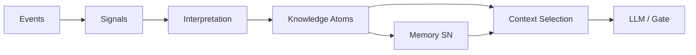

# User Knowledge Model (UKM)

**Статус:** принято (канон того, что система **знает** о пользователе).  
**Версия:** 1.7 (2026-06-23).  
**Владелец:** Product + Engineering.

**Место в PIM:** Knowledge Atom — **главный объект внутри** [Personal Intelligence Model](./PERSONAL_INTELLIGENCE_MODEL_V1.md). Atoms хранят **interpretations**, не raw signals. Signals → ILR → atom ([PIM §1.1](./PERSONAL_INTELLIGENCE_MODEL_V1.md), **C14**).

**Уровень:** фундамент между событиями и памятью — рядом с [KNOWLEDGE_ACQUISITION_AND_SIGNAL_POLICY.md](./KNOWLEDGE_ACQUISITION_AND_SIGNAL_POLICY.md) (**что и откуда собираем**), [PERSONAL_INTELLIGENCE_LAYER.md](./PERSONAL_INTELLIGENCE_LAYER.md), [DATA_OWNERSHIP_AND_CONSUMPTION_MAP.md](./DATA_OWNERSHIP_AND_CONSUMPTION_MAP.md), [API_MEMORY_AND_LEARNING_LAYER.md](./API_MEMORY_AND_LEARNING_LAYER.md).

**Связь:** [KNOWLEDGE_ACQUISITION_AND_SIGNAL_POLICY.md](./KNOWLEDGE_ACQUISITION_AND_SIGNAL_POLICY.md), [INTERPRETATION_LAYER_AND_REFERENCE.md](./INTERPRETATION_LAYER_AND_REFERENCE.md) (signal → multi-meaning → knowledge), [PERSONAL_INTELLIGENCE_LAYER.md](./PERSONAL_INTELLIGENCE_LAYER.md), [TODAY_PERSONALIZATION_CORE.md](./TODAY_PERSONALIZATION_CORE.md), [DAY_CONTEXT_V0.md](./DAY_CONTEXT_V0.md), [DAY_CONTEXT_V0.md](./DAY_CONTEXT_V0.md).

**Prerequisite:** Knowledge Atom создаётся только из разрешённого channel и после confirmation (KASP §5). Atom **должен** мапиться на поле [Compact User Model](./USER_MODEL_TARGET_STATE.md) §3.

---

## 0. Главный вопрос

**Что именно система считает знанием о пользователе?**

Сегодня: **что мы знаем?**  
Через год: **почему мы считаем, что знаем?**

Ответ — **Knowledge Atom** с provenance, confirmation history и decay strategy — не event log и не строка в промпте.

### Событие ≠ знание

| Событие (Event) | Это **не** знание |
|-----------------|-------------------|
| Пользователь сохранил совет про контроль | факт действия |
| 12× не выполнил утреннюю практику | факт пропусков |
| Открыл материалы про деньги | факт просмотра |

### Знание (Knowledge)

| Знание | Пример |
|--------|--------|
| Тема контроля — высокий интерес | `control_interest_score: 0.82`, повторялась 17× / 60d, связана с relationships + anxiety |
| Утро — плохое окно для практик | `practice_completion_before_09:00: 0.08`; optimal window `18:00–22:00` |
| Деньги — устойчивая тема | `money_interest_score: 0.91`; `entrepreneurship_interest_score: 0.87` |

**Знание** — структурированное, версионированное, с **confidence**, **окном**, **evidence** и **сроком жизни**. Его можно передать в LLM в 15–30 строках вместо 300 сырых events.

---

## 1. Место в архитектуре

### Каноническая цепочка PIL

```
Acquisition (KASP) → Events → Signals → Interpretation → Confirmation → Knowledge → Memory → Context Selection → …
```

| # | Слой | Документ |
|---|------|----------|
| 0 | **Acquisition & Signal Policy** | [KNOWLEDGE_ACQUISITION_AND_SIGNAL_POLICY.md](./KNOWLEDGE_ACQUISITION_AND_SIGNAL_POLICY.md) |
| 1 | User Event Layer | [TODAY_PERSONALIZATION_CORE.md](./TODAY_PERSONALIZATION_CORE.md) |
| 2 | Learning Signal Layer | KASP §8, [API_MEMORY_AND_LEARNING_LAYER.md](./API_MEMORY_AND_LEARNING_LAYER.md) §6 |
| 2b | **Interpretation Layer** | [INTERPRETATION_LAYER_AND_REFERENCE.md](./INTERPRETATION_LAYER_AND_REFERENCE.md) |
| 3 | User Knowledge Model | **этот документ** |
| 4 | Memory Layer | [PERSONAL_INTELLIGENCE_LAYER.md](./PERSONAL_INTELLIGENCE_LAYER.md) |
| 5 | Context Selection | PIL §9 |

**Правило:** LLM, Gate и Recommendation **читают Knowledge**, не сырой event log.

**Build order:** KASP → UKM → Gate ([KNOWLEDGE_ACQUISITION_AND_SIGNAL_POLICY.md](./KNOWLEDGE_ACQUISITION_AND_SIGNAL_POLICY.md) §10).



---

## 2. Определение Knowledge Atom

Минимальная единица знания — **Knowledge Atom** (не строка в промпте, а структурированная запись).

| Поле | Тип | Обязательно | Описание |
|------|-----|-------------|----------|
| `knowledge_id` | string | ✓ | стабильный id, e.g. `interest.control.v1` |
| `interpretation_instance_id` | string | ○ | source ILR instance if promoted from interpretation |
| `interpretation_ref_id` | string | ○ | rule id from Interpretation Reference |
| `knowledge_type` | enum | ✓ | **`fact`** \| **`pattern`** \| **`hypothesis`** — [KASP §2](./KNOWLEDGE_ACQUISITION_AND_SIGNAL_POLICY.md#2-три-типа-знания-knowledge_type) |
| `acquisition_channel` | enum | ✓ | **A–I** — [KASP §4](./KNOWLEDGE_ACQUISITION_AND_SIGNAL_POLICY.md#4-каталог-каналов-сбора-acquisition-channels) |
| `data_class` | enum | ✓ | `explicit` \| `behavioral` \| `inferred` |
| `trust_tier` | enum | ✓ | **T1–T5** — [KASP §3](./KNOWLEDGE_ACQUISITION_AND_SIGNAL_POLICY.md#3-уровни-доверия-trust_tier) |
| `confirmation_stage` | enum | ✓ | `pending` \| `confirmed` \| `rejected` |
| `domain` | enum | ✓ | см. §3 |
| `claim` | string | ✓ | машиночитаемое утверждение (EN key + optional RU display) |
| `value` | number \| string \| object | ✓ | score, window, enum, struct |
| `confidence` | float 0–1 | ✓ | уверенность системы |
| `first_seen_at` | datetime | ✓ | когда atom **впервые** появился |
| `last_confirmed_at` | datetime | ○ | последнее подтверждение / reinforcement |
| `decay_strategy` | enum | ✓ | см. §2.1 — как устаревает без подкрепления |
| `stability` | enum | ✓ | `observation` \| `weak` \| `stable` \| `decaying` |
| `evidence_count` | int | ✓ | сколько сигналов поддержали |
| `evidence_chain` | object[] | ✓* | **C14** — конкретная история наблюдений (см. §2.2) |
| `window_days` | int | ✓ | окно расчёта |
| `last_updated` | datetime | ✓ | |
| `source_signals` | string[] | ○ | типы signals |
| `related_knowledge_ids` | string[] | ○ | граф связей |
| `contradiction_count` | int | ○ | C15 — сколько раз оспаривался |
| `last_contradiction_at` | datetime | ○ | последний contradict/supersede |
| `superseded_by_atom_id` | string | ○ | lineage при замене |
| `supersedes_atom_id` | string | ○ | вырос из retire другого |
| `valid_from` | datetime | ✓* | C16 — начало окна истинности |
| `valid_until` | datetime | ○ | конец; null = current |
| `validity_status` | enum | ✓* | `current` \| `historical` \| `context_specific` |
| `temporal_scope` | enum | ✓* | `enduring` \| `phase` \| `context_bound` \| `situational_episode` |
| `context_binding` | object | ○ | domain / sphere — обязателен для `context_bound` |
| `expires_at` | datetime | ○ | для episodic / decay |
| `user_visible` | bool | ✓ | можно показать в «как мы тебя понимаем» |
| `llm_eligible` | bool | ✓ | можно в context slice (технический gate) |
| `decision_relevance` | enum | ✓ | C17 — `very_low` … `very_high` |
| `relevance_score` | float | ○ | 0–1 fine rank |
| `surface_affinity` | enum[] | ○ | daily_focus, goal_guidance, discovery, … |
| `dre_eligible` | bool | ✓ | Day Reasoning slice |
| `lre_eligible` | bool | ✓ | Learning Reasoning slice |
| `archive_only` | bool | ✓ | не в live slices |
| `version` | string | ✓ | semver схемы claim |

### 2.2 `evidence_chain` (gate C14)

**Обязателен** для `knowledge_type` ∈ {`pattern`, `hypothesis`} и для любого inferred `fact`.  
Explicit T1 facts (дата рождения) — `evidence_chain` может ссылаться на один onboarding event.

Каждый элемент:

| Поле | Тип | Описание |
|------|-----|----------|
| `observed_at` | datetime | когда произошло |
| `signal_type` | string | нормализованный тип |
| `event_id` | string | ○ — `meaning_events` id |
| `intent_record_id` | string | ○ — для goal cycle |
| `interpretation_ref_id` | string | ○ — какое правило сматчило |
| `weight` | float | вклад в confidence |

**Запрещено:** atom без `evidence_chain`; `evidence_chain` только из LLM narrative; trait из одного observation.

**Explainability:** UI «почему мы так думаем» строится из `evidence_chain` + sibling interpretations в Instance (не из atom claim alone).

### 2.3 `decay_strategy` (канон)

| Значение | Когда | Поведение |
|----------|-------|-----------|
| `none` | static facts (birth, explicit T1) | не decay без user edit |
| `reinforcement` | patterns, traits | `confidence` ↓ если нет `last_confirmed_at` refresh |
| `time_ttl` | episodic | `expires_at` обязателен |
| `contradiction` | inferred | decay при user correction / conflicting signal |
| `intent_cycle` | intent-derived | привязка к outcome windows ([INTENT_MODEL_V1.md](./INTENT_MODEL_V1.md)) |

**Provenance** (минимум): `acquisition_channel`, `source_signals[]`, `interpretation_instance_id`, `evidence_count`, **`evidence_chain[]`**.

### 2.4 Temporal Identity (C16)

См. [TEMPORAL_IDENTITY_V1.md](./TEMPORAL_IDENTITY_V1.md).  
`valid_from` / `valid_until` / `temporal_scope` — обязательны для pattern/hypothesis/trait-like (* explicit T1: `valid_from` = capture time).

**Retired atom:** `validity_status: historical`, `valid_until` set, `llm_eligible: false`.  
**Contradiction resolve:** must set `change_nature` on linked event.

### 2.5 Decision Relevance (C17)

См. [DECISION_RELEVANCE_V1.md](./DECISION_RELEVANCE_V1.md).

**`confidence` ≠ `decision_relevance`.** Context Selection §6 — rank by relevance tier, then confidence.

### Пример atom (JSON)

```json
{
  "knowledge_id": "timing.practice_optimal_window.v1",
  "knowledge_type": "pattern",
  "acquisition_channel": "D",
  "data_class": "behavioral",
  "trust_tier": "T2",
  "confirmation_stage": "confirmed",
  "domain": "timing",
  "claim": "optimal_practice_window_local",
  "value": { "start_hour": 18, "end_hour": 22, "timezone": "user" },
  "confidence": 0.76,
  "first_seen_at": "2026-04-12T08:00:00Z",
  "last_confirmed_at": "2026-06-20T21:15:00Z",
  "decay_strategy": "reinforcement",
  "stability": "stable",
  "evidence_count": 12,
  "evidence_chain": [
    { "observed_at": "2026-06-01T18:30:00Z", "signal_type": "practice_works", "event_id": "evt_abc" },
    { "observed_at": "2026-06-08T19:00:00Z", "signal_type": "practice_works", "event_id": "evt_def" }
  ],
  "window_days": 60,
  "source_signals": ["timing_format_mismatch", "practice_works"],
  "related_knowledge_ids": ["interest.body_practices.v1"],
  "user_visible": false,
  "llm_eligible": true,
  "version": "1.0.0"
}
```

---

## 3. Домены знаний

| Domain | Что описывает | Примеры `claim` |
|--------|---------------|-----------------|
| **interest** | темы и сферы | `control_interest_score`, `money_interest_score` |
| **timing** | когда пользователь активен / выполняет | `practice_completion_before_09`, `optimal_practice_window` |
| **format** | длина, глубина, структура | `prefers_short_responses`, `ignores_long_horoscope` |
| **style** | тон, прямота, давление | `prefers_direct_tone`, `low_pressure_only` |
| **practice** | что работает / не работает | `body_practice_effective`, `morning_routine_ineffective` |
| **emotion** | устойчивые паттерны состояния | `frequent_fatigue_mood`, `stress_trigger_workload` |
| **discipline** | выполнение, срывы, streaks | `discipline_level`, `common_slip_friday` |
| **theme_graph** | связи тем | `control_linked_to_relationships_anxiety` |
| **recommendation** | ranking hints | `discipline_theme_priority_over_relationships` |
| **intent** | намерения, declare/do gap | `intent.overestimate_frequency` — [INTENT_MODEL_V1.md](./INTENT_MODEL_V1.md) |
| **negative** | suppress | `suppress_morning_heavy_routines` |

**Правило:** domain + claim — **контролируемый словарь** (как `event_type`); новые claims — через PR + версия UKM.

---

## 4. Events → Signals → Interpretation → Confirmation → Knowledge

**Канон pipeline:** [KNOWLEDGE_ACQUISITION_AND_SIGNAL_POLICY.md](./KNOWLEDGE_ACQUISITION_AND_SIGNAL_POLICY.md) §5, [INTERPRETATION_LAYER_AND_REFERENCE.md](./INTERPRETATION_LAYER_AND_REFERENCE.md) §8.

**Запрещено:** Event → Knowledge; Signal → single meaning fact без Interpretation + Confirmation; **Signal → Atom** без `evidence_chain` (C14).

### 4.1 knowledge_type по источнику

| Источник | knowledge_type | trust |
|----------|----------------|-------|
| Onboarding / Profile answer | `fact` | T1 |
| Check-in slug today | `fact` (RT) | T1 |
| Stable behavioral window | `pattern` | T2 |
| Single open/save | `hypothesis` max | T3 |
| LLM extraction | `hypothesis` | T4 |

**Hypothesis** — не для high-priority recommendations без `confirmation_stage: confirmed` (KASP §6).

### 4.2 Пороги (anti-personalization)

| Stability | Условие (типично) |
|-----------|-------------------|
| `observation` | 1–2 signals |
| `weak` | 3–5 signals, одно окно |
| `stable` | ≥6 signals или ≥3 окна, confidence ≥ 0.65 |
| `decaying` | нет подтверждения N дней |

Один клик ≠ знание. См. PIL §10.12.

### 4.3 Примеры трансформации

**Events:** 5× save текста про контроль; 17× head_topic / diary control за 60d.

**Signals:** `useful` ×5, semantic tag `control`.

**Knowledge atoms:**

- `interest.control.v1` → score 0.82, stability `stable`
- `theme_graph.control_relationships_anxiety.v1` → linked ids
- `format.short_saved_control_copy.v1` → prefers short when topic=control

---

**Events:** 12× skip morning practice; 8× complete practice 18:00–22:00.

**Signals:** `timing_format_mismatch`, `practice_works`.

**Knowledge:**

- `timing.practice_before_09_probability.v1` → 0.08
- `timing.practice_optimal_window.v1` → 18–22
- `negative.morning_heavy_routines.v1` → suppress

---

**Events:** repeated opens on money / entrepreneurship content.

**Knowledge:**

- `interest.money.v1` → 0.91
- `interest.entrepreneurship.v1` → 0.87

---

## 5. Knowledge Store vs Memory Layer

| | Knowledge Store (UKM) | Memory Layer (PIL) |
|---|----------------------|---------------------|
| **Единица** | Knowledge Atom | typed SN bucket |
| **Назначение** | канон «что знаем» | материализация для engines |
| **Обновление** | из signals + rules | из knowledge + snapshots |
| **В LLM** | top-K atoms by relevance | slices (CoreProfile short, DayContext) |

**Memory** — **не дублирует** events. Memory **материализует** knowledge + редкие SN (CoreProfile, day_history).

**CoreProfile** хранит **static** knowledge (natal, life path) + ссылку на `knowledge_snapshot_id`.

**Behavior Profile** = materialized view доменов `practice`, `timing`, `discipline`, `style`, `format`.

---

## 6. Context Selection: что уходит в LLM

**Не передаём:** последние 300 events, сырой `meaning_events`, full atom dump, atoms with `archive_only`.

**Передаём:** **15–30** atoms — **ranked by `decision_relevance`** (C17) + `surface_affinity` match:

| Приоритет | Что включить | Лимит |
|-----------|--------------|-------|
| P0 | DayContext SN, ritual today | fixed |
| P1 | `very_high` / `high` + surface match (e.g. goal_guidance) | 8–12 |
| P2 | `medium` stable format/style/timing | 3–5 |
| P3 | Negative / suppress (`dre_eligible`) | 2–4 |
| P4 | Episodic summary (7d) | 1 object |
| — | `very_low`, `historical`, `archive_only` | **exclude** live surfaces |

**Пример slice для Today guide (human-readable summary, machine-built):**

- prefers short responses (0.89, stable)
- optimal practice window 18:00–22:00 (0.76)
- control theme high interest; linked to relationships (0.82)
- suppress morning-heavy routines
- money interest elevated this month (0.71, weak)

**Token impact:** UKM — главный рычаг экономии **до** Gate ([API_MEMORY_AND_LEARNING_LAYER.md](./API_MEMORY_AND_LEARNING_LAYER.md)).

---

## 7. User Knowledge Graph

Atoms связаны через `related_knowledge_ids`:

```
interest.control ── theme_graph ── interest.relationships
        │                                    │
        └── format.short ── style.direct ────┘
```

**Использование:**

- Context Selection подтягивает соседей по graph при выборе темы дня;
- Recommendation не предлагает practice, противоречащую `timing` + `negative` atoms;
- Explainability UI: «контроль ↔ отношения ↔ тревога».

---

## 8. Обновление и staleness

| Триггер | Действие |
|---------|----------|
| New meaning event batch | recompute affected domains (incremental) |
| Learning signal | reinforce path **или** Contradiction Event (C15) |
| **Contradicting signal** | **Contradiction Event** → Re-evaluation — не silent confidence only |
| User correction (`edit`, «не про меня») | Contradiction Event `user_corrected` или decay |
| Time decay | `stability → decaying` без reinforcement |
| Profile / birth data change | recompute static-linked atoms only |

**Staleness:** atom с `expires_at` < now не попадает в LLM; **retired** / `superseded_by` atoms — never `llm_eligible` (C15b).

**Contradiction:** см. [CONTRADICTION_AND_REEVALUATION_V1.md](./CONTRADICTION_AND_REEVALUATION_V1.md).

---

## 9. Ownership & privacy

| Data | Owner | UI | LLM | Training |
|------|-------|-----|-----|----------|
| Knowledge Atoms | User domain SN | opt-in subset (`user_visible`) | `llm_eligible` only | anonymized export |
| Event log | Platform | no | **never** bulk | quarantined |
| Signals | PIL internal | no | no | aggregated |

**User correction:** пользователь может оспорить atom → `confidence` cap или `suppressed_by_user` flag.

См. [DATA_OWNERSHIP_AND_CONSUMPTION_MAP.md](./DATA_OWNERSHIP_AND_CONSUMPTION_MAP.md) LLM matrix.

---

## 10. Integration map

| Компонент | Роль |
|-----------|------|
| **PIL** | UKM — слой 3 в цепочке §1 |
| **AMLL Gate** | читает knowledge relevance + cache keys; **не** events |
| **DayContext** | `layers.user_knowledge` (target) вместо только `behavior_patterns` |
| **Profile Selector** | weights from `interest`, `discipline`, `theme_graph` atoms |
| **Prompt Refinement** | format/style/timing from atoms |
| **Reference Layer** | codes in claims (tarot, practice_id), not bulk content |

---

## 11. Code baseline & migration

| Сейчас | Статус | UKM mapping |
|--------|--------|-------------|
| `meaning_events` | ✅ | Event Layer — input only |
| `build_meaning_surface_patterns_v0` | 🟡 proto-UKM | counts → migrate to atoms |
| `learning_context` / `LearningService` | 🟡 partial | mix of knowledge + raw stats |
| `behavior_patterns` in DayContext | 🟡 | display aggregate, not canonical store |
| `internal_profile` | 🟡 | should read from Knowledge Store |
| **`user_knowledge_atoms` table** | ⬜ | canonical store |
| **`build_user_knowledge_v0` job** | ⬜ | Events→Signals→Knowledge |

**Migration path (без big bang):**

1. Define atom schema + domain/claim registry (this doc + JSON schema backlog).  
2. Map `meaning_surface_patterns_v0` outputs → provisional atoms.  
3. Add `DayContext.layers.user_knowledge` (top-K).  
4. Switch `_fusion_slim_for_prompt` / selector to atoms.  
5. Deprecate passing raw pattern counts to LLM.

---

## 12. Build order (приоритет над gate_decision)

| # | Задача | Блокирует |
|---|--------|-----------|
| **KASP / UKM-0** | Acquisition policy + channel registry | [KNOWLEDGE_ACQUISITION_AND_SIGNAL_POLICY.md](./KNOWLEDGE_ACQUISITION_AND_SIGNAL_POLICY.md) ✅ |
| **UKM-1** | Atom schema + domain registry | всё PIL personalization |
| **ILR-1…ILR-4** | Interpretation Reference + Engine | [INTERPRETATION_LAYER_AND_REFERENCE.md](./INTERPRETATION_LAYER_AND_REFERENCE.md) |
| **UKM-2** | Interpretation → Knowledge rules | Memory quality |
| **UKM-3** | Knowledge Store + snapshot id | Context Selection |
| **UKM-4** | DayContext `user_knowledge` layer | token reduction |
| **UKM-5** | Gate reads knowledge slice | AMLL Gate v1 |
| **UKM-6** | User-visible knowledge UI (opt-in) | trust |

**Explicitly later:** `gate_decision` artifact, similarity reuse — **после** UKM-3.

---

## 13. Feature DoD (learning-aware)

Новая фича должна указать:

- [ ] какие **domains** knowledge может обновить;
- [ ] какие **signals** порождаются;
- [ ] какие **claims** (existing or new registry entry);
- [ ] попадает ли atom в `llm_eligible` / `user_visible`;
- [ ] default relevance tier в claim registry (new claims);
- [ ] **decision_relevance** + dre/lre_eligible (C17);
- [ ] **evidence_chain** для pattern/hypothesis/inferred (**C14**);
- [ ] **не** пишет ли сырые events напрямую в prompt path;
- [ ] signal vs interpretation: что observation, что promoted claim.

---

## 14. Changelog

- **1.7 (2026-06-23)** — C17 `decision_relevance`, surface_affinity, dre/lre_eligible; Context Selection rank.
- **1.6 (2026-06-23)** — C16 temporal fields; `validity_status`, `temporal_scope`, `context_binding`.
- **1.5 (2026-06-23)** — C15: `contradiction_count`, supersede lineage; Contradiction Event canon cross-ref.
- **1.4 (2026-06-23)** — `evidence_chain` gate C14; atoms = interpretations; Signal≠Atom for inferred.
- **1.3 (2026-06-23)** — PIM as container; `first_seen_at`, `last_confirmed_at`, `decay_strategy`; domain `intent`; «why we know» north star.
- **1.2 (2026-05-31)** — Interpretation Layer in chain; `interpretation_instance_id` / `interpretation_ref_id` on atoms.
- **1.1 (2026-05-31)** — `knowledge_type`, acquisition_channel, trust_tier; KASP prerequisite.
- **1.0 (2026-05-31)** — первый канон UKM.
