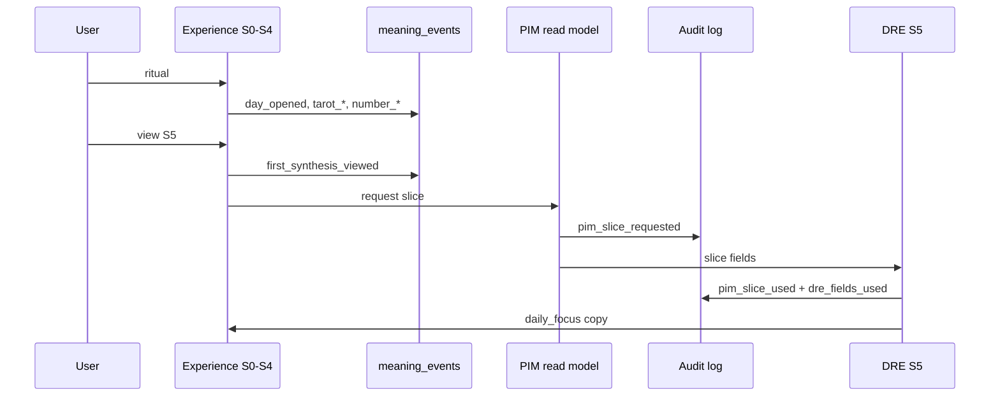

# PR1 — шаблон секций PIM PR Gate (для описания PR)

**Статус:** draft для копирования в PR description при открытии PR1  
**Pre-flight:** [PR1_PREFLIGHT.md](./PR1_PREFLIGHT.md)  
**Gate:** [PIM_PR_GATE_V1.md](../pim/PIM_PR_GATE_V1.md) §1, §3, §5

Заполнять **фактическими** значениями после реализации; до merge — заменить `TBD` / `expected` на ссылки на код, тесты, audit log sample.

---

## Summary

PR1: Today experience spine S0–S5 (greeting → 5-card ritual → number → Daily Focus). Убирает article-scroll и mood-gated synthesis. Вводит доказуемый поток **Experience → signals → PIM read → DRE**, без Goal Loop / atoms / intent.

---

## PIM (C10–C17) — Q1–Q5

| Phase | Q1 Signal | Q2 PIM | Q3 Atom | Q4 Evidence | Q5 Consumer |
|-------|-----------|--------|---------|-------------|-------------|
| S0 | `day_opened`, `day_sky_fact_viewed` | — | — | `day_key`, `sky_fact_id` in event | template fact picker |
| S1–S2 | `tarot_selected`, `tarot_revealed` | signal only | **none PR1** | `card_id`, `generation_id` optional | DRE ritual input |
| S3–S4 | `number_selected` | signal only | **none PR1** | `numerology_value`, `revealed: true` | DRE ritual input |
| S5 | `first_synthesis_viewed` | **read** slice via read model | **none** — `daily_focus_id` is DRE output, not atom | audit: `pim_slice_*` + `dre_fields_used[]` | **DRE** → Daily Focus copy |

**PR1 explicitly does not:** Intent Record, `day_goal_set`, atom writes, contradiction, LRE promotion.

---

## PIM Ownership

| Поле / артефакт | Owner | PR1 action |
|-----------------|-------|------------|
| `day_opened`, ritual reveal events | Experience → `meaning_events` | emit |
| `first_synthesis_viewed` | Experience → `meaning_events` | emit on S5 first paint |
| `daily_focus_id`, S5 copy | **DRE** (generation output) | render only; not owned by Today UI state |
| `knowledge_context_slice` | **UKM / read model** | read-only in S5 pipeline |
| `mood`, `head_topic` | — | **not in PR1 spine** (debt PR3) |
| Ritual persist (`tarotMainId`, phases) | Experience local | restore C4; not PIM knowledge |
| `intent_record_id`, `goal_text` | Intent Model | **out of scope** |

Today **не** владеет знанием о человеке — только сигналами и отображением DRE output.

---

## Today disappearance

**Test:** если убрать экран Today, следующие артефакты **остаются** в системе:

| Артефакт | После PR1 |
|----------|-----------|
| `meaning_events` за день (S0–S5 chain) | ✓ persisted |
| `generation_logs` / DRE request audit (`pim_slice_requested`, `pim_slice_used`, `dre_fields_used`) | ✓ persisted |
| `daily_focus_id` в generation payload | ✓ in log, not only UI |
| Atoms, Intent Records | — not created in PR1 |

**Fail:** synthesis существует только в React state / localStorage без server events + generation audit.

---

## PIM Diff

**Before (baseline — один проход legacy/experience без PR1):**

| Artifact | Count / note |
|----------|----------------|
| `meaning_events` (PR1 chain) | `TBD` — list types seen today |
| `pim_slice_requested` audit | 0 |
| `pim_slice_used` audit | 0 |
| Atoms created | 0 |
| Intent Records | 0 |

**After (one full S0–S5 pass, PR1 branch):**

| Artifact | Expected Δ |
|----------|------------|
| `day_opened` | +1 |
| `day_sky_fact_viewed` | +1 |
| `tarot_selected` | +1 |
| `tarot_revealed` | +1 |
| `number_selected` | +1 |
| `first_synthesis_viewed` | +1 |
| `pim_slice_requested` | +1 per S5 DRE call |
| `pim_slice_used` | +1 (may be empty `atom_ids[]`) |
| Atoms | 0 |
| Intent Records | 0 |

**PIM test command:** `TBD` — e.g. pytest + SQL/query listing `event_type` for `user_id` + `day_key` after scripted flow.

---

## Learning Δ

**Contour:** Learning (not Experience-only).

| ID | PR1 claim | Proof |
|----|-----------|-------|
| **L1** Signals | New observable ritual → synthesis path | §PIM Diff event list |
| L2 Interpretation | — | N/A PR1 |
| L3 Atom reinforce | — | N/A PR1 |
| L4 Contradiction | — | N/A PR1 |
| L5 Temporal | — | N/A PR1 |
| L6 Relevance | Read path invoked; fields logged | `pim_slice_used.dre_fields_used` |

**Minimum Learning Δ for merge:** **L1** (full event chain) + **L6** (slice request/use auditable, not checkbox).

**Reject if:** only UI changed; `meaning_events` incomplete; `pim_slice_requested` without `pim_slice_used` + field list.

---

## PIM ROI

| | |
|--|--|
| **User value** | Один ясный ответ «о чём день» (Daily Focus) без scroll / mood gate |
| **PIM value** | Первый доказуемый Experience→PIM read + signal chain для последующих PR |
| **Cost** | FSM refactor, 5-card UX, DRE wire + audit; **no** Goal Loop scope creep |

---

## S5 boundary (reject criterion)

После S5 пользователь понимает: **«О чём этот день?»**

Пользователь **не** должен получать ответ на: **«Как прожить его с моей целью?»** — это PR2.

**Do not ship in PR1 S5 UI:**

- goal input / suggestions (S6)
- goal-linked guidance paragraphs (S8)
- `PrimaryAction` framed as goal step
- do/avoid blocks tied to user-stated intent
- «твой шаг на сегодня» как closure loop

**OK in PR1 S5:**

- `daily_focus_id` + title + 1–2 lines «о чём день»
- optional compact ritual context (card/number) **without** action prescription
- CTA «продолжить» / end of morning spine — **not** goal capture

---

## Experience → PIM path (главный вопрос PR1)

> После прохождения S0–S5 появился ли **новый наблюдаемый путь** от Experience к PIM?

Не atom. Не intent. Не contradiction. **Поток сигналов + auditable read.**

**Merge = «да»** по цепочке выше. **Reject** = красивый ритуал без неё.

---

## Test plan

- [ ] First visit: S0 → … → S5 without mood
- [ ] Repeat visit: restore last phase (no re-pick)
- [ ] 5 cards; no name/number before reveal
- [ ] S5 shows Daily Focus only (no goal UI)
- [ ] PIM test: 6 meaning event types present
- [ ] Audit: `pim_slice_requested` + `pim_slice_used` + `dre_fields_used` in generation trace
- [ ] PIM Diff attached in PR comment
