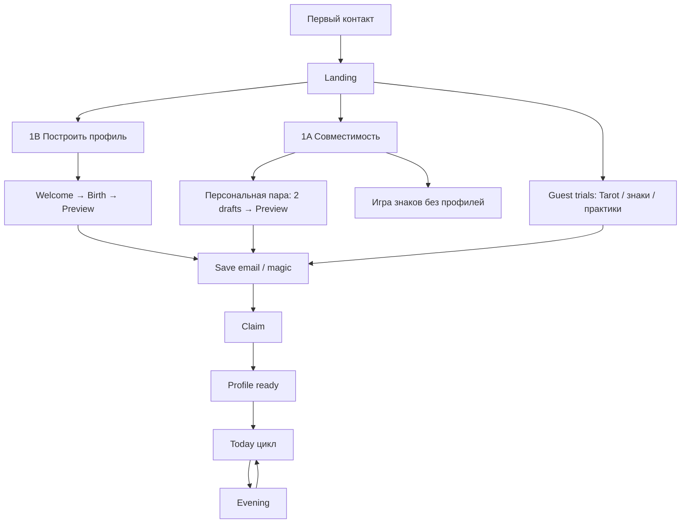
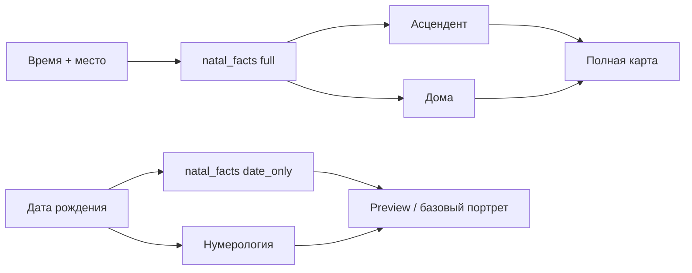
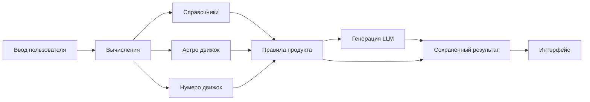
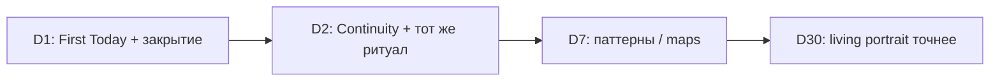

# TodayFlow — полный пользовательский путь и целевой канон v1

**Статус:** LIVING SoT пользовательского пути (обновлён 2026-07-24 — walkthrough vs code)  
**Роль:** карта маршрута и решений «зачем / какие данные / какая польза» по экранам.  
**Не заменяет:** Availability · Intake · Capability · Generation Contracts (они — следствия пути).  
**Связанные:** [USER_JOURNEY_AUDIT_2026-07-20.md](./USER_JOURNEY_AUDIT_2026-07-20.md) · [PRODUCT_DATA_INTAKE.md](../PRODUCT_DATA_INTAKE.md) · [AUTH_SESSION_CONTRACT_V1.md](../AUTH_SESSION_CONTRACT_V1.md) · [PRODUCT_GENERATION_CONTRACTS.md](../PRODUCT_GENERATION_CONTRACTS.md) · [status/TODAY_CANON_VS_CODE_DIFF.md](../status/TODAY_CANON_VS_CODE_DIFF.md)

**Главный критерий:** для каждого элемента продукта ясно: *зачем он есть, какие данные использует, какую пользу даёт*.

**Канон первого входа после A–E (жёстко):**

```text
Landing → (1B | 1A) → Preview → Guest First Today → save-prompt → Save (email/magic) → Claim → Profile|/today
```

- Preview **не** ведёт прямой кнопкой на Save: CTA = First Today + Refine (`FirstResultScreen`).  
- Перед email показывают вкус Today целиком (`/today?first=1` guest), затем `guest-save-prompt` → `/onboarding/save` — value-first сильнее, чем «Preview → Save» в старой формулировке.  
- После claim: `redirect_target` с бэкенда, фолбэк `FIRST_TODAY_PATH`.  
- 1A = два draft-профиля (не birth SoT в URL).  
- Signup = magic only (без plaintext temp password).  
- Free `max_profiles = 3`.  
- Факты карты нового пути = контракт **`natal_facts`** (DeepSeek); Swiss legacy не удалять, но не SoT нового пути.

---

## 0−. Personal Model (уже канон — не новый принцип)

Единый Personal Model / Snapshot / PIL уже описаны в Product Model, PIL, DATA_OWNERSHIP.  
Задача этого документа — **не изобретать слой**, а держать согласованным **путь** и код.

Соблюдение Personal Model в коде: [PERSONAL_MODEL_CODE_COMPLIANCE_2026-07-21.md](./PERSONAL_MODEL_CODE_COMPLIANCE_2026-07-21.md).

---

## 0. Вердикт (после A–E)

| Слой | Состояние |
|------|-----------|
| Продуктовая идея | Ясна: Профиль = карта, Сегодня = гид дня |
| Маршрут первого входа | **Закреплён:** Preview → Guest First Today → save-prompt → Save → Claim (value-first; см. §4.1) |
| Лендинг | Primary «Построить мой профиль»; secondary Совместимость; login; guest trials |
| «Сегодня» | Ritual-first в коде; Theme→Action→Progress в части канона — **открытый** UX-долг (не откатывает A–E) |
| Время рождения | Не блокирует; без time/place — нет ASC/домов (`unavailable_facts`) |
| Факты карты | MVP: LLM `natal_facts`; Swiss = legacy |
| 1A | Dual durable drafts → email bind обоих; free до 3 профилей |
| Signup | Magic / set-password; plaintext temp password **запрещён** |
| Привычка D2→D30 | Задумана; Continuity частичная — следующий фокус живого пути |

Ниже: путь → канон разделов → противоречия (часть закрыта A–E) → что править в коде экран за экраном.

---

## 1. Полный пользовательский путь

### 1.1 Целевая схема (канон)



### 1.2 Матрица этапов (12 вопросов)

| Этап | Видит | Может | Пока недоступно | Решение | Мотив дальше | Данные системе | Откуда | Считает / facts | Генерирует модель | В профиль | Ежедневно меняется | Постоянно |
|------|-------|-------|-----------------|---------|--------------|----------------|--------|-----------------|-------------------|-----------|-------------------|-----------|
| **Лендинг** | Обещание дня, guest trials, CTA | Таро/совместимость/практики; «Построить мой профиль» | Полный Profile/Today | Попробовать vs построить себя | Личный результат | locale | Клиент static | — | — | — | — | Бренд |
| **Гостевое** | Расклад / знаки / 1A drafts preview | Лимиты guest | Память между днями | Продолжить или сохранить | Не потерять результат | guest draft / compat pair | Session + storage | seeds | опц. dynamics | Черновик | — | — |
| **1B Birth→Preview** | Имя, дата, узнавание, limitations | Уточнить time/place или Save | ASC/дома без time+place | Доверять preview | Закрепить через email | birth, natal_facts | User + `natal_facts` | DeepSeek facts | recognition FE | Draft | — | Ядро после claim |
| **Регистрация** | Email + magic | Создать аккаунт | Password signup с лендинга | Привязать уже созданное | Открыть Profile | email | User | — | — | User | — | Аккаунт |
| **Claim** | Переход | — | — | Bind drafts | Увидеть карту | core-setup + profiles | Drafts | — | portrait при eligibility | AstroProfile(s) | — | SoT |
| **Профиль** | Recognition L1 | Читать, add profile, Today | Living без истории | Глубина vs день | Вернуться в Today | core-profile | API | calc + LLM funnel | identity… | Snapshots | Living | Natal facts |
| **Утро Today** | Тема/фокус/шаг… | Ритуал, символы | — | Чем заняться сегодня | Прожить день | date+profile | Day APIs | число/сид | day_story | Day state | День | Профиль |
| **Вечер** | Итог | Рефлексия | — | Закрыть день | Завтра Continuity | outcome | User | — | evening | Ritual | Итог | — |
| **D2+** | Continuity | Цикл | — | Снова утром | Накопление | yesterday | History | — | day_story | History | День | Профиль |

### 1.3 Фактический путь (код web, после A–E)

**1B:**

```text
/ Landing
  → /onboarding/welcome → /onboarding/birth
      (+ POST /profile/natal-facts, date_only)
  → /onboarding/preview
  → [/onboarding/refine?after=save]
  → /onboarding/save (POST /auth/email-signup, magic only)
  → claim → POST /account/core-setup (+ natal_facts)
  → /profile   (если is_ready)
```

**1A:**

```text
/compatibility → /compatibility/birthdates
  → guestCompatPair (2 drafts, не query SoT)
  → /compatibility/birthdates/result (gated preview)
  → /onboarding/save → claim → оба AstroProfile
  → /account/profiles или /profile
```

**Параллельно без онбординга:** `/tarot`, `/compatibility/signs`, `/practices` (лимиты client-side).

**Returning:** `/auth?mode=login` (email+password). `signup` mode → soft onboarding.

**iOS:** Auth → birth → Today → Profile; те же REST-контракты — паритет маршрута A–E на web приоритетнее iOS до отдельного sync.

---

## 2. Лендинг

### 2.1 Канон vs код (после A–E)

| Источник | Что говорит |
|----------|-------------|
| **Код** `ProductWebLanding` + `productWebLandingContent` | Hero + orbit + guest trials + Today promise (static) + testimonials + CTA |
| Primary CTA | «Построить мой профиль» → `/onboarding/welcome?fresh=1` |
| Secondary | «Совместимость» → `/compatibility` |
| Login | «Войти» → `/auth?mode=login` |
| Guest limits | Tarot 1 · Compat 4 · Practices basic (`GUEST_ACCESS_LIMITS`) |

### 2.2 Целевые блоки лендинга (канон)

Каждый блок — **демонстрация ценности**, не рабочий персональный результат (кроме гостевых проб).

| Блок | Зачем на лендинге | Real / Demo | Данные | Персонал.? | Без регистрации | После клика | След. действие |
|------|-------------------|-------------|--------|------------|-----------------|-------------|----------------|
| **Обещание** | JTBD дня через профиль | Demo copy | — | Нет | Да | 1B welcome | Birth |
| **Orbit / превью дня** | Атмосфера «дня» | Demo UI | Статика | Нет | Да | Onboarding / trials | — |
| **Today promise** | Обещание утра после bind | Demo cards | Статика | Нет | Да | Save/build profile | Profile→Today later |
| **Таро** | Быстрая проба | **Real** (лимит 1) | Колода + вопрос | Слабо | Да | `/tarot` | Лимит → save |
| **Совместимость** | Социальный магнит + 1A | **Real** (лимит 4) | Знаки / 2 drafts | Частично | Да | `/compatibility` | Preview → save |
| **Практики** | Телесный вход | Real catalog | Static/API | Нет | Да | `/practices` | — |
| **CTA профиля** | Закрепить себя | Real funnel | — | — | — | `/onboarding/welcome?fresh=1` | Preview→email |
| **Login** | Returning | Real | — | — | — | `/auth?mode=login` | Claim if draft |

### 2.3 Язык лендинга (запрет внутреннего жаргона)

В UI **нельзя** без пояснения: «хаб карт», «тропа пути», «созвездие якорей», «живые тексты», «вертикальная версия раскрытия», «PIM», «CUM», «ритуальный spine».

Допустимые пользовательские слова: *сегодня, фокус, шаг, карта дня, число дня, профиль / моя карта, совместимость, вечер, память о вчера*.

---

## 3. Регистрация и сбор данных

### 3.1 Минимальный набор

#### Обязательные

| Поле | Когда | Зачем |
|------|-------|-------|
| `email` (+ consent) | Save / signup | Аккаунт, magic bind |
| `locale` | Signup / settings | Язык |
| `birth_date` | Birth (1B) / person cards (1A) | Hard minimum для facts |
| `first_name` | Welcome (1B); label в 1A | Обращение; name numerology опц. |

#### Необязательные

| Поле | Зачем | Если нет |
|------|-------|----------|
| `birth_time` | ASC, дома, точнее Луна | `time_unknown=true`; ASC/houses → `unavailable_facts` |
| `location_name` + coords | Нужны **вместе со временем** для full mode | Без времени место не даёт precision; place required only if time known |
| `gender` | Грамматика RU | `unspecified` |
| Intent / reality chips | Смещение First Today | Дефолты на claim — **известный баг**, не блокер bind |

#### Не запрашивать

| Поле | Решение |
|------|---------|
| **Фамилия** | **Не спрашивать** в онбординге. Advanced settings only если нужно expression. |
| **Password на signup** | **Не слать** temp password; magic / set-password only |

### 3.2 Время рождения — канон точности

| Работает **без** времени | Требует время + место |
|--------------------------|------------------------|
| `natal_facts` date_only (Солнце и пр.) | Асцендент, дома, углы |
| Нумерология life path | Full synastry angles |
| Таро, guest trials | — |
| Preview recognition (дата) | — |

**UI:** «Не знаю время — добавить позже». Limitations CTA на preview. **Не** «профиль недоступен».

### 3.3 Auth hygiene (A–E)

| Правило | Статус |
|---------|--------|
| `POST /auth/email-signup` → magic link | Shipped |
| Нет `dev_temp_password` / plaintext в письме | Shipped |
| Password form только login | Shipped |
| Free `max_profiles` | **3** (self + partner + one) |

---

## 4. Первый результат и post-claim surface

### 4.1 До email — Preview → Guest First Today → Save (канон = факт кода, 2026-07-24)

| Вопрос | Канон |
|--------|-------|
| Куда попадает | **`/onboarding/preview`** (1B) или compat result (1A) |
| Что видит | Узнавание / gated compat; limitations без time/place |
| Почему | Ценность **до** регистрации |
| Facts | `natal_facts` (DeepSeek); date_only без ASC/домов |
| CTA на Preview | **Не** прямой Save. `FirstResultScreen`: primary **First Today** (`/today?first=1`) + **Refine**. Прямого `saveHref` нет — не добавлять «кнопку Save на Preview» по старой формулировке (дубль / лишний шаг). |
| Путь к email | Preview → Guest First Today (`GuestFirstTodayScreen`) → **`guest-save-prompt`** → `/onboarding/save` (email/magic). Перед почтой показывают вкус Today целиком — это **более** value-first, чем «Preview → Save» в одной кнопке. |

### 4.2 После email — Claim → Profile / Today (канон)

| Вопрос | Канон |
|--------|-------|
| Куда попадает | `POST /account/core-setup` → **`redirect_target`** с бэкенда; фолбэк **`FIRST_TODAY_PATH`**, если путь не пришёл |
| Что видит | Profile L1 recognition-first и/или First Today — по `redirect_target` |
| Почему | Bind уже собранного смысла |
| First Today до email | Уже прожит как guest taste (см. §4.1); после claim не обязан дублировать gate |
| 1A | Оба профиля в круге (`/account/profiles`) |

### 4.3 Факт vs канон

| | Факт (код, walkthrough 2026-07-24) | Канон |
|--|-------------------------------------|-------|
| До email | Preview → Guest First Today → save-prompt → Save | ✓ (§4.1 уточнён; старое «Primary CTA Preview → Save» — устарело) |
| После email | Claim → `redirect_target` / First Today fallback | ✓ |
| Preview Save button | Нет | ✓ не добавлять |
| First Today до email | Guest taste path, не blocker | ✓ |

---

## 5. Профиль пользователя

### 5.1 Словарь сущностей (без абстракций)

| Элемент UI | Что это | Как определяется | Функция для пользователя | Где живёт |
|------------|---------|------------------|--------------------------|-----------|
| **Архетип** | Короткое имя роли (Architect / Harmonizer / …) | Формула от life path (+ element) | Язык самопонимания | Постоянно в профиле |
| **Характер / identity_core** | 2–3 предложения «кто ты в основе» | LLM funnel `profile.identity` на calc-базе | Опора самоописания | Snapshot; пересчёт редко |
| **Сильные стороны** | Конкретные способности | LLM + calc | На что опираться | Профиль |
| **Зоны роста** (не «слабости-стигма») | Куда внимание | LLM | Осторожность без ярлыка | Профиль |
| **Внутренние противоречия** | Напряжения модальностей/аспектов/паттернов | Астро facts + LLM patterns | Нормализация конфликта в себе | Профиль |
| **Направления развития** | Куда расти в сферах | LLM spheres + living | Долгий фокус | Профиль |
| **Опоры (`helps`)** | **Практики и условия**, в которых человеку легче | `profile_contract.helps` + CUM | «Что мне помогает» | Постоянный слой |
| **Камень / цвет / тотем дня** | **Символ текущего дня** | Morning / day_story.talisman | Якорь внимания на день | **Дневной** слой |
| **Числовые показатели** | Life path, expression… | Numerology | Ритм жизни | Постоянно |
| **Астро показатели** | Солнце, Луна, планеты, (ASC) | **`natal_facts`** (+ Swiss legacy read) | Предрасположенности | Постоянно; ASC условно |
| **Таро-архетипы** | Повторы из истории | History | Символ ↔ паттерн | После накопления |

### 5.2 Карточка элемента профиля (шаблон канона)

Для каждого элемента фиксируется:

1. Входные данные  
2. Формула / справочник / генерация  
3. Канонический источник (SoT)  
4. Промпт (если LLM)  
5. Формат ответа  
6. Что сохраняется  
7. Может ли меняться  
8. Как применять в жизни  
9. Почему в профиле, а не только в «Сегодня»

### 5.3 Источники (кратко)

| Элемент | Вход | Механизм | SoT | Меняется? |
|---------|------|----------|-----|-----------|
| Архетип seed | life_path | `core_profile.py` | Backend calc | При смене birth/name logic |
| identity / styles / patterns / spheres | person+facts+living | profile funnel prompts | `core_profile_snapshots` | Rebuild / living |
| Helps | contract + CUM | LLM + rules | Snapshot + CUM | С опытом |
| Natal facts | birth (+time/place) | **`profile.natal_facts.v1`** DeepSeek | CachedNatalChart.metadata + positions list | При правке birth |
| Swiss natal (legacy) | birth+coords | astro microservice | cached_natal_charts | Legacy path |

---

## 6. Раздел «Сегодня»

**Вопрос экрана:** *Что мне важно понимать и делать сегодня?*

### 6.1 Утренний сценарий (целевой)

1. Continuity (D2+): одна строка про вчера  
2. Приветствие + тема дня (смысл)  
3. Фокус / избегать (insight)  
4. Один шаг (action)  
5. Символы: карта → число (дополняют, не заменяют смысл)  
6. Намерение / фокус пользователя (сигнал)  
7. Progress / микро-статус  

### 6.2 Что от чего зависит

| Данные | Постоянны | От даты | От состояния пользователя |
|--------|-----------|---------|---------------------------|
| Профильный baseline | ✓ | | |
| Карта/число дня, day_story | | ✓ | После ритуала/настроения — пересборка fingerprint |
| Намерение, mood chips, evening | | | ✓ |

### 6.3 Вечер

- Сравнение намерения и результата (`yes/partial/no`)  
- 1 короткая рефлексия + observations  
- Сохранение → seed Continuity на завтра  
- Без новых тяжёлых генераций «ради красоты»

### 6.4 Факт (риски)

- Ritual-first может прятать Theme/Action до pick (см. TODAY_CANON_VS_CODE_DIFF).  
- Spoilers morning в значительной мере закрыты через `day_symbol_states` (см. DAY_SYMBOL_REVEAL); держать регрессионные тесты.  
- Progress strip и мосты в Profile/Compatibility — частичные.

---

## 7. Таро

### 7.1 Сценарии

| Сценарий | Вопрос пользователя | Выбор карты | Данные интерпретации | Срок | Повтор |
|----------|---------------------|-------------|----------------------|------|--------|
| **Карта дня** | «Какой символический фокус сегодня?» | Выбор из закрытых / reveal seed (`day_symbol_states`) | Карта + профиль + контекст дня | **1 локальный день** | Нельзя «перетянуть» ту же дату; новый день = новая карта |
| **Постоянные карты** | «Что повторяется во мне?» | Агрегация истории | Частоты / темы | Пока копится история | Обновляется с новыми раскладами |
| **Расклад по запросу** | Явный вопрос пользователя | По spread_id + draw | Вопрос + позиции + профиль | По смыслу вопроса (часы–дни); не вечный вердикт | Новый расклад = новый вопрос; антиспам: лимит/тот же вопрос |

### 7.2 Про «35 дней»

| Гипотеза | Факт |
|----------|------|
| TTL результата таро = 35 дней | **Не найдено** в backend |
| 35 дней = что-то продуктовое | **Habit Map**: сетка **7×5 = 35 дней** визуализации привычек (`PRODUCT_EXECUTION_TRACKER` MP-3) |

**Решение канона:** не использовать «35 дней» как срок жизни карты/расклада.  
- Карта дня → до конца локальной даты.  
- Расклад → до смены вопроса / явного «новый расклад».  
- 35 дней → только UI окна карт привычек/настроения.

### 7.3 Связи

- С профилем: карта дня **не переписывает** портрет; может окрашивать day_story.  
- С состоянием: mood/intent после ритуала могут bump fingerprint day_story.  
- История: `tarot_draws` / spread draws; модуль не спойлерит до reveal.

---

## 8. Натальная карта

### 8.1 Слои данных (после A–E)

| Слой | Примеры | Источник (SoT нового пути) |
|------|---------|----------------------------|
| **Факты MVP** | Солнце/Луна/планеты, ASC/дома при full | **`POST /profile/natal-facts`** · `profile.natal_facts.v1` (DeepSeek) |
| Persist | positions list + facts metadata | `CachedNatalChart` (+ claim/core-setup) |
| Legacy math | Swiss / astro microservice | **Не удалять**; не primary для guest→Profile |
| Справочник | Значения аспектов, стихий | `DATA/reference`, `DATA/astrology_reference` |
| Интерпретация | Editorial / portrait | `natal_chart_editorial`, profile funnel |

См. [PRODUCT_DATA_PROVIDERS.md](../PRODUCT_DATA_PROVIDERS.md).

### 8.2 С временем и без



| Показатель | Без времени (`date_only`) | С временем + местом (`full`) |
|------------|---------------------------|------------------------------|
| Солнце, планеты в знаках | ✓ (`natal_facts`) | ✓ |
| Луна | ✓ | ✓ |
| Асцендент | **`unavailable_facts`** — не выдумывать | ✓ |
| Дома | **`unavailable_facts`** | ✓ |
| Аспекты планет | ✓ по контракту | ✓ |
| Доминирующие элементы / модальности | ✓ | ✓ |
| Практические выводы | ✓ осторожные | ✓ |

**Правило:** отсутствие времени **не обнуляет** профиль и «Сегодня»; блокирует только ASC/дома.

---

## 9. Совместимость

**UI (RU):** всегда «Совместимость», режимы: **Любовь · Семья · Родитель/ребёнок · Работа** — не `Compatibility`.

**1A (A–E):** персональная пара = **два durable guest drafts** (`guestCompatPair`), не birth SoT в URL; email bind **обоих**; free лимит профилей = **3**.

### 9.1 Типы (фактические modes)

| Тип (UI) | mode id | Данные о втором | Нужен аккаунт 2-го? | Расчёт | Генерация |
|----------|---------|-----------------|---------------------|--------|-----------|
| Любовь | `romantic` | знак / дата / профиль | Нет | Движок размерностей + опц. синастрия | content_v1 / premium |
| Семья | `family` | то же | Нет | Веса под быт/тепло | то же |
| Родитель/ребёнок | `parent_child` | то же | Нет | Веса под контакт/границы | то же |
| Работа | `business` | то же | Нет | Коммуникация/структура | то же |

Дополнительно (если есть в API, не как отдельные вкладки лендинга): эмоциональный/коммуникационный **слои внутри** отчёта, не отдельные продукты.

### 9.2 Методика (канон объяснения)

- **Астрология:** знаки, (синастрия при birth+time).  
- **Нумерология:** life path / ритмы при датах.  
- **Профиль пользователя:** стили общения/конфликта при `profile_enriched` / `two_profiles`.  
- **Итоговая оценка:** score/tier + условия; процент = *относительная лёгкость динамики в выбранном режиме*, не «судьба» и не гарантия отношений.  
- **Практика:** what_works / risks / next_step.

Кэш совместимости в коде: **7 суток** (`COMPATIBILITY_CACHE_TTL_HOURS`) — не путать с 35.

---

## 10. Реестр генераций и промптов

### 10.1 Канонические (registry + day_story)

| ID / имя | Место | Задача | Входы | Контракт | TTL / повтор | Зачем существует |
|----------|-------|--------|-------|----------|--------------|------------------|
| `day_story_v1` | Сегодня | Один голос дня | brief, ritual, fusion, profile slice | theme/story/do/avoid/domains/talisman… | На день / fingerprint | Главный смысл дня |
| `day.guide.funnel.*` | Legacy narrative guide | Пошаговый гид | core, fusion | guide steps | По запросу | Legacy; **свести к day_story** |
| `day.day_layer.funnel.*` | Legacy | Слой дня | — | — | — | Кандидат на deprecate |
| `day.spheres.funnel.*` | Legacy сферы дня | — | — | — | — | Кандидат на deprecate vs domains day_story |
| `day.evening.funnel.*` | Вечер | Рефлексия | day context | evening | Вечер дня | Закрытие |
| `day.deepen.funnel.*` | Углубление | Expand | — | — | По CTA | Опциональная глубина |
| `profile.identity.v1` | Профиль | Кто я | calc profile | identity_core | Snapshot / rebuild | Портрет |
| `profile.styles.v1` | Профиль | Стили | — | styles | — | Отношения/деньги/решения |
| `profile.patterns.v1` | Профиль | Паттерны | + living | patterns | — | Только с evidence |
| `profile.spheres.v1` | Профиль | Сферы жизни | — | spheres | — | Практические зоны |
| `compatibility_content_v1` | Совместимость | Тексты слоёв | profiles, mode | guest/reg/premium blocks | cache 7d | Динамика пары |
| `tarot_reading_synthesis` | Расклады | Синтез | cards, question | TarotSpreadReading | На расклад | Ответ на вопрос |
| `morning_ritual` recs | Утро | do/avoid/focus | natal, transits | short JSON | День | Короткие реко (если не дублирует day_story) |
| `natal_chart_editorial` | Карта | Пояснения | positions | editorial | Редко | Понятность карты |
| `profile.natal_facts.v1` | Birth / claim | Факты карты (MVP) | birth date ± time/place | natal_facts JSON | Persist cache | SoT facts нового пути (DeepSeek) |
| `today_story_enrichment_v0` | Фон | Обогащение | baseline story | enriched | fingerprint | Качество без блокировки UI |

**Правило:** один смысл = один промпт-пайплайн. Дубли `guide` / `day_layer` / `day_story` на одном экране — запрещены.

### 10.2 Карточка генерации (обязательные поля реестра)

Для каждой записи в полном реестре (spreadsheet / appendix): название, место, задача, входы, обязательные/опц. поля, system/user prompt refs, JSON-контракт, валидация, max length, banned phrases, fallback, TTL, условия регена, persist?, cost class, причина существования.

Полные тексты промптов — в коде (`prompts/`, `services/*`); этот канон владеет **смыслом и уникальностью**, не дублирует все строки.

---

## 11. Источники данных



| Поле UI (примеры) | Источник | Владелец | Создание | Жизнь | Пересчёт | Зависимости | Нет данных |
|-------------------|----------|----------|----------|-------|----------|-------------|------------|
| Имя в приветствии | UserSettings | User | Онбординг | Пока не сменят | Ручной | — | «ты» |
| Тема дня | day_story / DayModel | Day engine | Утро / после ritual | День | fingerprint | profile+date+ritual | Fallback copy |
| Карта дня | Tarot seed + reveal | day_symbol_states | Reveal | День | Нет | user+date | Locked UI |
| Число дня | YYYYMMDD reduce | day_symbol_states | Reveal | День | Нет | local date+TZ | Locked UI |
| ASC | `natal_facts` full | AstroProfile / cache | Core setup | Постоянно | При правке time+place | time+place | Скрыть / unavailable |
| Опоры (helps) | profile_contract | CoreProfile | Funnel | До rebuild | Rebuild | birth+living | Forming state |
| Камень дня | daily_symbols / talisman | Morning/day_story | День | День | Новый день | date | Скрыть карточку |
| Score совместимости | Engine | Compatibility service | Запрос | cache ≤7d | Новый запрос/mode | два набора данных | Ошибка + retry |

---

## 12. Ежедневная привычка

### 12.1 Целевой цикл

**Утро:** быстрый вход → контекст → рекомендация → намерение → минимальный шаг.  
**День:** возврат к фокусу → короткая отметка → карта/совет без новых тяжёлых gen.  
**Вечер:** фиксация → сравнение → рефлексия → прогресс → seed завтра.  
**Следующий день:** Continuity → ощущение накопления → причина открыть снова.

### 12.2 Механики привычки vs разовое развлечение

| Механика | Тип | Почему |
|----------|-----|--------|
| Continuity «вчера → сегодня» | Привычка | Незавершённый гештальт + прогресс |
| Вечернее закрытие | Привычка | Closure + данные для D2 |
| Тема→шаг→итог | Привычка | Петля компетентности |
| Карта/число дня | Гибрид | Ритуал входа; alone = развлечение |
| Расклады «ещё раз» без нового вопроса | Развлечение | Сжигать без обучения |
| Совместимость ради % | Развлечение | Пока нет next_step в жизнь |
| Habit/Mood maps 35d | Привычка | Видимый след серии |
| Гостевой лимит без claim | Развлечение | Нет памяти |

### 12.3 D1 → D2 → D7 → D30



| День | Должен почувствовать |
|------|----------------------|
| D1 | «Это про меня» + один шаг |
| D2 | «Меня помнят» |
| D7 | «Я вижу свою серию» |
| D30 | «Портрет стал точнее от моих дней» |

---

## 13. Проверка текущего канона — противоречия

Формат: **текущий канон → факт → рекомендация → изменения**.

| ID | Тема | Было | Факт после A–E | Решение | Статус |
|----|------|------|----------------|---------|--------|
| X1 | First Day маршрут | auth→Today; guest Today до email | **Preview→Save→Claim→Profile**; First Today не gate | Value-first + Profile post-claim = SoT | **CLOSED A–E** |
| X2 | Лендинг | Blueprint ≠ код | Primary «Построить мой профиль»; secondary Compat; login | Код лендинга = launch UX | **CLOSED A–E** (blueprint sync optional) |
| X3 | Spine Today | Theme vs ritual | Ritual-first в коде | Гибрид Theme/Focus/Step | OPEN — экран Today |
| X4 | Выбор карты | Theatrical | Seed reveal | Честный reveal copy | OPEN |
| X5 | Число дня | «Персональное» | Календарное YYYYMMDD | Copy = «число сегодняшнего дня» | OPEN |
| X6 | 35 дней | Путаница TTL | Habit Map 7×5 | Только maps | OPEN docs |
| X7 | Фамилия | Optional last_name | VF без фамилии | Не собирать в основном пути | OPEN audit forms |
| X8 | Profile jargon | «Живые тексты» | В UI | Voice-safe labels | OPEN |
| X9 | Dual signup | Magic vs password | Magic only; password = login | Один continue-path → Profile | **CLOSED A–E** |
| X10 | Guest claim | Неполный перенос | Claim + dual 1A; chips residual | Дожать mood/intent + E2E | OPEN residual |
| X11 | Legacy narratives | Дубли day_story | Параллель | Deprecate с Today | OPEN |
| X12 | iOS parity | Отставание | Web A–E ahead | Паритет после web | OPEN |
| X13 | Birth time messaging | Тревога «неполная» | `unavailable_facts` + limitations CTA | Без блокировки разделов | PARTIAL A–E |
| X14 | Progress блок | Часто нет | — | Микро-progress | OPEN Today |
| X15 | Регистрационный CTA | «Сохранить день» | Save → bind Profile | CTA = закрепить профиль / пару | **CLOSED A–E** (copy polish OK) |
| X16 | Personal Model | Compliance gaps | См. audit | Чинить read-path | OPEN P0 |
| X17 | Natal facts provider | Swiss as primary | DeepSeek `natal_facts` | MVP = LLM facts | **CLOSED A–E** |
| X18 | max_profiles free | 1 | **3** | Dual 1A + Add profile | **CLOSED A–E** |

---

## 14. Схемы (сводка)

В документе уже: полный путь (§1.1), натал с/без времени (§8.2), источники (§11), D1–D30 (§12.3).

Дополнительные целевые диаграммы для wiki/figma (те же узлы):

1. Полный путь — §1.1  
2. Незарегистрированный — Landing → trials → limit → save  
3. Регистрация/onboarding — welcome→birth→preview→save→claim→**Profile**  
4. Первый результат — `natal_facts` → Preview → (claim) → Profile; Today опционально  
5. Источники профиля — §5 + §11  
6. Формирование «Сегодня» — morning → symbols → day_story → contract → UI  
7. Утро/вечер — §6 + §12  
8. Таро — §7  
9. Натал — §8.2  
10. Совместимость — §9  
11. Карта генераций — §10  
12. Хранение — таблицы §11 / backend models  
13. Привычка — §12  
14. D1–D30 — §12.3  

---

## 15. Deliverables checklist

| # | Артефакт | Где |
|---|----------|-----|
| 1 | Аудит текущего состояния | §0, §13 |
| 2 | Карта полного пути | §1 |
| 3 | Канон разделов | §2–9, §12 |
| 4 | Матрица функций × данные | §1.2, §3, §5 |
| 5 | Карта источников | §11 |
| 6 | Реестр генераций | §10 |
| 7 | Схемы | mermaid + §14 |
| 8 | Противоречия | §13 |
| 9 | Решения | колонка «Рекомендуемое решение» |
| 10 | План приоритетов | §16 |
| 11 | Файлы к обновлению | §16.2 |
| 12 | Экраны/тексты | §16.3 |
| 13 | Тесты | §16.4 |

---

## 16. План изменений (только после принятия канона)

### 16.1 Приоритеты

**Done A–E (не откатывать без user bug):** Preview→Save→Claim→Profile · magic signup · dual 1A · `natal_facts` · `max_profiles=3`.

**P0 — сверка кода с этим каноном (экран за экраном)**

0. **Personal Model code gaps (X16)** — compliance audit; не плодить принципы.  
1. Прогнать живой путь Landing → … → Profile против §1.3; чинить только drift.  
2. Residual claim chips (intent/reality/mood) — X10.  
3. Theme/Focus/Step не прятать за полным ритуалом (X3).  
4. Честный copy карты + календарное число дня (X4–X5).

**P1 — ясность сущностей**

5. Словарь: опоры / камень дня / precision без времени.  
6. Убрать фамилию из основного UX.  
7. Deprecate дубли day narrative на Today.  
8. Progress + Continuity D2.  
9. Blueprint ↔ лендинг (optional).

**P2 — глубина и паритет**

10. iOS parity маршрута A–E.  
11. Longitudinal profile только с evidence.  
12. Maps 35d ↔ evening.  
13. E2E first-path journeys.

### 16.2 Файлы документации к обновлению

- `docs/FIRST_DAY_EXPERIENCE.md` — value-first SoT  
- `docs/TODAYFLOW_PRODUCT_CANON_UNIFIED.md` — ссылка на этот путь; уточнить birth_time  
- `docs/TODAY_SCREEN_V1_CANON.md` — гибрид Theme + ritual  
- `docs/status/WEB_LAUNCH_PRODUCT_BLUEPRINT.md` — лендинг как в коде  
- `docs/status/TODAY_CANON_VS_CODE_DIFF.md` — пересчитать после решений  
- `docs/profile/PROFILE_CONTENT_CANON_V1.md` — опоры/камень дня  
- `docs/PRODUCT_LEXICON_AND_RETENTION.md` — запрет жаргона  
- `docs/README.md` — приоритет чтения (этот аудит)  
- `docs/PRODUCT_EXECUTION_TRACKER.md` — строка принятия канона  
- `docs/audits/DAY_SYMBOL_REVEAL_CANON_V1.md` — честный reveal wording  

### 16.3 Экраны и тексты к правке (после accept)

| Экран | Что править |
|-------|-------------|
| Landing | Согласовать обещание числа дня; убрать внутренний жаргон |
| Onboarding save | CTA «сохранить день» |
| Today ritual | Copy выбора карты; Theme раньше |
| Profile | «Камень дня» vs вечные опоры; точность без времени |
| Natal | Скрытие ASC/домов, не всего модуля |
| Compatibility | Только RU labels в ru-locale |
| Tarot hub | Без спойлера карты дня; без «35 дней» |

### 16.4 Необходимые тесты

| Тест | Цель |
|------|------|
| Morning/Today не отдают identity карты/числа до reveal | Регресс DAY_SYMBOL |
| Guest claim переносит mood/goals/symbols/intent | Continuity регистрации |
| Profile без birth_time: Today + num + tarot 200; ASC gated | Необнуление |
| day_story один голос; нет тройного narrative | Анти-дубль |
| E2E: landing → first result → save → same day | Путь |
| Compatibility RU mode labels | i18n |
| Habit map 35 cells ≠ tarot expiry | Регресс смысла |
| D2 Continuity line non-empty after evening close | Привычка |

---

## 17. Правило сопровождения

1. Этот файл — **аудит + целевой канон пути**.  
2. После product accept спорные X* переносятся в живые SoT (FIRST_DAY, TODAY_SCREEN, CORE), а этот файл получает статус `ACCEPTED` и короткий changelog.  
3. **Не** править UI/промпты «по ходу» до принятия решений §13.  
4. Любая новая генерация обязана добавить строку в §10 с причиной существования.

---

## Changelog

| Дата | Изменение |
|------|-----------|
| 2026-07-21 | Первая версия полного аудита пути и целевого канона |
| 2026-07-21 | §0− + X16 → code compliance audit; откат ошибочного «нового принципа» |
| 2026-07-24 | §4.1 + шапка: путь к Save = Preview → Guest First Today → `guest-save-prompt` → `/onboarding/save` (не CTA Save на Preview); walkthrough web — путь цел |
