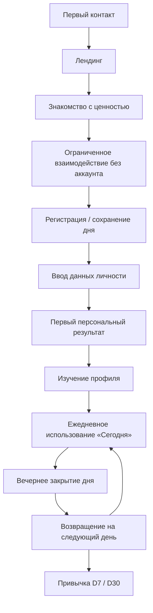
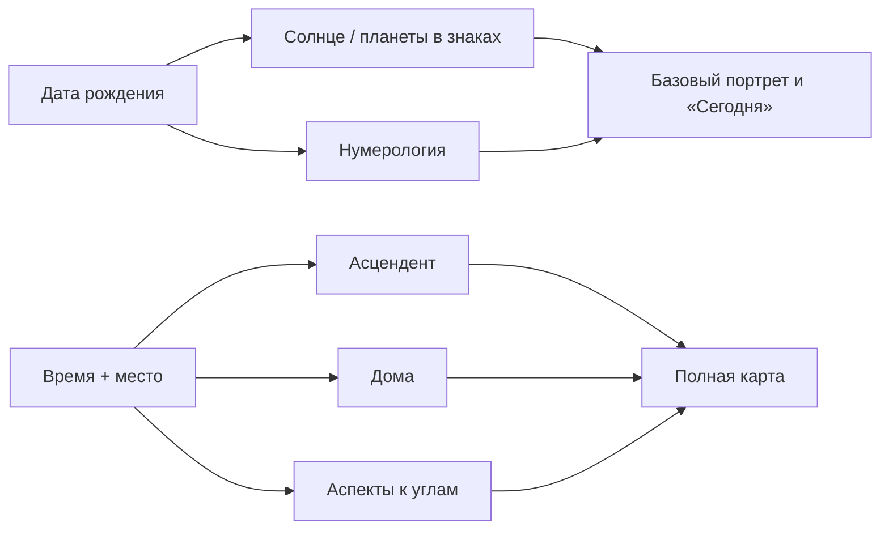
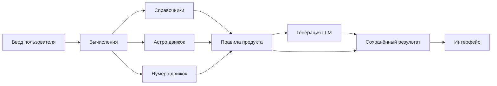
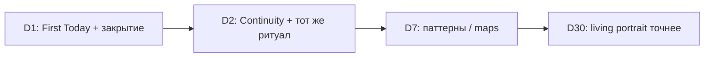

# TodayFlow — полный пользовательский путь и целевой канон v1

**Статус:** аудит + целевой канон (не молчаливая перепись старых SoT)  
**Дата:** 2026-07-21  
**Метод:** сверка docs ↔ backend ↔ frontend ↔ iOS (без косметических правок UI/кода в этом PR)  
**Связанные аудиты:** [USER_JOURNEY_AUDIT_2026-07-20.md](./USER_JOURNEY_AUDIT_2026-07-20.md) · [DAY_SYMBOL_REVEAL_CANON_V1.md](./DAY_SYMBOL_REVEAL_CANON_V1.md) · [status/TODAY_CANON_VS_CODE_DIFF.md](../status/TODAY_CANON_VS_CODE_DIFF.md)

**Главный критерий:** для каждого элемента продукта одним предложением ясно: *зачем он есть, какие данные использует, какую пользу даёт*.

---

## 0−. Personal Model (уже канон — не новый принцип)

Единый Personal Model / Snapshot / PIL уже описаны в Product Model, PIL, DATA_OWNERSHIP.  
Задача аудита пути — **не изобретать слой**, а закрыть конкурирующие execution-доки (X1 и др.) и сверить код.

Соблюдение Personal Model в коде: [PERSONAL_MODEL_CODE_COMPLIANCE_2026-07-21.md](./PERSONAL_MODEL_CODE_COMPLIANCE_2026-07-21.md).

---

## 0. Вердикт аудита (коротко)

TodayFlow уже умеет собирать персональный день и портрет, но **каноны расходятся между собой и с кодом**:

| Слой | Состояние |
|------|-----------|
| Продуктовая идея | Ясна: ежедневная навигация (Профиль = карта, Сегодня = гид дня) |
| Маршрут первого дня | **3 конкурирующих канона** (см. §13) |
| Лендинг | Факт ≠ blueprint launch |
| «Сегодня» | Ritual-first в коде; Theme→Action→Progress в части канона |
| Время рождения | Правильно не блокирует продукт; UI/copy местами пугают «неполной картой» |
| 35 дней | **Не TTL таро** — окно Habit Map 7×5; путаница терминов |
| Генерации | Много полезных; часть legacy-поверхностей дублирует day_story |
| Привычка D2→D30 | Задумана; Continuity / evening→morning связь **частичная** |

Ниже: фактический путь → целевой канон → решения по спорам → план изменений. Код и тексты **не меняем**, пока этот документ не принят как SoT маршрута.

---

## 1. Полный пользовательский путь

### 1.1 Целевая схема (канон)



### 1.2 Матрица этапов (12 вопросов)

| Этап | Видит | Может | Пока недоступно | Решение | Мотив дальше | Данные системе | Откуда | Считает сама | Генерирует модель | В профиль | Ежедневно меняется | Постоянно |
|------|-------|-------|-----------------|---------|--------------|----------------|--------|--------------|-------------------|-----------|-------------------|-----------|
| **Лендинг** | Обещание дня, превью блоков, CTA | Таро/совместимость/практики как гость; «Создать мой Today» | Полный «Сегодня», профиль, история | «Попробовать» vs «сохранить себя» | Личный результат за минуты | locale, signup_source | Клиент | — | — | — | — | Бренд, обещание |
| **Гостевое взаимодействие** | Расклад / совместимость по знакам / превью дня | 1–N бесплатных действий | Память между днями, вечер→утро | Продолжить без аккаунта или сохранить | «Не потерять сегодняшний день» | session_id, черновик | Guest session | Сиды карт/чисел | Опционально | Черновик | Символы дня | — |
| **Регистрация** | Email / OAuth / magic | Создать аккаунт | Глубина без birth-данных | Доверять продукт email | Продолжить тот же день | email, consent, locale | Пользователь | — | — | User | — | Аккаунт |
| **Ввод данных** | Имя, дата, место; время опционально | Заполнить / «не знаю время» | ASC/дома без времени | Дать минимум для персонализации | Увидеть «про меня» | first_name, birth_*, place, gender? | Пользователь + geocode | Знак, life path, natal base | Позже портрет | AstroProfile, Settings | — | Ядро личности |
| **Первый результат** | Тема/фокус/шаг или превью портрета | Открыть «Сегодня», углубить | Полный living-слой | «Это про меня?» | Изучить карту / вернуться завтра | core + intent/reality | Расчёт + опц. chips | Baseline | First package / preview | Core snapshot seed | — | Архетип seed |
| **Профиль** | Портрет, карта, сферы, опоры | Читать, добавить людей, уточнить время | Longitudinal без истории дней | Глубина vs действие дня | Вернуться в «Сегодня» | profile_contract | Calc + LLM | Числа, планеты | Портрет | Snapshots | Living/pulse | Natal, life path |
| **Утро «Сегодня»** | Контекст дня, символы, фокус, шаг | Открыть карту/число, намерение, микрошаг | Вечерний итог | Чем заняться сегодня | Прожить день с фокусом | date, TZ, ritual | Date + reveal | Число дня, сид карты | day_story | DayConnection | Всё дневное | Профиль |
| **День** | Фокус, подсказка, отметка | Короткий check-in, расклад по запросу | Новая «карта дня» | Держать курс или уточнить | Не перегружать генерациями | mood/focus events | Пользователь | — | По запросу | Events | Состояние | — |
| **Вечер** | Сравнение намерения и факта | Рефлексия, итог | Завтрашний день | Закрыть день | «Завтра вспомнит» | outcome, observations | Пользователь | Continuity seed | evening text | DayRitual | Итог дня | — |
| **D2+** | Связь с вчера | Продолжить цикл | — | Снова открыть утром | Накопленная персонализация | yesterday outcome | History | Continuity line | Новый day_story | History | День | Профиль |
| **Привычка** | Карты настроения/привычек, точность | Серия закрытых дней | — | Остаться | Ощущение «меня понимают лучше» | series | Aggregates | Confidence | Уточнение портрета | Living | Pulse | Identity core |

### 1.3 Фактический путь (код web, 2026-07)

```
/ Landing
  → /onboarding/welcome → /onboarding/birth → /onboarding/preview
  → /today?first=1 (guest demo package)
  → /onboarding/save (email) → claim → /today (auth)
  → позже /profile, /tarot, /compatibility, /practices
```

Параллельно без онбординга: `/tarot`, `/compatibility`, `/practices` (лимиты client-side).

**iOS:** Auth → birth → Today → Profile; те же REST-контракты; bilingual chrome.

---

## 2. Лендинг

### 2.1 Текущий канон vs факт

| Источник | Что говорит |
|----------|-------------|
| `WEB_LAUNCH_PRODUCT_BLUEPRINT` | Hero + 6 preview cards + footer CTA; **без** feature-grid / «как это работает» |
| `FIRST_DAY_EXPERIENCE` | CTA на `/demo/today` (помечен superseded) |
| **Код** `ProductWebLanding.tsx` | Hero + orbit (Фокус/Темп/Шаг/Вечер/Память) + гостевые пробы (Таро/Совместимость/Практики) + promise + testimonials + CTA |

### 2.2 Целевые блоки лендинга (канон)

Каждый блок — **демонстрация ценности**, не рабочий персональный результат (кроме гостевых проб, которые ведут в реальные ограниченные фичи).

| Блок | Зачем на лендинге | Real / Demo | Данные | Персонал.? | Без регистрации | После клика | След. действие |
|------|-------------------|-------------|--------|------------|-----------------|-------------|----------------|
| **Обещание** («Интересно, что сегодня для тебя?») | Сформулировать JTBD дня | Demo copy | — | Нет | Да | CTA signup/onboarding | Начать путь |
| **Карта дня (превью)** | Показать символический вход в день | Demo UI | Статика | Нет | Да | Онбординг или /tarot | Попробовать / зарегистрироваться |
| **Число дня** | Показать ритм дня | Demo | Статика/календарь | Нет* | Да | Онбординг | То же |
| **Настроение / состояние** | Показать, что день учитывает «как ты сейчас» | Demo | — | Нет | Да | Онбординг | Дать имя/дату |
| **Персональные направления** | «Не общий гороскоп, а фокус» | Demo | — | Нет | Да | Онбординг | First Result |
| **Профиль (превью)** | Обещание устойчивой карты себя | Demo | — | Нет | Да | После First Today | Изучить позже |
| **Таро** | Быстрая проба ценности | **Real** (лимит) | Колода + вопрос | Слабо | Да (лимит) | `/tarot` | Лимит → регистрация |
| **Натальная карта** | Глубина «кто я» | Demo на лендинге; real после birth | Нужны birth data | Да после ввода | Превью нет | Онбординг birth | Ввести дату |
| **Совместимость** | Социальный магнит | **Real** (лимит) | Знаки/даты | Частично | Да (лимит) | `/compatibility` | Сохранить / углубить |
| **Утро / вечер** | Показать цикл привычки | Demo | — | Нет | Да | CTA | Создать аккаунт ради продолжения |
| **CTA регистрации** | Сохранить день и память | Real auth | email | — | — | `/onboarding/*` или `/auth` | First personal Today |

\*Число дня в продукте сейчас — **календарное** (от даты), не персональный personal day от рождения; на лендинге нельзя обещать «твоё личное число», если логика общая на всех.

### 2.3 Язык лендинга (запрет внутреннего жаргона)

В UI **нельзя** без пояснения: «хаб карт», «тропа пути», «созвездие якорей», «живые тексты», «вертикальная версия раскрытия», «PIM», «CUM», «ритуальный spine».

Допустимые пользовательские слова: *сегодня, фокус, шаг, карта дня, число дня, профиль / моя карта, совместимость, вечер, память о вчера*.

---

## 3. Регистрация и сбор данных

### 3.1 Минимальный набор

#### Обязательные

| Поле | Когда | Зачем |
|------|-------|-------|
| `email` (+ consent) | Регистрация | Аккаунт, сохранение дня |
| `locale` | Signup / settings | Язык |
| `first_name` | Онбординг | Обращение, часть нумерологии имени |
| `birth_date` | Онбординг | Знак, life path, база натала |
| `location_name` + coords | Онбординг | Место для натального расчёта |

#### Необязательные

| Поле | Зачем | Если нет |
|------|-------|----------|
| `birth_time` | ASC, дома, точнее углы/синастрия | `time_unknown=true`; профиль и «Сегодня» работают |
| `gender` | Грамматика RU | `unspecified` |
| Intent / reality chips | Смещение First Today | Дефолты (сейчас иногда hardcode на claim — **баг**) |

#### Не запрашивать

| Поле | Решение |
|------|---------|
| **Фамилия** | **Не спрашивать** в онбординге и не упоминать в First Day. Если остаётся в кабинете настроек — только скрытое advanced для expression-нумерологии; иначе удалить из форм. |

### 3.2 Время рождения — канон точности

| Работает **без** времени | Требует время / хуже без него |
|--------------------------|-------------------------------|
| Нумерология (life path, день рождения, personal year…) | Асцендент |
| Таро (карта дня, расклады) | Дома натальной карты |
| Число дня, карта дня | Часть аспектов к углам |
| Базовый астро-слой (Солнце, планеты в знаках) | Точная интерпретация домов |
| Архетип seed, характер baseline | Синастрия с углами |
| Персональные направления дня | — |
| Камень/цвет дня (символы), опоры-практики | — |
| Ежедневные рекомендации day_story | — |
| Совместимость по знакам/датам | Полная синастрия домов |

**UI:** «Не знаю время — добавить позже». Бейдж точности: «Карта без времени: дома и асцендент приблизительны», **не** «профиль недоступен».

---

## 4. Первый результат после регистрации

### 4.1 Целевой First Experience

| Вопрос | Канон |
|--------|-------|
| Куда попадает | **`/today?first=1`** — не пустой профиль |
| Что видит первым | Короткий **личный смысл дня**: тема + фокус + один шаг (First Today Package) |
| Почему это | Быстро доказывает: «это про меня сегодня», не «кабинет астрологии» |
| Уже доступно | Имя, знак, life path, baseline archetype, день по дате |
| Сразу | Deterministic theme/action; символы дня после явного открытия |
| Позже | Полный LLM-портрет, living patterns, глубокая натал-редактура |
| Должен понять | «Система видит структуру и даёт ориентир на день» |
| Мотив продолжить | Открыть карту/число → дочитать день → вечером закрыть → завтра увидеть Continuity |

### 4.2 Факт vs канон

| | Факт | Целевой канон |
|--|------|---------------|
| До email | Value-first preview + guest Today | Оставить value-first (сильнее retention) |
| После email | Claim → Today; intent/reality часто hardcode | Переносить реальные chips + символы дня |
| Profile | Доступен, но не точка входа | Кабинет **после** первого payoff |

---

## 5. Профиль пользователя

### 5.1 Словарь сущностей (без абстракций)

| Элемент UI | Что это | Как определяется | Функция для пользователя | Где живёт |
|------------|---------|------------------|--------------------------|-----------|
| **Архетип** | Короткое имя роли (Architect / Harmonizer / …) | Формула от life path (+ element) | Язык самопонимания | Постоянно в профиле |
| **Характер / identity_core** | 2–3 предложения «кто ты в основе» | LLM funnel `profile.identity` на calc-базе | Опора самоописания | Snapshot; пересчёт редко |
| **Сильные стороны** | Конкретные способности | LLM + calc | На что опираться | Профиль |
| **Зоны роста** (не «слабости-стигма») | Куда внимание | LLM | Осторожность без ярлыка | Профиль |
| **Внутренние противоречия** | Напряжения модальностей/аспектов/паттернов | Астро calc + LLM patterns | Нормализация конфликта в себе | Профиль |
| **Направления развития** | Куда расти в сферах | LLM spheres + living | Долгий фокус | Профиль |
| **Опоры (`helps`)** | **Практики и условия**, в которых человеку легче (режим, границы, формат общения) — не магический предмет | `profile_contract.helps` + CUM recommendations | «Что мне помогает в жизни» | Постоянный слой профиля |
| **Камень / цвет / тотем дня** | **Символ текущего дня** из справочника daily_symbols (не «камень характера навсегда») | Morning celestial_events / day_story.talisman | Мягкий якорь внимания на день | **Дневной** слой (можно показывать в профиле как «сегодня», не как вечную истину) |
| **Числовые показатели** | Life path, expression… | Numerology engine | Структура ритма жизни | Постоянно |
| **Астро показатели** | Солнце, Луна, планеты, (ASC) | Astro engine | Карта предрасположенностей | Постоянно; ASC условно |
| **Таро-архетипы** | Повторяющиеся карты/темы из истории | History aggregations | Связь символа и паттерна | После накопления |

### 5.2 Карточка элемента профиля (шаблон канона)

Для каждого элемента фиксируется:

1. Входные данные  
2. Формула / справочник / генерация  
3. Канонический источник (SoT)  
4. Промпт (если LLM)  
5. Формат ответа  
6. Что сохраняется  
7. Может ли меняться  
8. Как применять в жизни  
9. Почему в профиле, а не только в «Сегодня»

### 5.3 Источники (кратко)

| Элемент | Вход | Механизм | SoT | Меняется? |
|---------|------|----------|-----|-----------|
| Архетип seed | life_path | Формула в `core_profile.py` | Backend calc | Только при смене birth/name logic |
| identity / styles / patterns / spheres | person+astro+num+living | `profile.identity|styles|patterns|spheres.v1` | `core_profile_snapshots` | При rebuild / новых living |
| Helps (опоры) | contract + CUM | LLM + rules | Snapshot + CUM | Да, с опытом |
| Камень дня | date + symbols ref | Справочник / day_story | Morning / day_story | **Каждый день** |
| Natal summary | birth + place (+time) | Astro engine + editorial LLM | Natal services | Редко (правка birth) |

---

## 6. Раздел «Сегодня»

**Вопрос экрана:** *Что мне важно понимать и делать сегодня?*

### 6.1 Утренний сценарий (целевой)

1. Continuity (D2+): одна строка про вчера  
2. Приветствие + тема дня (смысл)  
3. Фокус / избегать (insight)  
4. Один шаг (action)  
5. Символы: карта → число (дополняют, не заменяют смысл)  
6. Намерение / фокус пользователя (сигнал)  
7. Progress / микро-статус  

### 6.2 Что от чего зависит

| Данные | Постоянны | От даты | От состояния пользователя |
|--------|-----------|---------|---------------------------|
| Профильный baseline | ✓ | | |
| Карта/число дня, day_story | | ✓ | После ритуала/настроения — пересборка fingerprint |
| Намерение, mood chips, evening | | | ✓ |

### 6.3 Вечер

- Сравнение намерения и результата (`yes/partial/no`)  
- 1 короткая рефлексия + observations  
- Сохранение → seed Continuity на завтра  
- Без новых тяжёлых генераций «ради красоты»

### 6.4 Факт (риски)

- Ritual-first может прятать Theme/Action до pick (см. TODAY_CANON_VS_CODE_DIFF).  
- Spoilers morning в значительной мере закрыты через `day_symbol_states` (см. DAY_SYMBOL_REVEAL); держать регрессионные тесты.  
- Progress strip и мосты в Profile/Compatibility — частичные.

---

## 7. Таро

### 7.1 Сценарии

| Сценарий | Вопрос пользователя | Выбор карты | Данные интерпретации | Срок | Повтор |
|----------|---------------------|-------------|----------------------|------|--------|
| **Карта дня** | «Какой символический фокус сегодня?» | Выбор из закрытых / reveal seed (`day_symbol_states`) | Карта + профиль + контекст дня | **1 локальный день** | Нельзя «перетянуть» ту же дату; новый день = новая карта |
| **Постоянные карты** | «Что повторяется во мне?» | Агрегация истории | Частоты / темы | Пока копится история | Обновляется с новыми раскладами |
| **Расклад по запросу** | Явный вопрос пользователя | По spread_id + draw | Вопрос + позиции + профиль | По смыслу вопроса (часы–дни); не вечный вердикт | Новый расклад = новый вопрос; антиспам: лимит/тот же вопрос |

### 7.2 Про «35 дней»

| Гипотеза | Факт |
|----------|------|
| TTL результата таро = 35 дней | **Не найдено** в backend |
| 35 дней = что-то продуктовое | **Habit Map**: сетка **7×5 = 35 дней** визуализации привычек (`PRODUCT_EXECUTION_TRACKER` MP-3) |

**Решение канона:** не использовать «35 дней» как срок жизни карты/расклада.  
- Карта дня → до конца локальной даты.  
- Расклад → до смены вопроса / явного «новый расклад».  
- 35 дней → только UI окна карт привычек/настроения.

### 7.3 Связи

- С профилем: карта дня **не переписывает** портрет; может окрашивать day_story.  
- С состоянием: mood/intent после ритуала могут bump fingerprint day_story.  
- История: `tarot_draws` / spread draws; модуль не спойлерит до reveal.

---

## 8. Натальная карта

### 8.1 Слои данных

| Слой | Примеры | Источник |
|------|---------|----------|
| Математика / движок | Долготы планет, знаки, аспекты, дома | Astro engine (`astro/`, backend natal) |
| Справочник | Значения аспектов, стихий | `DATA/reference`, `DATA/astrology_reference` |
| Интерпретация модели | Editorial / narrative | `natal_chart_editorial`, profile funnel |

### 8.2 С временем и без



| Показатель | Без времени | С временем |
|------------|-------------|------------|
| Солнце, планеты в знаках | ✓ | ✓ точнее сутки |
| Луна | ✓ (знак; градус грубее) | ✓ |
| Асцендент | Скрыть / «нужно время» | ✓ |
| Дома | Скрыть / noon-disclaimer | ✓ |
| Аспекты планет | ✓ | ✓ |
| Доминирующие элементы / модальности | ✓ | ✓ |
| Ключевые напряжения | На базе планет | + углы |
| Практические выводы | ✓ осторожные | ✓ |

**Правило:** отсутствие времени **не обнуляет** профиль и «Сегодня».

---

## 9. Совместимость

**UI (RU):** всегда «Совместимость», режимы: **Любовь · Семья · Родитель/ребёнок · Работа** — не `Compatibility`.

### 9.1 Типы (фактические modes)

| Тип (UI) | mode id | Данные о втором | Нужен аккаунт 2-го? | Расчёт | Генерация |
|----------|---------|-----------------|---------------------|--------|-----------|
| Любовь | `romantic` | знак / дата / профиль | Нет | Движок размерностей + опц. синастрия | content_v1 / premium |
| Семья | `family` | то же | Нет | Веса под быт/тепло | то же |
| Родитель/ребёнок | `parent_child` | то же | Нет | Веса под контакт/границы | то же |
| Работа | `business` | то же | Нет | Коммуникация/структура | то же |

Дополнительно (если есть в API, не как отдельные вкладки лендинга): эмоциональный/коммуникационный **слои внутри** отчёта, не отдельные продукты.

### 9.2 Методика (канон объяснения)

- **Астрология:** знаки, (синастрия при birth+time).  
- **Нумерология:** life path / ритмы при датах.  
- **Профиль пользователя:** стили общения/конфликта при `profile_enriched` / `two_profiles`.  
- **Итоговая оценка:** score/tier + условия; процент = *относительная лёгкость динамики в выбранном режиме*, не «судьба» и не гарантия отношений.  
- **Практика:** what_works / risks / next_step.

Кэш совместимости в коде: **7 суток** (`COMPATIBILITY_CACHE_TTL_HOURS`) — не путать с 35.

---

## 10. Реестр генераций и промптов

### 10.1 Канонические (registry + day_story)

| ID / имя | Место | Задача | Входы | Контракт | TTL / повтор | Зачем существует |
|----------|-------|--------|-------|----------|--------------|------------------|
| `day_story_v1` | Сегодня | Один голос дня | brief, ritual, fusion, profile slice | theme/story/do/avoid/domains/talisman… | На день / fingerprint | Главный смысл дня |
| `day.guide.funnel.*` | Legacy narrative guide | Пошаговый гид | core, fusion | guide steps | По запросу | Legacy; **свести к day_story** |
| `day.day_layer.funnel.*` | Legacy | Слой дня | — | — | — | Кандидат на deprecate |
| `day.spheres.funnel.*` | Legacy сферы дня | — | — | — | — | Кандидат на deprecate vs domains day_story |
| `day.evening.funnel.*` | Вечер | Рефлексия | day context | evening | Вечер дня | Закрытие |
| `day.deepen.funnel.*` | Углубление | Expand | — | — | По CTA | Опциональная глубина |
| `profile.identity.v1` | Профиль | Кто я | calc profile | identity_core | Snapshot / rebuild | Портрет |
| `profile.styles.v1` | Профиль | Стили | — | styles | — | Отношения/деньги/решения |
| `profile.patterns.v1` | Профиль | Паттерны | + living | patterns | — | Только с evidence |
| `profile.spheres.v1` | Профиль | Сферы жизни | — | spheres | — | Практические зоны |
| `compatibility_content_v1` | Совместимость | Тексты слоёв | profiles, mode | guest/reg/premium blocks | cache 7d | Динамика пары |
| `tarot_reading_synthesis` | Расклады | Синтез | cards, question | TarotSpreadReading | На расклад | Ответ на вопрос |
| `morning_ritual` recs | Утро | do/avoid/focus | natal, transits | short JSON | День | Короткие реко (если не дублирует day_story) |
| `natal_chart_editorial` | Карта | Пояснения | positions | editorial | Редко | Понятность карты |
| `today_story_enrichment_v0` | Фон | Обогащение | baseline story | enriched | fingerprint | Качество без блокировки UI |

**Правило:** один смысл = один промпт-пайплайн. Дубли `guide` / `day_layer` / `day_story` на одном экране — запрещены.

### 10.2 Карточка генерации (обязательные поля реестра)

Для каждой записи в полном реестре (spreadsheet / appendix): название, место, задача, входы, обязательные/опц. поля, system/user prompt refs, JSON-контракт, валидация, max length, banned phrases, fallback, TTL, условия регена, persist?, cost class, причина существования.

Полные тексты промптов — в коде (`prompts/`, `services/*`); этот канон владеет **смыслом и уникальностью**, не дублирует все строки.

---

## 11. Источники данных



| Поле UI (примеры) | Источник | Владелец | Создание | Жизнь | Пересчёт | Зависимости | Нет данных |
|-------------------|----------|----------|----------|-------|----------|-------------|------------|
| Имя в приветствии | UserSettings | User | Онбординг | Пока не сменят | Ручной | — | «ты» |
| Тема дня | day_story / DayModel | Day engine | Утро / после ritual | День | fingerprint | profile+date+ritual | Fallback copy |
| Карта дня | Tarot seed + reveal | day_symbol_states | Reveal | День | Нет | user+date | Locked UI |
| Число дня | YYYYMMDD reduce | day_symbol_states | Reveal | День | Нет | local date+TZ | Locked UI |
| ASC | Astro | AstroProfile | Core setup | Постоянно | При правке time | time+place | Скрыть блок |
| Опоры (helps) | profile_contract | CoreProfile | Funnel | До rebuild | Rebuild | birth+living | Forming state |
| Камень дня | daily_symbols / talisman | Morning/day_story | День | День | Новый день | date | Скрыть карточку |
| Score совместимости | Engine | Compatibility service | Запрос | cache ≤7d | Новый запрос/mode | два набора данных | Ошибка + retry |

---

## 12. Ежедневная привычка

### 12.1 Целевой цикл

**Утро:** быстрый вход → контекст → рекомендация → намерение → минимальный шаг.  
**День:** возврат к фокусу → короткая отметка → карта/совет без новых тяжёлых gen.  
**Вечер:** фиксация → сравнение → рефлексия → прогресс → seed завтра.  
**Следующий день:** Continuity → ощущение накопления → причина открыть снова.

### 12.2 Механики привычки vs разовое развлечение

| Механика | Тип | Почему |
|----------|-----|--------|
| Continuity «вчера → сегодня» | Привычка | Незавершённый гештальт + прогресс |
| Вечернее закрытие | Привычка | Closure + данные для D2 |
| Тема→шаг→итог | Привычка | Петля компетентности |
| Карта/число дня | Гибрид | Ритуал входа; alone = развлечение |
| Расклады «ещё раз» без нового вопроса | Развлечение | Сжигать без обучения |
| Совместимость ради % | Развлечение | Пока нет next_step в жизнь |
| Habit/Mood maps 35d | Привычка | Видимый след серии |
| Гостевой лимит без claim | Развлечение | Нет памяти |

### 12.3 D1 → D2 → D7 → D30



| День | Должен почувствовать |
|------|----------------------|
| D1 | «Это про меня» + один шаг |
| D2 | «Меня помнят» |
| D7 | «Я вижу свою серию» |
| D30 | «Портрет стал точнее от моих дней» |

---

## 13. Проверка текущего канона — противоречия

Формат: **текущий канон → факт → рекомендация → изменения**.

| ID | Тема | Текущий канон | Факт | Рекомендуемое решение | Изменения |
|----|------|---------------|------|----------------------|-----------|
| X1 | First Day маршрут | `FIRST_DAY`: auth → core → intent → reality → Today; demo `/demo/today` | Value-first welcome→birth→preview→guest Today→email; `/demo/today` устарел | **Принять value-first** как SoT; пометить FIRST_DAY §1–2 superseded | Обновить FIRST_DAY + README priority |
| X2 | Лендинг | Blueprint: 6 cards, без trials | Orbit + guest trials + testimonials | **Принять код лендинга** как launch UX; синхронизировать blueprint | Blueprint §Landing |
| X3 | Spine Today | Theme→Action→Progress vs ritual S0–S10 | Ritual-first composition | **Гибрид:** Theme/Focus/Step видны до/параллельно символам; символы не единственный замок на весь смысл | TODAY_SCREEN + composition |
| X4 | Выбор карты | Reveal seed / theatrical | Theatrical → anchorCardId | **Честный reveal** посеянной карты дня (выбор = акт открытия), без иллюзии «любая плитка = разная судьба» | Copy + DAY_SYMBOL canon |
| X5 | Число дня | «Персональное» в копирайте | Календарное YYYYMMDD | Copy = «число сегодняшнего дня»; personal day — отдельная фича или не обещать | Copy + numerology docs |
| X6 | 35 дней | Путаница с TTL | Habit Map grid | Зафиксировать: **только maps**; не TTL таро | Tracker + tarot docs |
| X7 | Фамилия | Optional last_name в местах | VF onboarding без фамилии | **Не собирать** в основном пути | Убрать из copy/форм onboarding |
| X8 | Profile jargon | «Живые тексты», «Живой слой» | В UI | Заменить на «Что меняется» / «По вашим дням» | PROFILE + i18n |
| X9 | Dual signup | Email-magic vs password | Оба | Один continue-path: всегда в тот же Today | Auth UX |
| X10 | Guest claim | Полный перенос дня | SoT `guest_sessions` + claim **DONE** (tracker 2026-07-20); дожать mood/goals/intent в черновике и E2E | Закрыть остаточные поля + Playwright | guest_claim FE/BE + e2e |
| X11 | Legacy narratives | Многие funnels | Параллель day_story | Deprecate неиспользуемые с экрана Today | registry cleanup |
| X12 | iOS parity | Те же контракты | Отставание Day Story stack | Паритет после web SoT | iOS backlog |
| X13 | Birth time messaging | Не блокирует | Иногда «карта неполная» = тревога | Бейдж точности без блокировки разделов | Natal/Profile UI |
| X14 | Progress блок | Обязателен в loop | Часто отсутствует | Обязательный микро-progress после шага | Today UI |
| X15 | Регистрационный CTA | «Сохранить день» | Часто «сохранить данные рождения» | CTA = продолжение дня/вечера | Onboarding save copy |
| X16 | Переинтерпретация личности | Personal Model / PIL / Snapshot | См. code compliance audit | Чинить read-path, не писать новый принцип | [PERSONAL_MODEL_CODE_COMPLIANCE_2026-07-21.md](./PERSONAL_MODEL_CODE_COMPLIANCE_2026-07-21.md) |

---

## 14. Схемы (сводка)

В документе уже: полный путь (§1.1), натал с/без времени (§8.2), источники (§11), D1–D30 (§12.3).

Дополнительные целевые диаграммы для wiki/figma (те же узлы):

1. Полный путь — §1.1  
2. Незарегистрированный — Landing → trials → limit → save  
3. Регистрация/onboarding — welcome→birth→preview→save→claim  
4. Первый результат — birth calc → package → Today  
5. Источники профиля — §5 + §11  
6. Формирование «Сегодня» — morning → symbols → day_story → contract → UI  
7. Утро/вечер — §6 + §12  
8. Таро — §7  
9. Натал — §8.2  
10. Совместимость — §9  
11. Карта генераций — §10  
12. Хранение — таблицы §11 / backend models  
13. Привычка — §12  
14. D1–D30 — §12.3  

---

## 15. Deliverables checklist

| # | Артефакт | Где |
|---|----------|-----|
| 1 | Аудит текущего состояния | §0, §13 |
| 2 | Карта полного пути | §1 |
| 3 | Канон разделов | §2–9, §12 |
| 4 | Матрица функций × данные | §1.2, §3, §5 |
| 5 | Карта источников | §11 |
| 6 | Реестр генераций | §10 |
| 7 | Схемы | mermaid + §14 |
| 8 | Противоречия | §13 |
| 9 | Решения | колонка «Рекомендуемое решение» |
| 10 | План приоритетов | §16 |
| 11 | Файлы к обновлению | §16.2 |
| 12 | Экраны/тексты | §16.3 |
| 13 | Тесты | §16.4 |

---

## 16. План изменений (только после принятия канона)

### 16.1 Приоритеты

**P0 — смысл пути и доверие**

0. **Personal Model code gaps (X16)** — см. compliance audit; не плодить новые принципы.  
1. Зафиксировать value-first First Day как SoT; закрыть `/demo/today` в доках.  
2. CTA регистрации = «сохранить сегодняшний день».  
3. Полный guest→auth claim (настроение, цели, intent/reality, символы).  
4. Theme/Focus/Step не прятать за полным ритуалом.  
5. Честный copy выбора карты + календарное число дня.

**P1 — ясность сущностей**

6. Словарь: опоры / камень дня / точность натала без времени.  
7. Убрать фамилию из основного UX.  
8. Deprecate дублирующих day narrative funnels на Today.  
9. Progress + Continuity D2 обязательны.  
10. Согласовать лендинг blueprint ↔ ProductWebLanding.

**P2 — глубина и паритет**

11. iOS Day Story parity.  
12. Longitudinal profile только с evidence.  
13. Maps 35d связать с evening outcomes.  
14. E2E 20–30 first-day journeys.

### 16.2 Файлы документации к обновлению

- `docs/FIRST_DAY_EXPERIENCE.md` — value-first SoT  
- `docs/CORE_PRODUCT_CANON.md` — ссылка на этот путь; уточнить birth_time  
- `docs/TODAY_SCREEN_V1_CANON.md` — гибрид Theme + ritual  
- `docs/status/WEB_LAUNCH_PRODUCT_BLUEPRINT.md` — лендинг как в коде  
- `docs/status/TODAY_CANON_VS_CODE_DIFF.md` — пересчитать после решений  
- `docs/PROFILE_CONTENT_CANON_V1.md` — опоры/камень дня  
- `docs/PRODUCT_LEXICON_AND_RETENTION.md` — запрет жаргона  
- `docs/README.md` — приоритет чтения (этот аудит)  
- `docs/PRODUCT_EXECUTION_TRACKER.md` — строка принятия канона  
- `docs/audits/DAY_SYMBOL_REVEAL_CANON_V1.md` — честный reveal wording  

### 16.3 Экраны и тексты к правке (после accept)

| Экран | Что править |
|-------|-------------|
| Landing | Согласовать обещание числа дня; убрать внутренний жаргон |
| Onboarding save | CTA «сохранить день» |
| Today ritual | Copy выбора карты; Theme раньше |
| Profile | «Камень дня» vs вечные опоры; точность без времени |
| Natal | Скрытие ASC/домов, не всего модуля |
| Compatibility | Только RU labels в ru-locale |
| Tarot hub | Без спойлера карты дня; без «35 дней» |

### 16.4 Необходимые тесты

| Тест | Цель |
|------|------|
| Morning/Today не отдают identity карты/числа до reveal | Регресс DAY_SYMBOL |
| Guest claim переносит mood/goals/symbols/intent | Continuity регистрации |
| Profile без birth_time: Today + num + tarot 200; ASC gated | Необнуление |
| day_story один голос; нет тройного narrative | Анти-дубль |
| E2E: landing → first result → save → same day | Путь |
| Compatibility RU mode labels | i18n |
| Habit map 35 cells ≠ tarot expiry | Регресс смысла |
| D2 Continuity line non-empty after evening close | Привычка |

---

## 17. Правило сопровождения

1. Этот файл — **аудит + целевой канон пути**.  
2. После product accept спорные X* переносятся в живые SoT (FIRST_DAY, TODAY_SCREEN, CORE), а этот файл получает статус `ACCEPTED` и короткий changelog.  
3. **Не** править UI/промпты «по ходу» до принятия решений §13.  
4. Любая новая генерация обязана добавить строку в §10 с причиной существования.

---

## Changelog

| Дата | Изменение |
|------|-----------|
| 2026-07-21 | Первая версия полного аудита пути и целевого канона |
| 2026-07-21 | §0− + X16 → code compliance audit; откат ошибочного «нового принципа» |
