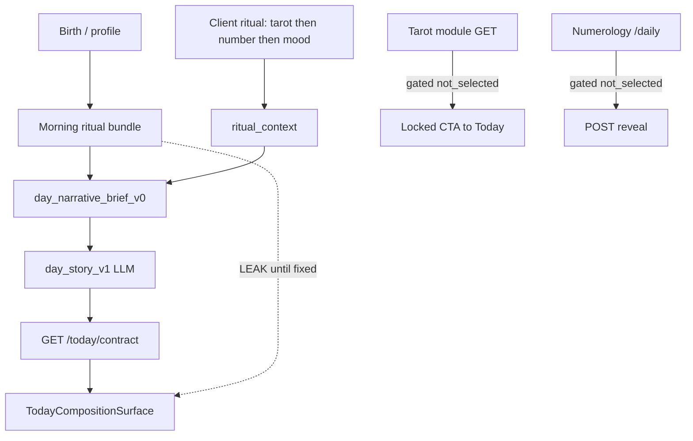

# TodayFlow User Journey Audit — 2026-07-20

**Scope:** guest → registration → Today → modules (web primary; iOS noted where different).  
**Method:** code + API contract review (frontend + backend). Not a full browser field pass of 20–30 accounts.  
**Related:** [WEB_LAUNCH_PRODUCT_BLUEPRINT.md](../status/WEB_LAUNCH_PRODUCT_BLUEPRINT.md), [FIRST_DAY_EXPERIENCE.md](../FIRST_DAY_EXPERIENCE.md), [LLM_QUALITY_AND_PROMPT_EVOLUTION.md](../LLM_QUALITY_AND_PROMPT_EVOLUTION.md).

---

## 1. Фактический пользовательский путь

```
/ (landing)
  → /onboarding/welcome?fresh=1
  → /onboarding/birth  (name + DOB → sun_sign, life_path)
  → /onboarding/preview  (First Result)
  → optional /onboarding/refine  (location / birth time)
  → /today?first=1  (GuestFirstTodayScreen — local demo package)
  → /onboarding/save  (email signup)
  → POST /auth/email-signup (+ magic or JWT)
  → claimGuestProfileAfterAuth → POST /account/core-setup
  → /today?first=1  (First Today, authenticated)
  → later: /today (full contract + ritual + day_story)
```

**Parallel guest trials (no onboarding):** `/tarot` (1 spread), `/compatibility` (4), free `/practices`. Limits: `guestAccessStore` (client-only).

**Auth model:** no Next.js middleware. Backend `require_user` per endpoint. Guest walls are page-local.

---

## 2. Ожидаемый пользовательский путь

```
интерес → имя/дата → персональный First Result
  → пробный «Сегодня» (без спойлеров карты/числа)
  → желание сохранить → регистрация с понятной причиной
  → продолжение того же дня (карта/число/настроение/цели сохранены)
  → заполненное «Сегодня»
```

**Gap vs expected:** guest First Today does **not** produce a real day card (`cardName: "—"`); mood/goals not collected; claim hardcodes intent=`focus`, reality=`stable`. Registration often feels like “save birth data”, not “save today’s ritual”.

---

## 3. Схема регистрации

| Step | UI | API | Notes |
|------|----|-----|-------|
| Entry | Landing CTA, limit gate, `/onboarding/save`, `/auth?mode=signup` | — | Multiple CTAs |
| Email-only | save page | `POST /auth/email-signup` | JWT only if SMTP fails; else magic link |
| Password | `/auth` | `POST /auth/signup`, `/auth/login` | |
| OAuth | `OAuthButtons` | `/oauth/google`, `/oauth/apple` | |
| Claim | after token | `POST /account/core-setup` | birth + location; clears draft |
| Redirect | `resolveTargetAfterAuthSession` | — | claim → First Today or refine |

**Fields claimed:** first_name, birth_date/time, location. **Not transferred:** day card, day number, mood, goals, guest tarot usage counter.

---

## 4. Схема формирования «Сегодня»

### Auth path (primary)

```
GET /morning-ritual/today
  → tarot_card (still assigned server-side) + numerology_number + foundation/recs
GET /tracking/fusion/{date}
DayConnection + core profile
  → build_day_narrative_brief_v0 (embeds card + number text)
  → day_story_v1 (prompt day-story-v1) OR fallback
GET /today/contract → today_contract_v1 + day_story
UI: TodayCompositionSurface (single voice when day_story present)
```

### Legacy surfaces

`POST /today/narrative` surfaces: `guide` | `day_layer` | `spheres` | `evening` | `deepen`  
(funnel prompts in registry / `guide_narrative_funnel_v0` / `surface_disclosure_funnel_v0`).

### Block map (composition)

| Block | Source | Prompt | Gate | Fallback |
|-------|--------|--------|------|----------|
| Continuity | local yesterday | — | not firstToday | hide |
| Greeting / pulse / hero | day_story | **day-story-v1** | contract | brief / copy |
| Glance spheres | day_story domains | day-story | not firstToday | empty |
| Color / sky | morning CONTENT + foundation | daily-foundation-v3 | — | defaults |
| Ritual tarot | morning + deck RU | explainer optional | until pick | static deck |
| Ritual number | morning numerology | explainer optional | after tarot | static |
| Mood / focus | meaning events | — | dialogue | chips |
| Personalized story | day_story after ritual | day-story | personalizedReady | locked |
| Goals / promise | engagement + weekly-goals | — | after personalize | suggestions |
| Evening | evening funnel / closure | day.evening.funnel.* | evening slot | hardcoded close |

**Cache:** date + ritual fingerprint + narrative keys; reuse when snapshot matches.  
**Partial day:** UI phases via `todayRitualSpineMachine` / reveal gates (client).  
**Model error:** `build_day_story_fallback_v1` / `_fallback_*` / `guide_decision_v0`.

---

## 5. Схема выбора и трактования карты

| Stage | Actual |
|-------|--------|
| Assignment | `sha256(user_id:date)` → major arcana (`TarotService._create_draw`) |
| Module GET | **Gated (2026-07-20):** `selection_status=not_selected` until `POST /tarot/daily/reveal` |
| Public GET | Always `not_selected` (Tarot hub cannot spoil) |
| Today morning | Still **assigns** via `get_daily_draw(assign_if_missing=True)` — remaining leak |
| UI pick | Theatrical: any tile → predetermined `anchorCardId` |
| Interpretation | Catalog upright/reversed + optional AI explain; day_story weaves card after ritual_context |
| Persist | DB `tarot_draws` after reveal/morning assign; client ritual localStorage |

**Product rule (needed):** one SoT — Today ritual select → server reveal ack → then module/history may show.

---

## 6. Схема выбора и трактования числа

| Stage | Actual |
|-------|--------|
| Formula | digits of `YYYYMMDD` → reduce (same for all users that calendar day) |
| Timezone | Uses server/`date.today()` — **not** user TZ (product decision open) |
| Module GET | **Gated:** `/numerology/daily` → `not_selected`; `POST /numerology/daily/reveal` returns value |
| Today morning | Still returns number in morning payload — remaining leak |
| Personal vs calendar | Calendar day number, not personal day from birth (despite “personal” copy in places) |
| Influence on Today | `day_narrative_brief` thread_number → day_story |

**Product rule (needed):** define whether “выбор” = reveal of calendar number vs true pick; unify guest + auth.

---

## 7. Карта зависимостей блоков



**Desired synthesis:** profile/day context = base; card = symbolic lens; number = rhythm accent; one voice (day_story), not three glued paragraphs.

---

## 8. Таблица аудита модулей

| Module | Guest | Auth | Role clear? | Spoiler risk | Hardcode | Notes |
|--------|-------|------|-------------|--------------|----------|-------|
| Landing | yes | redirect | yes | low | marketing | value-first CTA |
| Onboarding VF | yes | — | yes | medium (preview copy) | recognition engine | |
| Today guest `?first=1` | yes | — | partial | medium | demo package | no real card |
| Today auth | no | yes | yes | **critical** (morning) | fallbacks | primary magnet |
| Tarot hub | yes | yes | yes | **fixed** hub UI + public GET | — | was blocker |
| Card of day page | yes | yes | conflicting | **mitigated** (reveal POST) | catalog text | should redirect to Today long-term |
| Numerology day | yes | yes | conflicting | **mitigated** module GET | catalog | morning still leaks |
| Compatibility | limited | yes | yes | low | — | guest limit 4 |
| Practices | free tier | yes | yes | low | — | personalized gated |
| Profile | wall | yes | yes | low | forming state | profile-contract-v3 |
| Mood | local | meaning API | yes | — | chips | |
| Goals | — | tracking | yes | — | — | |
| Evening | local demo | yes | yes | low | close copy | |
| History | — | tarot/num | yes | medium | — | today no longer auto-created |
| Tomorrow | UI hook | — | weak | — | static | no API |
| Notifications | — | devices | yes | low | — | |
| Auth | yes | — | yes | — | — | dual signup UX |

---

## 9. Найденные ошибки (severity)

### BLOCKER

| ID | Module | Repro | Expected | Actual | Cause | Layer | Fix | Test |
|----|--------|-------|----------|--------|-------|-------|-----|------|
| B1 | Tarot hub | Open `/tarot` | No card identity | Was: face+name from `/tarot/daily` | Module used daily draw as promo | FE+API | Hub locked + public `not_selected` | `test_public_module_draw_is_not_selected` + hub source |
| B2 | `/tarot/daily` GET | Auth GET before pick | `not_selected` | Was: full card + DB create | `_ensure_draw` on GET | BE | `assign_if_missing=False` + `POST /reveal` | `test_card_number_reveal_gate_v1` |
| B3 | `/numerology/daily` | GET before reveal | gated | Was: full number | Public calc always | BE | GET gated + POST reveal | same |

### CRITICAL (still open)

| ID | Module | Repro | Expected | Actual | Cause | Layer | Fix plan |
|----|--------|-------|----------|--------|-------|-------|----------|
| C1 | Morning / Today | Load `/today` authed | No card/number until ritual | Morning JSON includes both | `get_morning_ritual` assigns | BE | Redact morning until server ritual ack; reveal endpoints for Today |
| C2 | Fake pick | Pick any tile | Real choice or honest reveal | Always `anchorCardId` | Theatrical UX | FE+product | Product decision: free pick vs reveal-of-seed |
| C3 | Guest→auth | Finish First Today + signup | Transfer card/number/mood | Not transferred | Draft schema | FE+BE | Extend draft + claim payload |
| C4 | Day-story brief | Generate before ritual | No card/number names | Brief embeds names from morning | `day_narrative_brief_v0` | BE | Build brief without identity until ack |

### MAJOR

| ID | Issue | Severity note |
|----|-------|---------------|
| M1 | No Next middleware; guest limits client-only | Bypass via direct API for some public calc |
| M2 | Dual signup (email-only vs password) | Confusing continuity |
| M3 | `email-signup` JWT only when SMTP fails | Unreliable session |
| M4 | Intent/reality hardcoded on claim | Weak personalization |
| M5 | Day number TZ = server date | Boundary bugs |
| M6 | Calendar day number marketed as personal | Copy/logic mismatch |
| M7 | iOS parallel reveal paths | Parity gap |
| M8 | `buildPersonalInsight` chips can show names | FE gate incomplete |
| M9 | Numerology explain still computes number | Secondary spoil if called |

### MINOR

| ID | Issue |
|----|-------|
| m1 | Guest access store not cleared on register |
| m2 | Docs still mention superseded `/demo/today` paths |
| m3 | Tomorrow growth UI is static labels |

---

## 10. План исправлений (приоритет)

### P0 (this sprint)

1. **Done:** Tarot module + public daily + numerology module GET gated; hub UI locked; reveal POSTs; day-flow no auto-assign.
2. **Next:** Redact `GET /morning-ritual/today` + `/today*` morning embeds until `tarot_selected` / `number_selected` (or new ritual ack table).
3. **Next:** Stop building `day_narrative_brief` card/number threads before ack; regenerate day_story after ritual (single fingerprint bump).
4. Wire Today ritual pick → `POST /tarot/daily/reveal` + `POST /numerology/daily/reveal` so module and Today share SoT.

### P1

5. Guest draft: persist ritual choices; claim transfers them.  
6. Product decision: fake pick vs free choice; document in canon.  
7. User-timezone day boundary for number + draws.  
8. Server/edge guest middleware for limit enforcement.  
9. Unify signup → always continue First Today with clear CTA reason.

### P2

10. iOS/Android parity for reveal gates.  
11. Remove `/tarot/card-of-the-day` as parallel day entry (redirect to Today).  
12. Synthesis-pass for card vs number contradictions in day_story.  
13. Manual QA 20–30 profiles / first-day journeys.

---

## 11. Необходимые тесты

| Test | Status |
|------|--------|
| Public `/tarot/daily` / service not_selected | **Added** service tests |
| Auth GET gated until reveal | **Added** |
| Numerology GET gated until reveal | **Added** |
| Tarot hub does not fetch daily identity | FE source change (add jest when node_modules present) |
| Morning payload omits card/number pre-ack | **TODO** integration |
| 20 parallel Today opens don’t multiply LLM | existing pattern in profile; **TODO** for day_story |
| E2E: guest First Today → signup → same day continues | **TODO** Playwright |
| E2E: `/tarot` never shows card name before Today pick | **TODO** |

---

## 12. Продуктовые решения (нельзя вывести только из кода)

1. **Что такое «выбор карты»?** Свободный выбор из колоды vs reveal заранее посеянной карты?  
2. **Что такое «выбор числа»?** Reveal календарного числа vs персональный personal day?  
3. **Должен ли модуль Таро вообще показывать карту дня**, или только расклады/вопросы?  
4. **Где обязательная точка регистрации** — после First Result, после Guest Today, или после полного ритуала?  
5. **Вес карты vs числа в day_story** — целевые доли / запретные зоны формулировок.  
6. **Timezone дня** — birth TZ, device TZ, or account TZ?  
7. **Guest limits** — device-local forever or migrate into account?  
8. **OAuth vs email-only** — один канонический post-auth continue path?

---

## DoD checklist

| Criterion | Status |
|-----------|--------|
| Full path first open → filled Today documented | Yes (§1–4) |
| Why each step / retention to signup | Yes (§2–3) |
| Card nowhere before selection | **Partial** — module/public fixed; **morning/Today still leak** |
| Number nowhere before action | **Partial** — module fixed; morning still leak |
| Tarot cannot bypass day card | **Hub + public/API GET fixed**; Today morning still assigns |
| FE+BE limits checked | Yes |
| Today blocks + prompts documented | Yes (§4) |
| Hardcode identified | Yes |
| Card/number ↔ day coherence | Documented; synthesis still weak |
| All modules walked | Yes (§8) |
| Prioritized backlog | Yes (§10) |
| Critical tests added | Partial (service gate tests) |

---

## Changelog of fixes landed with this audit

- `GET /tarot/daily/public` → always `not_selected`
- `GET /tarot/daily` → no auto-assign; `POST /tarot/daily/reveal`
- `GET /tarot/history` → no longer creates today’s draw
- `GET /tarot/daily/explain` → 409 if not selected
- `GET /numerology/daily` → gated; `POST /numerology/daily/reveal`
- Tarot hub UI: locked card-of-day panel, no daily fetch
- Card-of-day screen: reveal via POST; guests not loaded from public daily
- Day-flow: no tarot assign; numerology not revealed in payload
- Tests: `tests/test_card_number_reveal_gate_v1.py`

### P0 follow-up (same day) — unified SoT

- Table `day_symbol_states` + service `day_symbol_state_v1`
- API `/today/symbols/*` (state / card reveal / number reveal / guest claim)
- `GET /morning-ritual/today` redacts card+number until SoT reveal
- day_story brief only receives revealed ritual fields
- Ritual FE calls reveal endpoints; claim transfers guest symbols
- Canon decisions: [DAY_SYMBOL_REVEAL_CANON_V1.md](./DAY_SYMBOL_REVEAL_CANON_V1.md)
- Matrix tests: `tests/test_day_symbol_reveal_matrix_v1.py`
