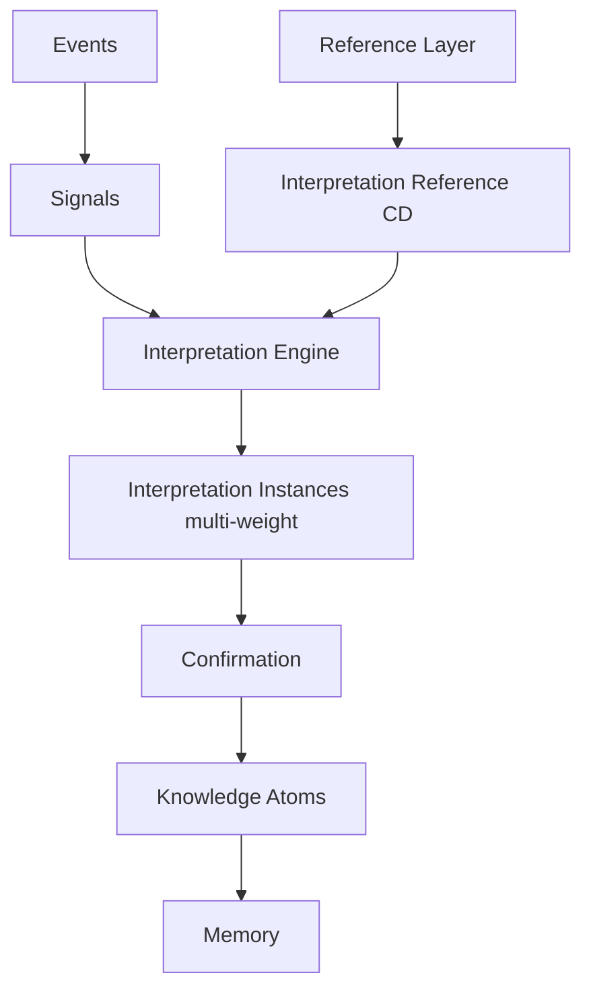

# Interpretation Layer & Reference (ILR)

**Статус:** принято (канон **как события становятся смыслом** — без LLM).  
**Версия:** 1.1 (2026-06-23).  
**Владелец:** Product + Engineering.

**Уровень:** между Signal Layer и Knowledge Layer — один из **главных долгосрочных активов** TodayFlow.

**Связь:** [PERSONAL_INTELLIGENCE_MODEL_V1.md](../pim/PERSONAL_INTELLIGENCE_MODEL_V1.md) (PIM §1.1 Signal vs Interpretation, **C14**), [KNOWLEDGE_ACQUISITION_AND_SIGNAL_POLICY.md](../KNOWLEDGE_ACQUISITION_AND_SIGNAL_POLICY.md), [USER_KNOWLEDGE_MODEL.md](../pim/USER_KNOWLEDGE_MODEL.md), [REFERENCE_LAYER_AND_BUILD_ORDER.md](../REFERENCE_LAYER_AND_BUILD_ORDER.md), [PERSONAL_INTELLIGENCE_LAYER.md](../pim/PERSONAL_INTELLIGENCE_LAYER.md), [DATA_OWNERSHIP_AND_CONSUMPTION_MAP.md](../DATA_OWNERSHIP_AND_CONSUMPTION_MAP.md).

---

## 0. Главный принцип

**Событие ≠ смысл.**

| Событие | Возможные интерпретации (не одна!) |
|---------|-------------------------------------|
| Сохранил текст про деньги | интерес к деньгам · финансовая тревога · планирует бизнес · понравилась формулировка |

Interpretation Layer — **не LLM**, **не промпт**. Это **канонический справочник + движок**, который по правилам превращает signals в **набор weighted interpretations** до Knowledge.

**Product boundary:** пользователь видит **интерпретации** (meaning) — не selection trace, scores, rule IDs. См. [EXPLAIN_MEANING_NOT_MECHANISM.md](./EXPLAIN_MEANING_NOT_MECHANISM.md).

**Долгосрочная ценность:** собственная карта event → meaning → **CUM field** ([USER_MODEL_TARGET_STATE.md](../pim/USER_MODEL_TARGET_STATE.md)).  
**Главный риск PIM:** загрязнение **interpretations** без опоры на **signals** — см. PIM **C14**; один signal → много meanings до promotion.

---

## 1. Место в архитектуре

### Каноническая цепочка

```
Reference Layer
  ↓
Acquisition (KASP) → Events → Signals
  ↓
Interpretation Engine (+ Interpretation Reference)
  ↓
Confirmation (KASP §5)
  ↓
Knowledge (UKM) → Memory → Context Selection → Gate → LLM → Feedback
```



| # | Слой | Артефакт |
|---|------|----------|
| — | **Interpretation Reference** | CD: правила «что может значить» |
| — | **Interpretation Engine** | детерминированный matcher signal/event → candidates |
| — | **Interpretation Instance** | per-user: несколько meanings + weights + evidence |
| — | **Knowledge Atom** | promoted interpretation после confirmation |

**Правило:** Engine **не выбирает один** смысл сразу (кроме L1 direct). Хранит **несколько** interpretations с весами.

---

## 2. Четыре типа пользовательского смысла

Система хранит **раздельно** (не смешивать в одном поле):

| Тип | Код | Пример | Когда |
|-----|-----|--------|-------|
| **Fact** | `fact` | родился 15 мая; отметил практику выполненной | explicit / L1 |
| **Pattern** | `pattern` | лучше выполняет задачи вечером | stable behavioral |
| **Hypothesis** | `hypothesis` | вероятно интересуется дисциплиной | до confirmation |
| **Interpretation** | `interpretation` | частые save про дисциплину **могут** указывать на поиск структуры | multi-meaning candidate |

Каждая запись: **`confidence`**, **`evidence[]`** (event/signal ids), ссылка на `interpretation_ref_id`.

**Knowledge Atom** ([USER_KNOWLEDGE_MODEL.md](../pim/USER_KNOWLEDGE_MODEL.md)) — **продукт promotion** из Interpretation Instance. Interpretation Instance может жить дольше и держать альтернативы.

---

## 3. Interpretation Reference (справочник)

Часть Reference Layer — **Behavior & Meaning Reference**. Machine + policy contract (не editorial LLM text bulk).

### 3.1 Запись справочника (Interpretation Rule)

| Поле | Описание |
|------|----------|
| `interpretation_ref_id` | stable id, e.g. `beh.save_content.money.v1` |
| `taxonomy` | см. §4 |
| `level` | L1 \| L2 \| L3 \| L4 |
| `trigger` | `event_type`, `signal`, или signal pattern |
| `candidate_meanings` | `[{ code, label_key, prior_weight }]` — **несколько** |
| `does_not_mean` | явные anti-patterns |
| `min_confidence_for_knowledge` | порог promotion |
| `required_confirmations` | signals/events/user feedback needed |
| `allowed_actions_if_confirmed` | rec types, surfaces (не CTA для L4 без extra gate) |
| `related_patterns` | links to other ref ids |
| `spawn_hypothesis_ids` | UKM claim templates |
| `version` | semver |
| `status` | draft \| review \| active |

### 3.2 Пример rule (save money content)

```json
{
  "interpretation_ref_id": "beh.save_content.money.v1",
  "taxonomy": "interest",
  "level": "L3",
  "trigger": { "signal": "useful", "content_theme": "money" },
  "candidate_meanings": [
    { "code": "money_interest", "label_key": "interp.money.interest", "prior_weight": 0.35 },
    { "code": "financial_anxiety", "label_key": "interp.money.anxiety", "prior_weight": 0.30 },
    { "code": "business_planning", "label_key": "interp.money.business", "prior_weight": 0.20 },
    { "code": "liked_wording_only", "label_key": "interp.format.liked_copy", "prior_weight": 0.15 }
  ],
  "does_not_mean": ["user_is_rich", "user_will_invest_today", "financial_crisis_diagnosis"],
  "min_confidence_for_knowledge": 0.65,
  "required_confirmations": { "min_signal_count": 3, "window_days": 60 },
  "allowed_actions_if_confirmed": ["soft_topic_hint", "optional_goal_suggest"],
  "version": "1.0.0",
  "status": "draft"
}
```

**Хранение (target):** `DATA/reference/interpretation/` — Machine rules JSON; Content — i18n labels only.

---

## 4. Interpretation Taxonomy (10 групп)

| # | Taxonomy | Примеры смыслов |
|---|----------|-----------------|
| 1 | **interest** | тема значима, curiosity, avoidance |
| 2 | **behavior** | выполняет/пропускает, rhythm fit |
| 3 | **motivation** | ищет структуру, избегает давления |
| 4 | **goal** | движение к stated/implicit цели |
| 5 | **emotional** | тревога, усталость, подъём |
| 6 | **rhythm** | утро/вечер, weekly cycle |
| 7 | **relationship** | партнёр, конфликт, опора |
| 8 | **career** | работа, выгорание, смена |
| 9 | **learning** | предпочитает короткий формат, глубину |
| 10 | **transformation** | переезд, большие жизненные сдвиги (**L4 only**) |

Новая группа — строка в catalog §6 [REFERENCE_LAYER_AND_BUILD_ORDER.md](../REFERENCE_LAYER_AND_BUILD_ORDER.md) + rule registry.

---

## 5. Уровни интерпретации (L1–L4)

| Level | Название | Когда | Пример | Multi-meaning? |
|-------|----------|-------|--------|----------------|
| **L1** | Direct | explicit / однозначное действие | practice marked complete → выполнено | usually no |
| **L2** | Behavioral | серия events | practices after 20:00 → evening rhythm fits | often 2–3 |
| **L3** | Psychological | накопление | reads control content → control theme likely significant | **yes** |
| **L4** | Strategic | долгий горизонт, высокий риск ошибки | interest in relocation content → **not** «хочет эмигрировать» | **yes**; strict caps |

### L4 правило (жёсткое)

**Нельзя:** «Хочет эмигрировать», «Хочет развестись», «Имеет расстройство».

**Можно:** «Тема переезда вызывает устойчивый интерес» (`interpretation`, max confidence 0.55 без user confirm).

L4 **запрещены** high-priority recommendations и push ([KNOWLEDGE_ACQUISITION_AND_SIGNAL_POLICY.md](../KNOWLEDGE_ACQUISITION_AND_SIGNAL_POLICY.md) §6).

---

## 6. Interpretation Instance (per user)

Результат работы Engine для одного trigger batch.

| Поле | Описание |
|------|----------|
| `instance_id` | uuid |
| `user_id` | |
| `interpretation_ref_id` | rule applied |
| `meanings` | `[{ code, weight, confidence }]` — **сумма weights = 1.0** после normalize |
| `level` | L1–L4 |
| `evidence` | event_ids, signal_ids, window |
| `dominant_meaning` | optional; **не** используется для rec если L3+ без confirm |
| `status` | `open` \| `confirmed` \| `rejected` \| `superseded` |
| `promoted_knowledge_ids` | after confirmation |

### Пример (discipline saves ×7 / month)

**Signal:** `discipline_interest_score` elevated.

**Interpretation Instance — meanings:**

| code | weight |
|------|--------|
| wants_more_discipline | 0.28 |
| feels_undisciplined | 0.27 |
| seeking_habit_system | 0.25 |
| guilt_about_discipline | 0.20 |

**Knowledge promotion:** только после KASP confirmation → один или несколько `hypothesis` atoms, **не** fact.

---

## 7. Interpretation Engine

**Детерминированный** движок (не LLM):

1. Input: signal batch + optional event window + user context slice (facts only).  
2. Match: active rules from Interpretation Reference where `trigger` fits.  
3. Output: Interpretation Instance(s) with weighted meanings.  
4. Update weights: Bayesian / count-based adjustment from new evidence (rules in ref, not ad-hoc).  
5. Promotion hook: if `confidence ≥ min` and confirmations met → UKM Knowledge Atom.  
6. **Conflict detect:** if new signal contradicts active atom → [Contradiction Event](../CONTRADICTION_AND_REEVALUATION_V1.md) (C15), not silent overwrite.

**Запрещено:** LLM as primary interpreter for user memory path. LLM may **phrase** UI copy from **already selected** interpretation codes (Content), not invent new meanings.

**Код сегодня:** **нет** Engine; proto-logic scattered in `LearningService`, `meaning_surface_patterns_v0` (counts without multi-meaning).

---

## 8. Pipeline (полный)

```
Event (KASP channel)
  → Signal
  → Interpretation Engine + Reference
  → Interpretation Instance (multi-weight)
  → Confirmation (KASP §5)
  → Knowledge Atom (fact | pattern | hypothesis)
  → Memory
```

**Anti-pattern:** Event → «интерес к деньгам» fact in one step.

### 8.1 Пример: Intent signals → competing interpretations

**Signal (факт):** 7× подряд `goal_outcome = no` на Intent Records.

**Не atom сразу.** Interpretation Instance держит кандидатов:

| interpretation_ref (пример) | weight | spawn claim |
|----------------------------|--------|-------------|
| `intent.goal_too_ambitious.v1` | 0.35 | `intent.overestimate_frequency` |
| `intent.goal_evening_set.v1` | 0.30 | `timing.goal_set_evening` |
| `intent.goal_off_priority.v1` | 0.25 | `intent.off_priority_theme` |
| `trait.lazy.v1` | — | **blocked** L4 — не promote без policy |

После confirmation → **один** (или несколько) atoms с `evidence_chain` → 7× `intent_record_id`.

---

## 9. Ownership & Reference Layer

| Asset | Type | Owner |
|-------|------|-------|
| Interpretation Reference rules | **CD** (Canonical) | Platform / editorial |
| Interpretation Instance | **DD/SN** per user | User domain |
| Promoted Knowledge | **SN** | User domain |

**Consumers:** UKM, Profile Selector, Prompt Refinement, Recommendation — **interpretation codes**, not raw events.

**Catalog row (target):** Domain `Interpretation` | Entity `BehaviorInterpretationRule` | `DATA/reference/interpretation/` | Machine | Content labels | PIL, UKM | missing

---

## 10. Build order

| # | Task | Blocks |
|---|------|--------|
| **ILR-1** | Этот канон + taxonomy + L1–L4 | — |
| **ILR-2** | Schema `interpretation_rule_v1` + CI | editorial rules |
| **ILR-3** | Seed rules: save/open/complete/skip (top 20 triggers) | Engine |
| **ILR-4** | Interpretation Engine v0 | UKM-2 |
| **ILR-5** | Instance store + link to evidence | Memory |
| **UKM-2** | Signal → Interpretation → Knowledge | personalization |
| **Gate** | after UKM-3 | AMLL |

**Parallel:** Reference P0 numerology **не блокирует** ILR-2 schema; editorial interpretation rules — отдельная очередь.

---

## 11. Feature DoD

- [ ] trigger maps to `interpretation_ref_id` or new rule PR  
- [ ] level L1–L4 assigned  
- [ ] `does_not_mean` documented for user-facing copy  
- [ ] multi-meaning for L3+  
- [ ] confirmation before knowledge promotion  
- [ ] no LLM-invented meaning in memory path  

---

## 12. Changelog

- **1.1 (2026-06-23)** — PIM C14 cross-ref; §8.1 goal-outcome multi-interpretation example.
- **1.0 (2026-05-31)** — первый канон ILR: Interpretation Reference, Engine, Instance, taxonomy×10, levels L1–L4, chain Signal→Interpretation→Knowledge.
